## 0. はじめに

ここでは、インストーラー版ではなくレジストリーを操作していないと思われる.zip版を展開し使用する手順です。  
また、Windowsの64ビット版で進めていきます。  

 

## 1. 事前準備

### 1-1. Android Studioのダウンロード

[Android Studio Downloads](https://developer.android.com/studio)でWindows(64bit)の.zip版(`No .exe installer`)をクリックしダウンロードします。  

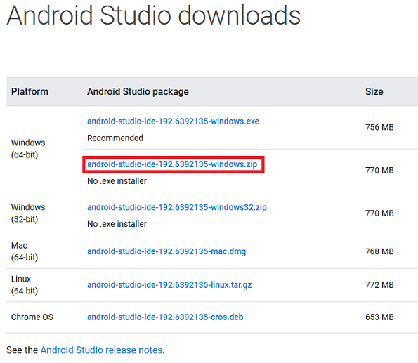  

### 1-2. zipファイルの展開・配置

Cドライブ直下に`android`フォルダを作り、さらにその中へ`android-sdk`フォルダを作ります。android-sdkはのちに  
ここへSDKファイルを格納させるために作っておきます。  
ダウンロードした.zipファイルを展開し`android-studio`ファイル丸ごと**android**フォルダの中へ配置させます。  
最終的には以下の様な階層配置とします。  

    c:
        \android
            \android-sdk
            \android-studio
                \bin
                \jre
                \lib
                \license
                \plugins
                build.txt
                LICENSE.txt
                NOTICE.txt
                uninstall.exe

 

## 2. Android Studioのセットアップ

`c:\android\android-studio\bin\studio64.exe`をダブルクリックしてAndroid Studioを起動します。  

2-1. 以下の様な画面が出ますので「Do Not import settings」ラジオボタンをクリックし選択します。  
良ければ、「OK」ボタンをクリックし次へ進みます。  

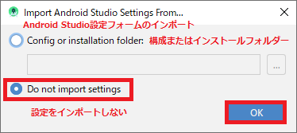  

2-2. Welcome画面が出ますのでそのまま「Next」ボタンをクリックし次へ進みます。  

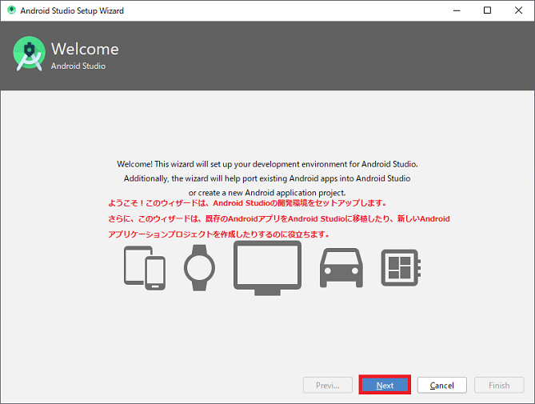  

2-3. Install Type画面が出ますのでここでは「Custom」ラジオボックスをクリックします。  
Android-SDKを先ほどの指定したフォルダへ格納するためです。  

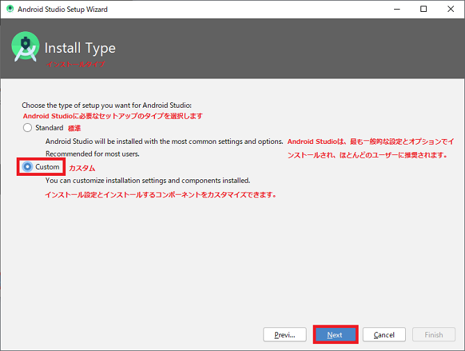  

2-4. Select default JDK Location画面が出ます。こちらはJava標準ライブラリーの方なので`c:\android\android-studio\jre`
となっていればそのまま「Next」ボタンをクリックし次へ進みます。  

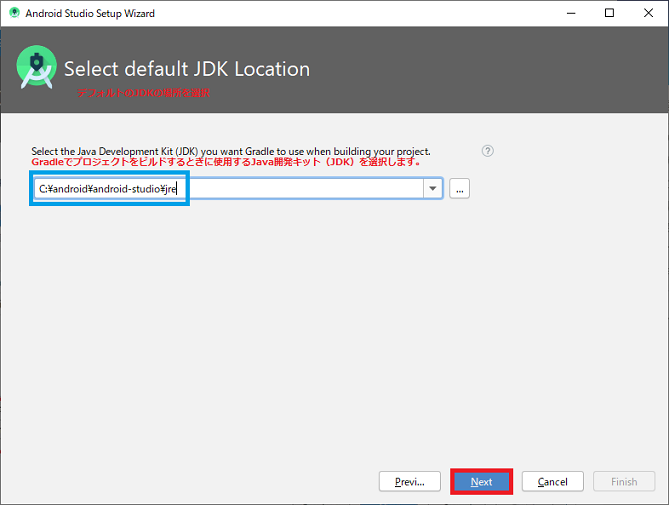  

2-5. Select UI Theme画面が出ますのでお好みの色のテーマを選びます。ここでは、「Darcula」ラジオボタンをクリックし  
黒っぽいテーマの方を選びます。良ければ、「Next」ボタンをクリックし次へ進みます。  

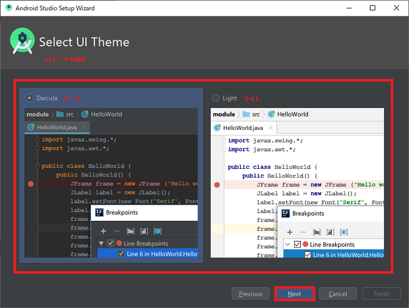  

2-6. SDK Components Setup画面が出ます。ここで先ほどフォルダを作成したandroid-sdkフォルダを指定します。Android SDK  
Locationテキストボックスに`c:\android\android-sdk`と打ち込むかテキストボックス横のフォルダーマークを押しフォルダを  
選びます。  
「Performance(Intel🄬 HAXM)」チェックボックスはONになっていると思いますがクリックしONにします。HAXMは、デバッグ時の  
エミュレーターを高速に動作させるためのものです。  
良ければ、「Next」ボタンをクリックし次へ進みます。  

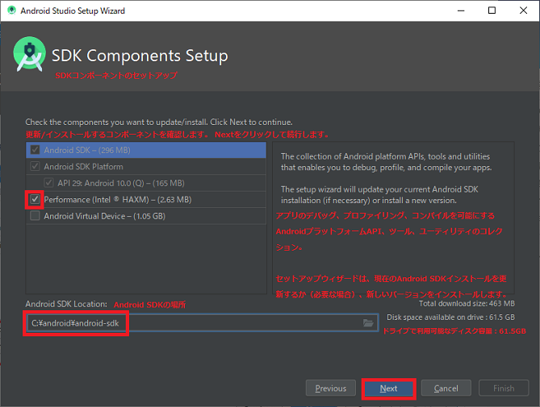  

2-7. Emulator Settings画面が出ます。HAXMが使用するメモリーのサイズの様ですが良く分からないのでデフォルト(2.0GB)の  
まま「Next」ボタンをクリックし次へ進みます。  
※後からインストーラーでサイズを変更できるそうですが、現在HAXM単独でインストールする際のサイズ設定は無くなっている  
様でいくつに設定しても意味が無いとの記事も見かけます。  

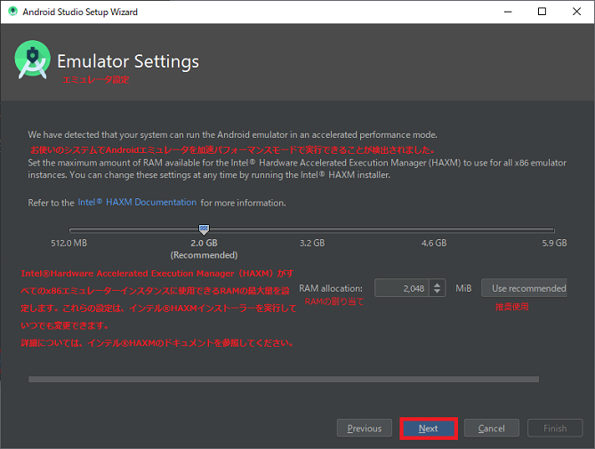  

2-8. Verify Settings画面が出ますので、これまでの設定の確認をし良ければ「Finish」ボタンをクリックし完了させダウンロード  
兼インストールを行います。  

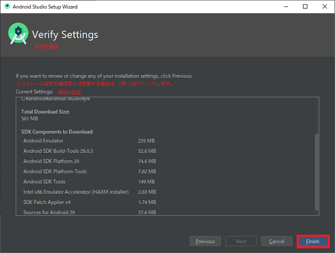  

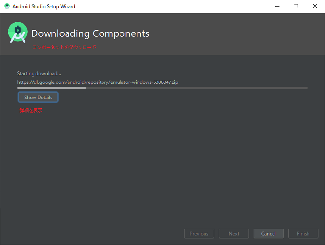  

2-9. Downloading Components画面が出てインストール結果が出ます。  
通常は、何もエラーが出ずに進むはずですがこちらの環境では事前にHAXMをインストールして導入していたために出たエラーです。  
良ければ、「Finish」ボタンをクリックし完了させます。その後、Android Studioのスタート画面が起動します。  

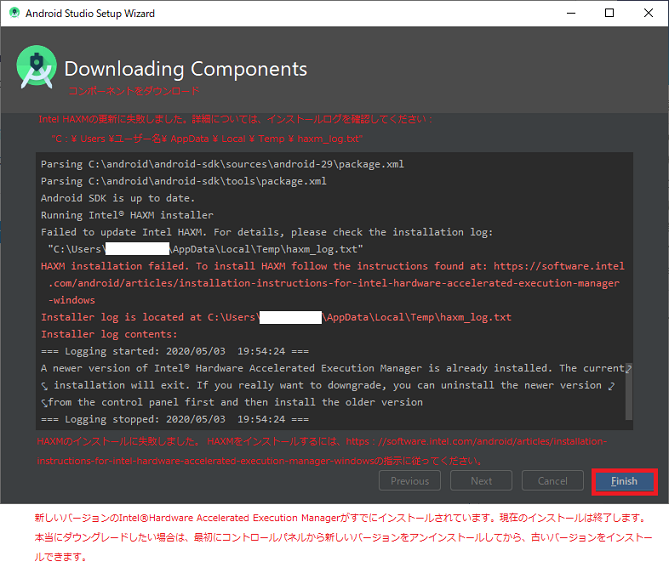  

 

## 3. Android Studioの日本語化

Android Studioに日本語化パッチをあてるにはMergedocサイトのPleiadesプラグインで日本語化できますが今回日本語化を行った際、  
Android Studioなどを日本語化するにはJetBrainsの純正日本語パックをご利用下さいと書かれていましたので純正プラグインから行  
なおうとしましたが2020年05月03日現在対応しておりませんでした。  
プラグイン一覧に無いと思いながら直接手動でダウンロードしインストールも行おうとしましたがエラーが発生しました。  
ですので、エラーは発生しますが概ねこの通りに行うと良いのでPleiadesも含めた２通りの方法を書いていきます。  
※また、Pleiadesで日本語化を行う場合はAndroid-Studioのセットアップ前に行う事によりセットアップから日本語に対応できます。  

### 3-1. JetBrains純正日本語パックプラグイン

JetBrains純正日本語パックプラグインで日本語化してみます。  

#### 3-1-1. Japanese Language Pack EAPのダウンロード

[Japanese Language Pack EAP](https://plugins.jetbrains.com/plugin/13964-japanese-language-pack-eap/versions)でDownloadボタンをクリックしjarファイルをダウンロードします。  

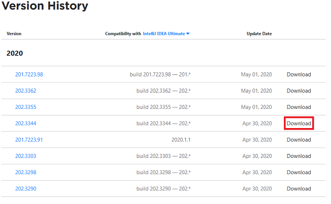  

#### 3-1-2. プラグインの導入で日本語化

Android Studioのスタート画面の「Configure」をクリックし出てきたプルダウンメニューの「Plugins」をクリックしダイアログを開き  
ます。  

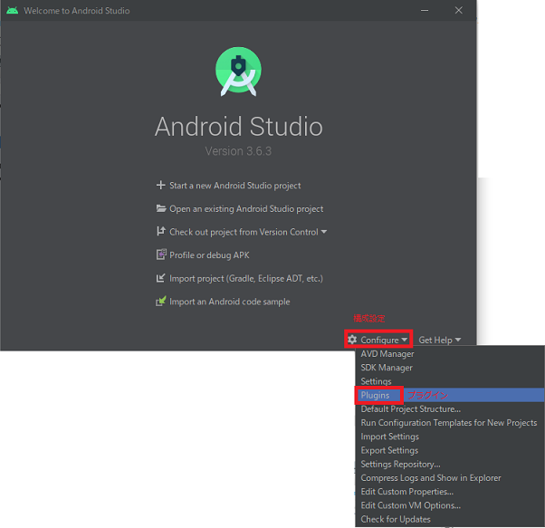  

Pluginsダイアログの「歯車マーク」をクリックし出てきたプルダウンメニューの「Install Plugin from Disk...」をクリックします。  
※ちなみに、左側の検索バーで`japan`と入力し候補が出てくるか試しましたがそれらしきものは出てきませんでした。おそらく、対応  
していれば候補が出てくるのでしょう。

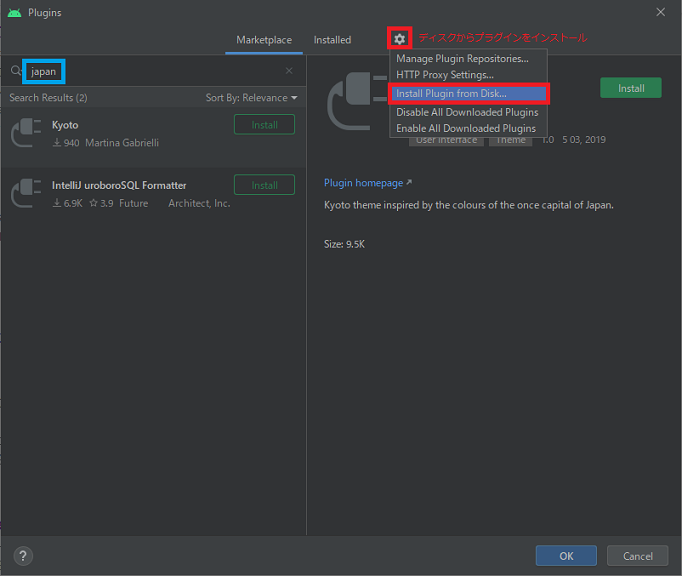  

Choose Plugin Fileダイアログが出ますのでダウンロードした例えば`ja.202.3344.jar`ファイルなどをクリックし選択します。  
良ければ、「OK」ボタンをクリックしプラグインの導入を開始します。  

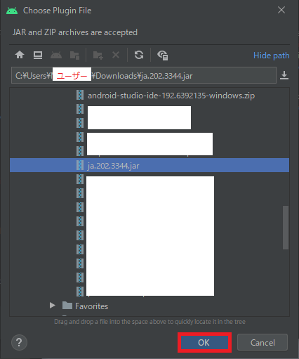  

ここで、Android Studioには対応していない様で「互換性がありません」とエラーが発生しました。対応版を待ちましょう。  

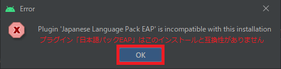  

### 3-2. MergedocのPleiadesプラグイン

MergedocサイトのPleiadesプラグインで日本語化してみます。  

#### 3-2-1. Pleiadesプラグインのダウンロード

[Mergedoc Project](https://mergedoc.osdn.jp/)でPleiadesプラグイン・ダウンロードのWindowsをクリックしダウンロードします。  
その後、.zipファイルを展開します。

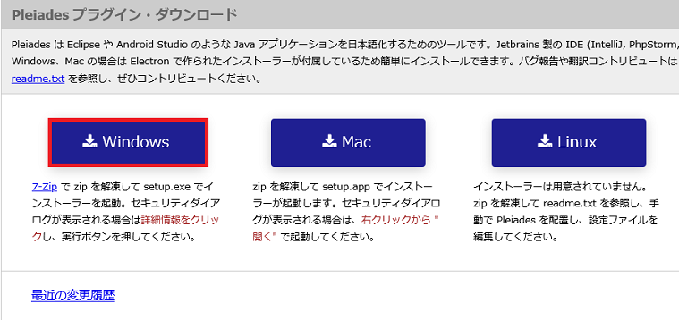  

#### 3-1-2. プラグインで日本語化

展開したフォルダ内のsetup.exeファイルをダブルクリックし画面を起動させます。  
日本語するアプリケーションつまり、Android Studioのexeファイル`studio64.exe`を指定しますので「選択」ボタンをクリックします。  

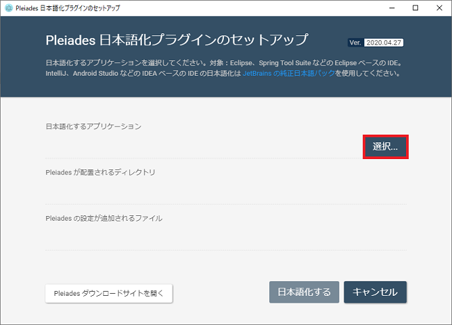  

エクスプローラーダイアログが出ますので`studio64.exe`をクリックし選択し「開く(O)」ボタンをクリックします。  

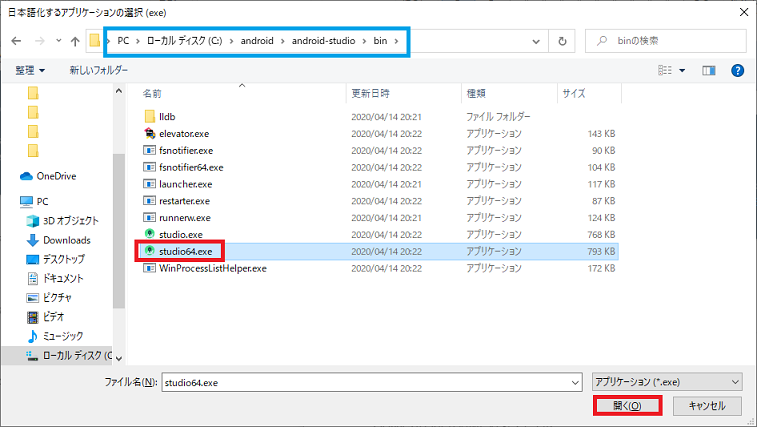  

Pleiadesプラグインが配置されるフォルダが自動的に決定されます。良ければ「日本語化する」ボタンをクリックしパッチを当てます。  

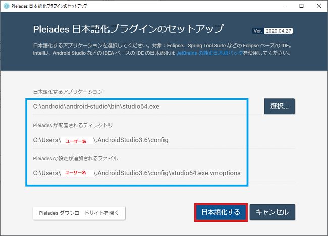  

正しくパッチがあてられると以下の様なダイアログが出ます。良ければ、「OK」ボタンをクリックします。  

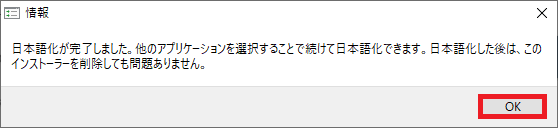  

これも「終了」ボタンをクリックし終了させます。  

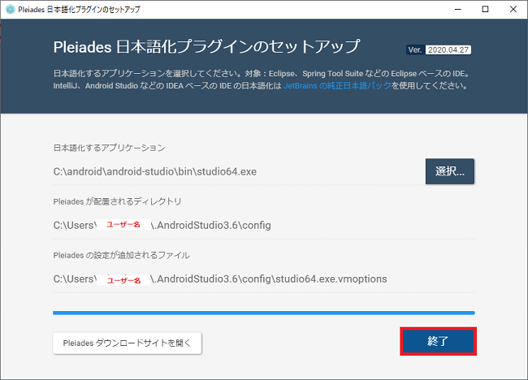  

日本語化されましたので`studio64.exe`をダブルクリックしAndroid Studioを起動し日本語になっているか確認して下さい。  

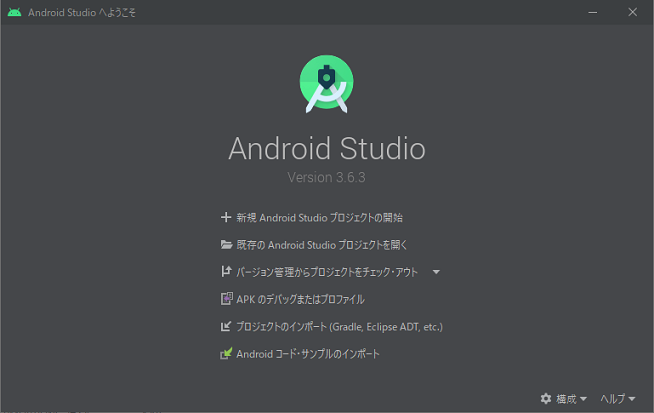  

* * *
