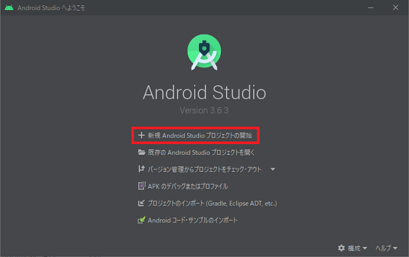

## 0. はじめに

Android Studioで新規プロジェクトを作成し、エミュレーターデバイスの作成、実行するまでの一通りの手順を  
書いていきます。

    OS:Windows10 Home 64bit
    IDEバージョン：Android Studio 3.6.3(日本語化)

 

## 1. 新規プロジェクトの作成

1-1. スタートアップ画面の「新規Android Studio プロジェクトの開始」をクリックします。  

  

1-2. Select a Project Template画面が出ます。  
「スマホおよびタブレット」タブをクリックし、「空のアクティビティー」をクリックし選択します。  
良ければ「次へ(N)」ボタンをクリックし次へ進みます。  

  

1-3. プロジェクトの構成画面が出ます。  
「名前」テキストボックスはプロジェクト名を入れます。今回は`MyApplication`と入力します。  
「パッケージ名」テキストボックスはパッケージ名で`com.example.myapplication`と今回は入力します。クラス  
ファイルをグループ分けしたりするもので`.(ドット)`で区切られフォルダ階層のようになっています。  
「保存ロケーション」テキストボックスは、プロジェクトを保存するフォルダを指定します。  
「言語」コンボボックスは、開発する言語を選択します。JavaまたはKotlin(コトリン)を指定できますが今回は  
`Java`を選択します。
「最小 SDK」コンボボックスは、開発するAndroidのSDKのバージョンを指定します。  
今回は、最新の`API 29: Android 10.0 (Q)`を選択してみます。  
入力や選択を済ませたら「完了(F)」をクリックします。その後、開発画面が起動します。  

  

開発画面です。`activity_main.xml`が画面を作成するためのxmlファイルでデザイナーを使ってボタンなどを配置でき  
ます。`MainActivity.java`の**MainActivityクラス**がアプリのエントリーポイントクラス(プログラムの開始場所)  
です。開発画面上側のツールバー内の実行ボタン「▶」の左側に「No Devices」となっていますがAndroid Studioセット  
アップ開始直後は、エミュレーター(実機相当をPCの画面上で仮想的に動かす)の設定がされていませんのでこの様になっ  
ています。  

  

 

## 2. エミュレーターデバイスの作成

エミュレーターでアプリの動作を確認するには「No Devices」では実行できません。  
そのための仮想的なデバイスの作成というものを行っていきます。  
2-1. メニューバーの「ツール(T)」→「AVDマネージャー」をクリックし仮想デバイス画面を開きます。  
「仮想デバイスの作成...」ボタンをクリックします。  

  

2-2. ハードウェアの選択画面が出ます。Google系のスマートフォンの名前が並んでいますが今回はカテゴリーの「Phone」  
の「Pixel 2」で行おうと思いますのでクリックし選択します。  
良ければ、「次へ(N)」ボタンをクリックし次へ進みます。  

  

2-3. システムイメージ画面が出ます。Android Studioセットアップ直後は、仮想機に応じたAndroid APIがインストール  
されていませんのでダウンロード兼インストールします。プロジェクトで対象OSをAndroid10(Q)としましたのでAndroid10  
のx86_x64のGoogle APIsの行の「Download」リンクをクリックします。  

  

2-4. ご使用条件画面が出ます。ご利用規約を読み良ければ「承諾」ラジオボタンを押し「次へ(N)」ボタンをクリックし、  
ダウンロード兼インストールを開始させます。  

  

2-5. コンポーネント・インストーラー画面が出てダウンロードとインストールを行います。  
終了しましたら、「完了(F)」ボタンをクリックし画面を閉じます。  

  

2-6. システム・イメージ画面の「Download」リンクが消え、その行を選択すると「次へ(N)」ボタンが有効になり次へ進め  
ます。「次へ(N)」ボタンをクリックし次へ進みます。  

  

2-7. Android 仮想デバイス(AVD)画面が出ます。AVD名はこの仮想機の名前を付けますが今回はそのままの`Pixel 2 API 29`  
とします。その他の設定も変更可能ですが今回はそのままとします。「完了(F)」ボタンをクリックし完了させます。  

  

2-8. 仮想デバイス画面にデバイス(仮想機)が追加されました。追加されましたのでこの画面を閉じるために「X」閉じるボタ  
ンをクリックし閉じます。  

  

2-9. 開発環境の上側のツールバーアイコンの実行ボタン(▶)ボタン左横のコンボボックスがNo Deviceから`Pixcl 2 API 29`  
に変わりました。これで準備が出来ましたので実行ボタン「▶」をクリックし仮想デバイスで実行してみます。  

  

スマートフォンの仮想デバイス(エミュレーター)が起動しその後、アプリも自動で起動し**Hello World**が出れば成功です。  
下画像の左側がアプリ起動時のキャプチャ、右側がアプリ起動直後のキャプチャです。  
※HAXMの機能によりエミュレーターが高速化されていると思いますがそれでもパソコンの能力により特に初回は起動時間がかか  
ります。

  

* * *
