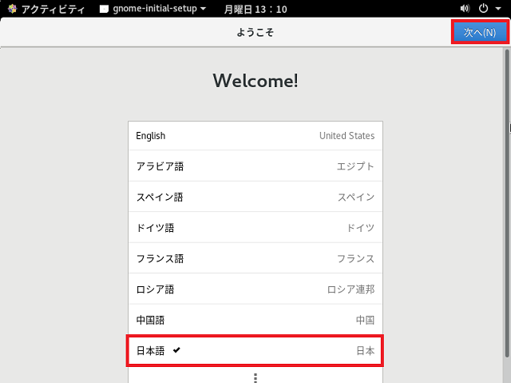

## 0. はじめに

実HDDへのインストールでは画面のキャプチャを取るのに難しいのでWindowsのVirtualBoxでのインストールで行います。  
実HDDにインストールする場合もほぼ同じと思われます。  
VirtualBoxなどの仮想化ツールを利用しインストールすると解像度が800x600などとなり画面が途切れる現象がおきます。  
よって、解像度を変更する方法も書いておきます。  
※それでも途中から解像度が戻ります。  

 

## 1. CentOSのインストール

1-1. インストールメニューで`tab`キーを押すとパラメーターを設定できる文字列が現れカーソルが入力できるようになる。  

    rd.live.check quiet

の文字を消し`1280x800`であれば以下の様に入力する  
※英語キーボード配列なので`=`は隣の`^`キーを押す(shiftは押さない)  

    resolution=1280x800 quiet

  

1-2. 入力したらメニューの`Install CentOS Linux xxxxx`など目的のものを選んでいる事を確認し`Enter`キーを押す。  
インストーラーが起動するまでしばらく待ちます。  

  

しばらく待ちます。  

  

1-3. インストーラーが起動し言語を選択する画面が表示されます。  
左リストおよび右リスト内の`日本語`をクリック選択し「続行(C)」ボタンをクリックし次に進みます。  

  

1-4. インストールするディスクや時刻などを設定する画面が表示されます。  
最低でもインストールするディスクの指定をしなければ次へは進めません。  
ここでは、時刻とインストールするディスクの指定を行います。  
まずは、「時刻と日付(T)」をクリックすると以下の様な画面が表示されます。  
地図上の日本がある行をクリックし選択後、「完了(D)」ボタンをクリックし完了させます。  

  

1-5. 次に「インストール先(D)」をクリックし以下の様な画面を表示させます。  

  

1-6. 設定が完了すると「インストール先(D)」の警告メッセージが消え「インストールの開始(R)」ボタンが有効になりますのでクリックし次に進みます。  

  

1-7. インストールが開始されます。インストール中にrootパスワードとユーザーの作成両方を行ってください。  
まずは、「rootパスワード(R)」をクリックします。  
※また、このインストールが終わると解像度がもとに戻ってしまう様です。  

  

1-8. 「rootパスワード(R)」と「確認(C)」テキストボックスに考えたパスワードを入力して下さい。確認はrootパスワードと同じものを入れ双方に間違いが無いかスペルチェックするために使われます。  
良ければ「完了(D)」ボタンをクリックし完了させます。  

  

1-9. 次に1-7.の画面で「ユーザーの作成(U)」をクリックします。  
ユーザーの作成画面が開きますので必要事項を記入します。  
rootおよびこのユーザー名とパスワードはCentOSへログインするためのものです。  
良ければ「完了(D)」ボタンをクリックし完了させます。  
※このユーザー設定は後からでも良いのかと思い1-8.を終わらせた時点で待機しておりました。しかし、1-8.および1-9.両方を設定しないとおそらくその後の「再起動」ボタンが表示されません。  
解像度がもとに戻ってしまった事もありtabキーを押しても移動しているのか何なのか分からず一旦終了させざるを得なくなりました。  

  

1-10. インストールおよびユーザーの設定が完了しましたので「再起動」ボタンをクリックし再起動させます。  

  

1-11. 再起動後にCentOSを始めるための設定をしていきます。  
まずは、使用するためのライセンスの確認をします。  
「License Information」をクリックします。  

  

1-12. ライセンス規約を読み良ければ「ライセンス規約に同意します。(A)」チェックボックスをクリックして「完了(D)」ボタンを押し完了させます。  

  

1-13. 「設定の完了(F)」ボタンをクリックし完了させます。  

  

1-14. CentOSにサインインします。  
インストール時に設定したrootではなくユーザーを作成した方のパスワードを入力し「サインイン」ボタンをクリックします。  
※この画面はその後も起動するたびに行います。  

  

1-15. こちらもCentOS内で使う初期設定です。  
言語は「日本語」を選択しその後「次へ(N)」ボタンをクリックし次へ進めます。  

  

1-16. キーボードレイアウトの設定です。  
「日本語」を選択し「次へ(N)」ボタンをクリックし次へ進めます。  

  

1-17. 位置情報サービスの設定です。  
ここでは「オフ」にして「次へ(N)」ボタンをクリックし次へ進めます。  

  

1-18. Googleなどのアカウントにログインさせておくかの設定をします。  
後からブラウザからログインもできますのでここではそのまま「スキップ(S)」ボタンをクリックし次へ進めます。  

  

1-19. 初期設定が完了しましたので「CentOS Linux を使い始める(S)」ボタンをクリックし完了させます。  
※1-15.～1-19.は次回からは表示しません。

  

* * *
