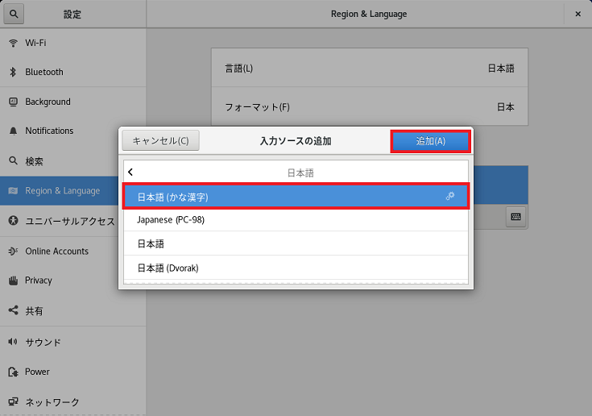

## 1. CentOS8でGUI、CUI起動変更

### 1-1. 起動モードをGUIからCUIへ変更

`root`ユーザーでログインする。端末(コンソール)を開く。  
ディスプレイマネージャーgdm.serviceを無効にすれば良い。  
**確認する**  

    [root@localhost ~]# systemctl list-unit-files

下の方へスクロールする。  

    gdm.service		enabled

となっているはず。確認したら`q`ボタンで入力モードに戻る。  

**無効にする**  

    [root@localhost ~]# sudo systemctl disable gdm.service

※rootユーザーでログインしなければファイルがありませんとなるので注意。  

`exit`と入力し、端末を終了しＰＣの再起動するとCUIで起動できる。  

### 1-2. 起動モードをCUIからGUIへ変更

`root`ユーザーでログインする。

    localhost login:root
    password:<画面には表示されないがパスワード入力>

今度はディスプレイマネージャーgdm.serviceを有効にする。 
**確認する**  

    [root@localhost ~]# systemctl list-unit-files

下の方へスクロールする。  

    gdm.service		disable

となっているはず。確認したら`q`ボタンで入力モードに戻る。  

**有効にする**  

    [root@localhost ~]# sudo systemctl enable gdm.service

**再起動する**  

    [root@localhost ~]# systemctl reboot

※シャットダウン後にパワーオフは、rebootの所を`poweroff`とする。  
再起動後はGUIモードで起動できる。  

 

## 2. ネットワーク確認、接続／切断、設定

CentOS7以降は、NetworkManagerというサービスを使うのが主流の様です。  

### 2-1. ネットワーク接続確認

デフォルトではネットワーク接続はOFFとなっています。  
`nmcli device`と入力しEnterを押す。  

    [username@localhost ~]$ nmcli device
    DEVICE	TYPE		STATE		CONNECTION
    enp0s3	ethernet	切断済み		--

**詳細表示で確認する**  

    [username@localhost ~]$ nmcli device show
    および
    [username@localhost ~]$ nmcli device show enp0s3

### 2-2. ネットワーク接続をする

`nmcli con up デバイス名`を入力しEnterを押す。  

    [username@localhost ~]$ nmcli con up enp0s3
    接続が正常にアクティベートされました(D-Bus アクティブパス: /org/freedesktop/NetworkManager/ActiveConnection/3)

`nmcli device`で確認するとSTATEが接続済みとなります。 

### 2-3. ネットワークを切断する

接続を切るには、`nmcli con down デバイス名`を入力しEnterを押す。  

    [username@localhost ~]$ nmcli con up enp0s3
    接続 'enp0s3' が正常に非アクティブ化されました(D-Bus アクティブパス: /org/freedesktop/NetworkManager/ActiveConnection/3)

### 2-4. OSの起動時に自動でネットワーク接続する設定

    [username@localhost ~]$ nmcli connection modify enp0s3 connection.autoconnect yes

 

## 3. 日本語(かな漢字)入力パッケージのインストール

キーボードで日本語かな漢字入力はCentOSに標準で入っていない様です。  
`日本語(かな漢字)`をインストールするには、まず`root`でログインまたは`su -`でrootに切り替えます。  
※ダウンロード兼インストールするのでインターネットへ接続できるようにしておきます。  

### 3-1. 関連するものを検索する

日本語の入力のパッケージ関連は`kkc`という名前が付いている様です。なので`dnf search kkc`と入力し検索してみます。  

    [root@localhost ~]# dnf search kkc
    CentOS-8 - AppStream                     74 kB/s | 5.9 MB       01:21
    CentOS-8 - Base                         277 kB/s | 4.0 MB       00:14
    CentOS-8 - Extras                       129  B/s | 2.1 kb       00:16
    ============================ 名前 & 概要 一致： kkc ============================
    libkkc-common.noarch : Common data files for libkkc
    libkkc-data.x86_64 : Language model data for libkkc
    ================================ 名前 一致： kkc ===============================
    libkkc.i686 : Japanese Kana Kanji conversion library
    libkkc.x86_64 : Japanese Kana Kanji conversion library
    ibus-kkc.x86_64 : Japanese Kana kanji input method for ibus

`ibus-kkc.x86_64 : Japanese Kana kanji input method for ibus`が対象のパッケージの様です。  

### 3-2. 日本語(かな漢字)をダウンロード兼インストール

`sudo dnf -y install ibus-kkc.x86_64`と入力します。  

    [root@localhost ~]# sudo dnf -y install ibus-kkc.x86_64
    メタデータの期限切れの最終確認： 0:03:07 時間前の 2020年01月19日 20時47分06秒 に
    実施しました。
    依存関係が解決しました。
    ================================================================================
     パッケージ          アーキテクチャー
                                    バージョン                  リポジトリ    サイズ
    ================================================================================
    Installing:
     ibus-kkc           x86_64      1.5.22-9.el8                AppStream       86 k
    依存関係をインストール中：
     libgee             x86_64      0.20.1-1.el8                AppStream      284 k
     libkkc             x86_64      0.3.5-12.el8                AppStream      232 k
     libkkc-common      noarch      0.3.5.12.el8                AppStream       66 k
     libkkc-data        x86_64      1:0.2.7-12.el8              AppStream       14 M
     marisa             x86_64      0.2.4-36.el8                AppStream       86 k
     skkdic             noarch      20170102-4.T1100.el8        AppStream      7.4 M

    トランザクションの概要
    ================================================================================
    インストール　7 パッケージ

    ダウンロードサイズの合計: 22 M
    インストール済みのサイズ: 57 M
    パッケージのダウンロード中です:
    (1/7): ibus-kkc-1.5.22-9.el8.x86_64.rpm          13 kB/s |  86 kB     00:06
    (2/7): libkkc-common-0.3.5-12.el8.noarch.rpm     66 kB/s |	66 kB     00:01
    (3/7): libkkc-0.3.5-12.el8.x86_64.rpm            28 kB/s | 232 kB     00:08
    (4/7): libgee-0.20.1-1.el8.x86_64.rpm            31 kB/s | 284 kB     00:09
    (5/7): marisa-0.2.4-36.el8.x86_64.rpm            84 kB/s |  86 kB     00:01
    (6/7): skkdic-20170102-4.T1100.el8.noarch.rpm    56 kB/s | 7.4 MB     02:15
    (7/7): libkkc-data-0.2.7-12.el8.x86_64.rpm       56 kB/s |  14 MB     04:18
    --------------------------------------------------------------------------------
    合計                                             84 kB/s |  22 MB     04:31
    警告: /var/cache/dnf/AppStream-a520ed22b0a8a736/packages/ibus-kkc-1.5.22-9.el8.x
    86_64.rpm: ヘッダー V3 RSA/SHA256 Signature、鍵 ID xxxxxxxx: NOKEY
    CentOS-8 - AppStream                            1.6 MB/s | 1.6 kB     00:00
    GPG 鍵 0xxxxxxxxx をインポート中:
     Userid		: "CentOS (CentOS Official Signing Key) <security@centos.org>"
     Fingerprint: xxxx xxxx xxxx xxxx xxxx xxxx xxxx xxxx xxxx xxxx
     From		: /etc/pki/rpm-gpg/RPM-GPG-KEY-centosofficial
    鍵のインポートに成功しました
    トランザクションの確認を実行中
    トランザクションの確認に成功しました。
    トランザクションのテストを実行中
    トランザクションのテストに成功しました。
    トランザクションを実行中
    　準備             :                                                        1/1
    　Installing　     : libgee-0.20.1-1.el8.x86_64                             1/7
    　Installing　     : skkdic-20170102-4.T1100.el8.noarch                     2/7
    　Installing　     : marisa-0.2.4-36.el8.x86_64                             3/7
    　scriptletの実行中: marisa-0.2.4-36.el8.x86_64                             3/7
    　Installing　     : libkkc-data-1:0.2.7-12.el8.x86_64                      4/7
    　Installing　     : libkkc-common-0.3.5-12.el8.noarch                      5/7
    　Installing　     : libkkc-0.3.5-12.el8.x86_64                             6/7
    　scriptletの実行中: libkkc-0.3.5-12.el8.x86_64                             6/7
    　Installing　     : ibus-kkc-1.5.22-9.el8.x86_64                           7/7
    　scriptletの実行中: ibus-kkc-1.5.22-9.el8.x86_64                           7/7
    　検証　           : ibus-kkc-1.5.22-9.el8.x86_64                           1/7
    　検証　           : libgee-0.20.1-1.el8.x86_64                             2/7
    　検証　           : libkkc-0.3.5-12.el8.x86_64                             3/7
    　検証　           : libkkc-common-0.3.5-12.el8.noarch                      4/7
    　検証　           : libkkc-data-1:0.2.7-12.el8.x86_64                      5/7
    　検証　           : marisa-0.2.4-36.el8.x86_64                             6/7
    　検証　           : skkdic-20170102-4.T1100.el8.noarch                     7/7

    インストール済み:
    　ibus-kkc-1.5.22-9.el8.x86_64           libgee-0.20.1-1.el8.x86_64
    　libkkc-0.3.5-12.el8.x86_64             libkkc-common-0.3.5-12.el8.noarch
    　libkkc-data-1:0.2.7-12.el8.x86_64      marisa-0.2.4-36.el8.x86_64
    　skkdic-20170102-4.T1100.el8.noarch

    完了しました！

#### 3-3. 日本語(かな漢字)入力の設定、適用

設定を開き左側リストの「Region & Language」をクリックします。  
「日本語」をクリックします
入力ソースの追加ダイアログのリスト内に「日本語(かな漢字)」が追加されているのでクリックし、「追加(A)」ボタンを押します。

  

適用するためにコンピュータの再起動をします。  
これで日本語入力ができるようになり`Windows`キー + `Space`キーで入力を切り替える事ができるようになります。  

 

### 4. アクティビティ(メニュー)から起動

アクティビティにショートカットを作りアクティビティ内に追加する方法です。  

#### 4-1. ショートカットの作成

`.desktop`拡張子で`application`フォルダに作る事によりアクティビティに追加されます。  
まずは、空のdesktopファイルを作りgeditで開きます。geditは標準エディタ。  

    [username@localhost ~]$ gedit ~/.local/share/applications/eclipse.desktop ※現在ログリンしているユーザーだけに適用
    または
    [username@localhost ~]$ gedit /usr/share/applications/eclipse.desktop

#### 4-2. パラメータの書き込み

以下の様な情報を書き込み保存するとアクティビティに追加されそこから起動できるようになる。  

    [Desktop Entry]
    Version=1.0
    Type=Application
    Name=ショートカットファイル名
    Comment=コメント名
    Icon=アイコン指定
    Exec=アプリのPath
    Terminal=false
    Keywords=txt;textなどアクティビティでの検索キーワードでヒットする文字

* * *
