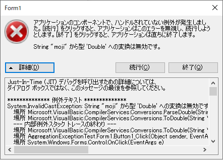

## 0. はじめに

他の言語も様々ですが.NETには`try-catch`で例外をキャッチしていない例外はWindowsフォームアプリケーションなどでは.NETが出す  
以下の様なエラーダイアログを表示します。  

  

このエラーは、ユーザーから見た場合に非常に見ずらいわけの分からない専門用語やエラー内容およびトレース内容などが表示され  
ユーザーはどう対応すれば良いか分かりません。  
そこで.NETにはtry-catchされなかった例外をまとめて自動キャッチしてくれるイベントハンドラーがあります。  
これを集約例外ハンドラーと呼ばれている様です。  
具体的には、Windowsフォームアプリケーション用やWPF用、別スレッド用など複数ある様です。  
システムの内部的例外はこの機能を使うことによりtry-catch文をむやみに使うことを減らせます。

<br />

## 1. Windowsフォームアプリケーション用の使い方

WindowsフォームアプリのUIスレッドでのキャッチ方法  
一般的にはエントリーポイントにイベントハンドラーを作成する様です。  
※VB.NETのWindowsフォームアプリにはエントリーポイントがありませんのでProgram.vbファイルを自作してください。  

```vb
Public Class Program

  <STAThreadAttribute()>
  Shared Sub Main()
    'Windowsフォームアプリケーション用集約例外ハンドラーの定義
    AddHandler System.Windows.Forms.Application.ThreadException, AddressOf Application_ThreadException
    
    Application.EnableVisualStyles()
    Application.SetCompatibleTextRenderingDefault(False)
    Application.Run(New Form1())
  End Sub

  '集約例外イベントプロシージャー
  Shared Sub Application_ThreadException(sender As Object, e As System.Threading.ThreadExceptionEventArgs)
    '例外の内容やトレース内容をLogに出力したい場合やユーザーに画面出力したい場合にここへ書きます。
    
    MessageBox.Show("アプリケーションエラーが起きました。システムを終了します。" & vbCrLf &
            "メッセージ：" & e.Exception.Message & vbCrLf & "スタックトレース：" & e.Exception.StackTrace)
    Debug.Print(e.Exception.Message)
    Debug.Print(e.Exception.StackTrace)
  End Sub
  
End Class
```

<br />

## 2. コンソールアプリケーション、ワーカースレッド用の使い方

コンソールアプリケーションやUIスレッドから呼び出した別スレッドでのキャッチ方法  

```vb
Module Program

  Sub Main(args As String())
    'コンソールアプリケーション、ワーカースレッド用集約例外ハンドラーの定義
    AddHandler System.AppDomain.CurrentDomain.UnhandledException ,AddressOf CurrentDomain_UnhandledException
    
    Console.WriteLine("数字を入力して下さい：")
    Dim i As Integer = Console.ReadLine()
  End Sub

  '集約例外イベントプロシージャー
  Sub CurrentDomain_UnhandledException(sender As Object, e As System.UnhandledExceptionEventArgs)
    '例外の内容やトレース内容をLogに出力したい場合やユーザーに画面出力したい場合にここへ書きます。
    
    Console.WriteLine("メッセージ:" & CType(e.ExceptionObject, Exception).Message)
    Console.WriteLine("スタックトレース：" & CType(e.ExceptionObject, Exception).StackTrace)
    
    Environment.Exit(-1)
  End Sub
  
End Module
```

* * *
