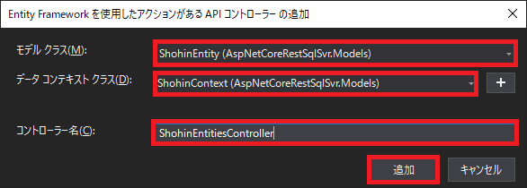

## 0. はじめに

ASP.NET CoreでRESTful APIサーバーのサンプル作成手順です。  
例として、データベースはMicrosoft SQL Serverを使い商品を管理するアプリサーバーを作成します。  

<br />

## 1. プロジェクトの作成

「新しいプロジェクトの作成(N)」の、C#の「ASP.NET Core Web アプリケーション」をクリックし選び「次へ(N)」ボタン  
をクリックし次へ進みます。  
「プロジェクト名(N)」テキストボックスにプロジェクト名、「場所(L)」で保存場所を指定します。  
「作成(C)」ボタンを押すと、新しいASP.NET Core Web アプリケーションの作成ダイアログを開きます。  
プロジェクトのタイプは「API」を選んでもよいのですが余計なサンプル(ToDoアプリ向けのサンプル)が入っているので  
「空」をクリックして選びます。また、右側詳細設定の「HTTPS用の構成(C)」チェックボックスにチェックを入れ「作成」  
ボタンをクリックしプロジェクトを作成します。

  

作成されたソリューション・エクスプローラーのファイル構成は以下の画像の様になるはずです。　　

  

<br />

## 2. 事前準備

### 2-1. NuGetパッケージでEntityFrameworkCoreSqlServerライブラリを追加

はじめに、データベースはMicrosoft SQL Serverを使う事にしますのでNuGetパッケージマネージャーを使いEntityFramework  
CoreSqlServerのライブラリをダウンロードしプロジェクトに追加します。  
開発環境左下のパッケージマネージャーコンソールタブをクリックします。  
無い場合は、メニューバーの「ツール(T)」→「NuGetパッケージマネージャー(N)」→「パッケージマネージャーコンソール(O)」  
をクリックし選ぶと左下に表示されます。  
以下の様に入力しEnterボタンを押します。  

    PM > Install-Package Microsoft.EntityFrameworkCore.SqlServer -Version 3.1.3

  

実行し、ダウンロード兼ライブラリの追加を行うとソリューション・エクスプローラーの「依存関係」→「パッケージに」以下の  
様に追加されます。  

  

### 2-2. フォルダの追加

プロジェクト直下に、ソースファイルを追加しても良いですがグループごとに分けようと思いますのでフォルダを作成します。  
プロジェクト名の上で右クリックしプルダウンメニューを出し「追加(D)」→「新しいフォルダ(D)」を選びます。  

  

フォルダが作成され名前を付けるようにアクティブになりますので「Controllers」と名前を付け決定します。  
同じ様に、もう１つフォルダを作成し「Models」と名前を付け決定します。  

  

<br />

## 3. モデルの作成

商品管理をするためのデータベースと紐付けるオブジェクト(モデル)を作成します。  
また、データベース側でテーブルなどをあらかじめ作成する必要はありません。  
実行時に、コードのメンバ名や属性などからテーブルや型などを決定し自動で作成します。  

### 3-1. 商品クラスの作成

ソリューション・エクスプローラーの「Models」フォルダの上で右クリックしプルダウンメニューを開きます。  
「追加(D)」→「新しい項目(W)...」をクリックし選びます。  

  

新しい項目ダイアログの`クラス`をクリックし選び、「名前(N)：」テキストボックスに**ShohinEntity.cs**と入力し「追加(A)」  
ボタンをクリックし追加します。  

  

データベースの内容と紐づける**ShohinEntity**クラスの中身を以下の様に書きます。  
オブジェクト名と`Column`属性を敢えて別の名前としていますのでオブジェクト名はShohinCodeですがデータベースのカラム名は、  
`ShohinNum`となるはずです。その他詳しくはMicrosoftの公式ドキュメントを見て下さい。  

```csharp
using System;
using System.Collections.Generic;
using System.Linq;
using System.Threading.Tasks;
using System.ComponentModel.DataAnnotations;
using System.ComponentModel.DataAnnotations.Schema;


namespace AspNetCoreRestSqlSvr.Models
{
    public class ShohinEntity
    {
        private int _NumId;
        private short _ShohinCode;
        private string _ShohinName;
        private decimal _EditDate;
        private decimal _EditTime;
        private string _Note;
        
        [Key]
        [DatabaseGenerated(DatabaseGeneratedOption.Identity)]
        [Column("NumId", Order = 0, TypeName = "int")]
        public int NumId
        {
            get { return this._NumId; }
            set { this._NumId = value; }
        }
        
        [Column("ShohinNum", Order = 1, TypeName = "smallint")]
        public short ShohinCode
        {
            get { return this._ShohinCode; }
            set { this._ShohinCode = value; }
        }
        
        [Column("ShohinName", Order = 2, TypeName = "char(50)")]
        public string ShohinName
        {
            get { return this._ShohinName; }
            set { this._ShohinName = value; }
        }
        
        [Required]
        [Range(0, 29991231)]
        [Column("EditDate", Order = 3, TypeName = "decimal(8, 0)")]
        public decimal EditDate
        {
            get { return this._EditDate; }
            set { this._EditDate = value; }
        }
        
        [Required]
        [Range(0, 235959)]
        [Column("EditTime", Order = 4, TypeName = "decimal(6, 0)")]
        public decimal EditTime
        {
            get { return this._EditTime; }
            set { this._EditTime = value; }
        }
        
        [Column("Note", Order = 5, TypeName = "varchar(255)")]
        public string Note
        {
            get { return this._Note; }
            set { this._Note = value; }
        }
    }
}
```

### 3-2. コンテキストの作成

商品クラスを実際に紐づけるためEntityFrameworkのDbContextと関連付けさせます。  
「Models」フォルダに**ShohinContext.cs**ファイルを追加して下さい。  
DbContextを継承しShohinContextメソッドとDbSet型のプロパティを以下の様に追加して下さい。  

```csharp
using System;
using System.Collections.Generic;
using System.Linq;
using System.Threading.Tasks;
using Microsoft.EntityFrameworkCore;

namespace AspNetCoreRestSqlSvr.Models
{
    public class ShohinContext : DbContext
    {
        public ShohinContext(DbContextOptions<ShohinContext> options) : base(options)
        {
        }

        public DbSet<ShohinEntity> ShohinItems { get; set; }
    }
}
```

<br />

## 4. コントローラーの作成

Https通信のGETやPOSTなどのメソッドを扱い、先ほどの商品モデルでデータベースを操作するコントローラーを作成します。  

### 4-1. 商品コントローラーの作成

ソリューション・エクスプローラーの「Controllers」フォルダの上で右クリックしプルダウンメニューを出します。  
「追加(D)」→「コントローラー(T)...」をクリックし選びます。  

  

新規スキャフォールディングアイテムの追加ダイアログで「Entity Frameworkを使用したアクションがあるAPIコントローラー」  
をクリックし選び「追加」ボタンをクリックし選びます。  

  

Entity Frameworkを使用したアクションがあるAPIコントローラーの追加ダイアログの「モデルクラス(M)」コンボボックスで  
**ShohinEntity**を選び、「データコンテキストクラス(D)」コンボボックスで**ShohinContext**を選びます。  
「コントローラー名(C)」はこれら２つを選ぶと自動的に**ShohinEntitiesController**となるはずですが、なっていなければ  
編集し書き直します。  

  

スキャフォールディングと言うモデルからコードのCRUD(ここではGET、POST、PUT、DELETE)を自動生成を実行します。  

  

スキャフォールディングが終わると、Controllersフォルダに**ShohinEntitiesController.cs**ファイルが生成され以下の様な  
コードが作成されます。  

```csharp
using System;
using System.Collections.Generic;
using System.Linq;
using System.Threading.Tasks;
using Microsoft.AspNetCore.Http;
using Microsoft.AspNetCore.Mvc;
using Microsoft.EntityFrameworkCore;
using AspNetCoreRestSqlSvr.Models;

namespace AspNetCoreRestSqlSvr.Controllers
{
    [Route("api/[controller]")]
    [ApiController]
    public class ShohinEntitiesController : ControllerBase
    {
        private readonly ShohinContext _context;

        public ShohinEntitiesController(ShohinContext context)
        {
            _context = context;
        }

        // GET: api/ShohinEntities
        [HttpGet]
        public async Task<ActionResult<IEnumerable<ShohinEntity>>> GetShohinItems()
        {
            return await _context.ShohinItems.ToListAsync();
        }

        // GET: api/ShohinEntities/5
        [HttpGet("{id}")]
        public async Task<ActionResult<ShohinEntity>> GetShohinEntity(int id)
        {
            var shohinEntity = await _context.ShohinItems.FindAsync(id);

            if (shohinEntity == null)
            {
                return NotFound();
            }

            return shohinEntity;
        }

        // PUT: api/ShohinEntities/5
        // オーバーポスト攻撃から保護するには、バインドする特定のプロパティを有効にしてください。
        // 詳細については、https://aka.ms/RazorPagesCRUD を参照してください。
        [HttpPut("{id}")]
        public async Task<IActionResult> PutShohinEntity(int id, ShohinEntity shohinEntity)
        {
            if (id != shohinEntity.NumId)
            {
                return BadRequest();
            }

            _context.Entry(shohinEntity).State = EntityState.Modified;

            try
            {
                await _context.SaveChangesAsync();
            }
            catch (DbUpdateConcurrencyException)
            {
                if (!ShohinEntityExists(id))
                {
                    return NotFound();
                }
                else
                {
                    throw;
                }
            }

            return NoContent();
        }

        // POST: api/ShohinEntities
        // オーバーポスト攻撃から保護するには、バインドする特定のプロパティを有効にしてください。
        // 詳細については、https://aka.ms/RazorPagesCRUD を参照してください。
        [HttpPost]
        public async Task<ActionResult<ShohinEntity>> PostShohinEntity(ShohinEntity shohinEntity)
        {
            _context.ShohinItems.Add(shohinEntity);
            await _context.SaveChangesAsync();

            return CreatedAtAction("GetShohinEntity", new { id = shohinEntity.NumId }, shohinEntity);
        }

        // DELETE: api/ShohinEntities/5
        [HttpDelete("{id}")]
        public async Task<ActionResult<ShohinEntity>> DeleteShohinEntity(int id)
        {
            var shohinEntity = await _context.ShohinItems.FindAsync(id);
            if (shohinEntity == null)
            {
                return NotFound();
            }

            _context.ShohinItems.Remove(shohinEntity);
            await _context.SaveChangesAsync();

            return shohinEntity;
        }

        private bool ShohinEntityExists(int id)
        {
            return _context.ShohinItems.Any(e => e.NumId == id);
        }
    }
}
```

編集日付と編集時刻は、追加や更新をしたその日時とするためPostShohinEntityメソッドとPutShohinEntityメソッドへ以下のコードを  
追加します。  

```csharp
shohinEntity.EditDate = decimal.Parse(String.Format(DateTime.Now.ToString("yyyyMMdd")));
shohinEntity.EditTime = decimal.Parse(String.Format(DateTime.Now.ToString("HHmmss")));
```

また、PostShohinEntityメソッドのCreateAtActionイベントを以下の様に書き換えます。  

```csharp
return CreatedAtAction(nameof(GetShohinEntity), new { id = shohinEntity.NumId }, shohinEntity);
```

最後に、PutShohinEntityメソッドにidをShohinEntity.NumIdに代入しておきます。  
これを入れないと、何故かShohinEntity.NumIdが空となるためBadRequest(401)エラーが返り更新できません。  

```csharp
shohinEntity.NumId = id;
```

完成したコードがこちらです。  

```csharp
using System;
using System.Collections.Generic;
using System.Linq;
using System.Threading.Tasks;
using Microsoft.AspNetCore.Http;
using Microsoft.AspNetCore.Mvc;
using Microsoft.EntityFrameworkCore;
using AspNetCoreRestSqlSvr.Models;

namespace AspNetCoreRestSqlSvr.Controllers
{
    [Route("api/[controller]")]
    [ApiController]
    public class ShohinEntitiesController : ControllerBase
    {
        private readonly ShohinContext _context;

        public ShohinEntitiesController(ShohinContext context)
        {
            _context = context;
        }

        // GET: api/ShohinEntities
        [HttpGet]
        public async Task<ActionResult<IEnumerable<ShohinEntity>>> GetShohinItems()
        {
            return await _context.ShohinItems.ToListAsync();
        }

        // GET: api/ShohinEntities/5
        [HttpGet("{id}")]
        public async Task<ActionResult<ShohinEntity>> GetShohinEntity(int id)
        {
            var shohinEntity = await _context.ShohinItems.FindAsync(id);

            if (shohinEntity == null)
            {
                return NotFound();
            }

            return shohinEntity;
        }

        // PUT: api/ShohinEntities/5
        // オーバーポスト攻撃から保護するには、バインドする特定のプロパティを有効にしてください。
        // 詳細については、https://aka.ms/RazorPagesCRUD を参照してください。
        [HttpPut("{id}")]
        public async Task<IActionResult> PutShohinEntity(int id, ShohinEntity shohinEntity)
        {
        	//追加
            shohinEntity.NumId = id; //Entityの主キーIDへidを入れるべきではないかもしれないが何故か空になっている。
            if (id != shohinEntity.NumId)
            {
                return BadRequest();
            }

			//追加
            shohinEntity.EditDate = decimal.Parse(String.Format(DateTime.Now.ToString("yyyyMMdd")));
            shohinEntity.EditTime = decimal.Parse(String.Format(DateTime.Now.ToString("HHmmss")));
            _context.Entry(shohinEntity).State = EntityState.Modified;

            try
            {
                await _context.SaveChangesAsync();
            }
            catch (DbUpdateConcurrencyException)
            {
                if (!ShohinEntityExists(id))
                {
                    return NotFound();
                }
                else
                {
                    throw;
                }
            }

            return NoContent();
        }

        // POST: api/ShohinEntities
        // オーバーポスト攻撃から保護するには、バインドする特定のプロパティを有効にしてください。
        // 詳細については、https://aka.ms/RazorPagesCRUD を参照してください。
        [HttpPost]
        public async Task<ActionResult<ShohinEntity>> PostShohinEntity(ShohinEntity shohinEntity)
        {
        	//追加
            shohinEntity.EditDate = decimal.Parse(String.Format(DateTime.Now.ToString("yyyyMMdd")));
            shohinEntity.EditTime = decimal.Parse(String.Format(DateTime.Now.ToString("HHmmss")));
            _context.ShohinItems.Add(shohinEntity);
            await _context.SaveChangesAsync();

			//編集
            //return CreatedAtAction("GetShohinEntity", new { id = shohinEntity.NumId }, shohinEntity);
            return CreatedAtAction(nameof(GetShohinEntity), new { id = shohinEntity.NumId }, shohinEntity);
        }

        // DELETE: api/ShohinEntities/5
        [HttpDelete("{id}")]
        public async Task<ActionResult<ShohinEntity>> DeleteShohinEntity(int id)
        {
            var shohinEntity = await _context.ShohinItems.FindAsync(id);
            if (shohinEntity == null)
            {
                return NotFound();
            }

            _context.ShohinItems.Remove(shohinEntity);
            await _context.SaveChangesAsync();

            return shohinEntity;
        }

        private bool ShohinEntityExists(int id)
        {
            return _context.ShohinItems.Any(e => e.NumId == id);
        }
    }
}
```

<br />

## 5. データベースの作成および更新

3.で作成したモデル(コード)からデータベース、テーブルの作成をEntityFrameworkにより自動で作成します。  

### 5-1. Jsonファイルの編集

ソリューション・エクスプローラーのappsettings.jsonファイルにデータベースへ接続する接続文字列(ConnectionStrings)を  
追加します。  
※データベースはExpress Editionのローカルへ接続する事とし、Windows認証とする例です。  

```json
{
  "Logging": {
    "LogLevel": {
      "Default": "Information",
      "Microsoft": "Warning",
      "Microsoft.Hosting.Lifetime": "Information"
    }
  },
  "AllowedHosts": "*",
  "ConnectionStrings": {
    "ShohinContext": "Server=(local)\\SQLEXPRESS;Database=AspNetCoreRestSample;Trusted_Connection=True;MultipleActiveResultSets=true"
  }
}
```

### 5-2. NuGetパッケージマネージャーでデータベースの作成

ShohinEntityクラス、ShohinContextクラスなどをもとにMicrosoft SQL Serverのデータベースを自動で作成します。  
開発環境左下のパッケージマネージャーコンソールタブで`Add-Migration InitialCreate`と入力しEnterを押して下さい。  

    PM > Add-Migration InitialCreate
    Build started...
    Build succeeded.
    The EF Core tools version '3.1.1' is older than that of the runtime '3.1.3'. 
    	Update the tools for the latest features and bug fixes.
    To undo this action, use Remove-Migration.

  

    The EF Core tools version '3.1.1' is older than that of the runtime '3.1.3'. 
    	Update the tools for the latest features and bug fixes.
    訳：EF Coreツールのバージョン「3.1.1」は、ランタイム「3.1.3」のバージョンよりも古いです。
    	最新の機能とバグ修正のためにツールを更新します。

  

これでデータベースが作成されましたのでMicrosoft SQL Server Management Studioなどで確認してみて下さい。  
データベースのみの作成でテーブルはまだ作成されていないはずですのでテーブルは後に行います。
また、NuGetパッケージマネージャーに黄色背景の警告メッセージが出ています。  
これは2-1.のNugetでパッケージを導入したMicrosoft.EntityFramework.Core.SQLServerと今回Add-Migration InitialCreateで  
自動的に導入されるMicrosoft.EntityFramework.Core.ToolsなどのPackageのバージョンに差があるのでこの様なメッセージが出  
ています。他のパッケージのバージョンアップを行っていきます。  

### 5-3. NuGetパッケージのバージョンアップ

メニューバーの「ツール(T)」→「NuGetパッケージマネージャー(N)」→「ソリューションのNuGetパッケージの管理(N)...」でウィ  
ンドウを開きます。  
「インストール済み」タブをクリックし、Microsoft.EntityFrameworkCore.Sqlite、Microsoft.EntityFrameworkCore.Tools、  
を3.1.3に、Microsoft.VisualStudio.Web.CodeGeneration.Designを3.1.2にバージョンアップしていきます。  
右側のプロジェクトリストのチェックボックスをクリックしONにします。「バージョン」コンボボックスを3.1.3および3.1.2に変更  
し「インストール」ボタンをクリックします。  

  

変更のプレビュー画面が出ますので確認し良ければ、「OK」ボタンをクリックします。  

  

ライセンスの同意画面が出ますので「ライセンスの表示」リンクなどをクリックし確認し良ければ、「同意する」ボタンをクリック  
しバージョンアップを行います。  

  

ソリューションエクスプローラーなどでパッケージが3.1.3および3.1.2になっている事を確認してください。  

### 5-4. データベースのUpdate(テーブルの作成)

次に、NuGetパッケージマネージャーで`Update-Database`と入力しEnterを押しテーブルを作成します。  

    PM > Update-Database
    Build started...
    Build succeeded.
    Done.

また、すでにテーブルが存在しその上でUpdate-Databaseを行った場合は以下の様なエラーが出ます。  
この様な場合は、基本的にはテーブルを1度Microsoft SQL Server Management Studioなどで削除を行った後もう一度実行します。  

  

<br />

## 6. ASP.NET Core Web APIの実行

これで一通りの作業が完了しましたので実行をしてみます。  
ツールバーの実行ボタン「▶ IIS Express」右の「▼」ボタンをクリックしプルダウンメニューを出します。  
その中の「プロジェクト名」ここではAspNetCoreRestSqlSvrを選びます。  

  

その上で、「▶」実行ボタンを押して実行してください。  

初回実行時には、[ASP.NET 自己署名証明書について](AspNetSsl)のはじめにに記載されているような証明書の作成確認画面が出ます  
ので「はい」を押し許可して下さい。  

その後、ブラウザーとWindowsコンソール画面が出ます。  
コントローラークラスで`[Route("api/[controller]")]`としていますので、ブラウザーで`https://localhost:5001/api/ShohinEntities`  
としてGETメソッドなどを試してJson形式で情報が読み取れるかなど確認してみて下さい。  

ブラウザーではなく別の自作のクライアントアプリで操作したい場合でブラウザーを起動したくない場合はプロジェクトのプロパティ  
の左側「デバッグ」タブをクリックし「ブラウザーの起動」チェックボックスをOFFにしてみて下さい。  

* * *
