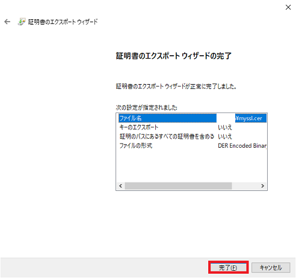

## 0. はじめに

Microsoft Visual StudioでASP.NET MVCやWebAPIなどのプロジェクトを作成しHTTPS通信を行う場合、Internet Information  
Services(IIS) Expressでデバッグや開発向けのための自己署名証明書の発行を促すダイアログ確認メッセージが表示されます。  

  

  

「はい」を押すと証明書が発行されます。  
※この自己署名証明書は1度発行すると次回からは発行せず別のプロジェクトもこの証明書を使い回します。  
※また、一定時間内に「はい」ボタンを押さないと以下の様なタイムアウトが発生します。  

  

 

## 1. ASP.NETの証明書ストアの格納場所

作成された証明書ストアの格納場所はWindowsのレジストリが管理しておりどこにどのように管理されているのか分かりません。  
しかし、Windowsにどんな公開鍵証明書が登録されているのか見る事ができます。  
証明書ストアとは、鍵や公開鍵証明書などのオブジェクトを１つのパッケージにしたものです。  

### 1-1. 証明書の確認方法

キーボードの「Windowsキー」+ 「Rキー」で「ファイル名を指定して実行」ダイアログを開きます。  
「名前(O):」テキストボックスに`certmgr.msc`と入力し「OK」ボタンをクリックします。  
以下の様な証明書の一覧が表示されます。  
※証明書の有効期限は作成された日付の1年や5年などの年単位となる様です。  

  

この一覧が`現在のユーザー`である事に注目してください。現在のユーザーではなく当初ファイル名を指定して実行で`certlm.msc`  
と入力して表示された証明書の一覧には**ローカルコンピューター**となっており「信頼されたルート証明機関」には該当と思われ  
るものは無く「個人」の方に１つIIS Express Development Certificateがありました。  
しかし、ASP.NET MVCやWebAPIのプロジェクトによってはこの証明書では無い場合があります。  
ASP.NET Core Web APIプロジェクトでは、現在のユーザーのみで使う証明書として発行されている側に該当のものがありました。  
つまり、クライアントアプリ側での公開鍵証明書を登録する必要がある場合、ローカルコンピューターの方のlocalhost証明書では  
違う証明書なので検証でミスマッチが起きますので注意して下さい。  
ASP.NET Core WebAPIでは、上の画像３つのうちの一番上`ASP.NET Core HTTPS development certificate`です。  

また、これらの証明書ストアのレジストリは以下にあります。  

-   **ローカル コンピューターの証明書ストアのレジストリ**  
    HKEY_LOCAL_MACHINEのルート  

-   **現在のユーザー証明書ストアのレジストリ**  
    HKEY_CURRENT_USER のルート  

 

## 2. 証明書ストアから公開鍵証明書のエクスポート

Microsoft Windowsの証明書ストアから公開鍵証明書をファイル(.cer)として出力したい場合の手順です。  
例えば、「localhost」を右クリックしプルダウンメニューの「すべてのタスク(K)」→「エクスポート(E)」をクリックし、「証明書の  
エクスポートウィザード」ダイアログを開きます。  

  

「次へ(N)」ボタンをクリックし次へ進みます。  

  

エクスポートするファイル形式は「DER encoded binary X.509(.CER)(D)」ラジオボタンをクリックし選び、  
「次へ(N)」ボタンをクリックし次へ進みます。  

  

ファイルを出力するフォルダPathを指定します。「参照」ボタンを押してフォルダとファイル名を指定するか、  
直接「ファイル名(F):」テキストボックスへPathを入力します。  
良ければ「次へ(N)」ボタンをクリックし次へ進みます。  

  

確認ダイアログを確認し良ければ「完了(F)」ボタンをクリックすると`ファイル名.cer`として証明書が出力されます。  
※フォルダPathを指定せずファイル名のみの場合は`C:\Windows\System32`へファイルが出力されているはずです。  

  

* * *
