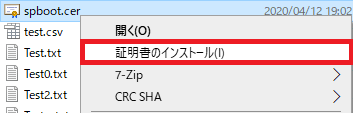
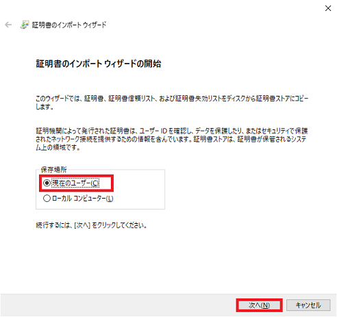
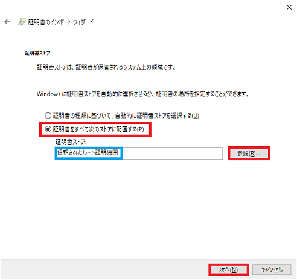
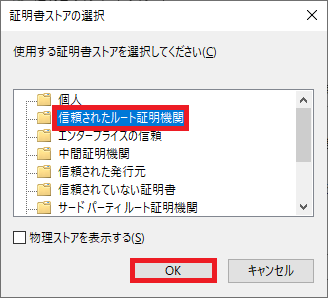
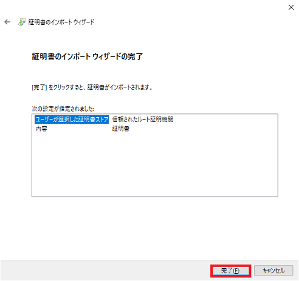
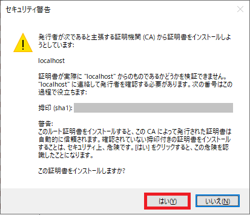
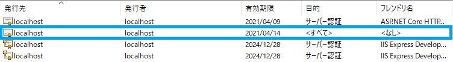

## 0. はじめに

HTTPS通信でASP.NETの開発デバッグ用に配布される証明書以外の証明書でサーバーWebアプリケーションへ.NETのクライアント  
アプリケーションから通信する際には.NETのセキュリティに引っかかります。  

**`http://からhttps://への変更とポート番号変更のみで発生するエラー`**  
※.NET Framework4.5以降のHttpClient、HttpRequestMessageクラスを使った場合のメッセージです。  

    ユーザーが処理していない例外
    System.Net.Http.HttpRequestException: 'The SSL connection could not be established, see inner exception.'
    System.Net.Http.HttpRequestException： 'SSL接続を確立できませんでした。内部例外を参照してください。'
    内部例外
    AuthenticationException: The remote certificate is invalid according to the validation procedure.
    AuthenticationException：検証手順によると、リモート証明書は無効です。

サーバーが保持するキーストア(.p12など)からエクスポートした公開鍵証明書(.cer)を、Windowsの証明書ストアへ登録する必要  
があります。  
※ASP.NETの開発デバッグ用に配布される証明書を使う場合は、デバッグ時に証明書の登録を求められ「はい」を押しますので必要  
無い場合があります。(サーバー、クライアントアプリどちらもlocalhostの場合など)  

 

## 1. Windows証明書ストアへ公開鍵証明書を登録

あらかじめ、キーストア(.p12など)から公開鍵証明書(.cer)をエクスポートして置いて下さい。  
公開鍵証明書ファイルを右クリックし、プルダウンメニューから「証明書のインストール(I)」を選びクリックしダイアログを開きます。  

  

証明書のインポートウイザードの開始で保存場所を「現在のユーザー(C)」ラジオボックスをクリックし選びます。  
「次へ(N)」ボタンをクリックし次へ進みます。  

  

証明書ストアで、「証明書をすべて次のストアに配置する(P)」ラジオボタンをクリックし選びます。  
「参照(R)」ボタンを押し証明書ストアの選択ダイアログを開きます。

  

「信頼されたルート証明機関」をクリックし選び、「OK」ボタンをクリックします。  

  

「次へ(N)」ボタンをクリックし次へ進みます。  
※「証明書の種類に基づいて、自動的に証明書ストアを選択する(U)」を選択した場合は、「中間証明機関」へも入る様です。  

証明書のインポートウィザードの完了が表示されます。良ければ「完了(F)」ボタンをクリックし完了させます。

  

公開鍵証明書を登録するための確認メッセージが出ます。「はい(Y)」ボタンをクリックし登録して下さい。  

  

Windows証明書ストアを開き「信頼されたルート証明機関」へ登録できているか確認して見て下さい。  
※Windows証明書ストアの開き方は、キーボードの「Windowsキー」+ 「Rキー」で「ファイル名を指定して実行」ダイアログを開きます。  
「名前(O):」テキストボックスに`certmgr.msc`と入力し「OK」ボタンをクリックし開きます。  

  

* * *
