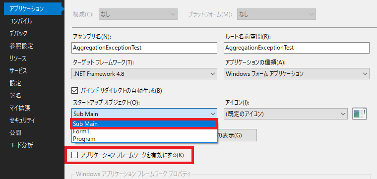

## 0. はじめに

C#では、エントリーポイント(プログラムの開始)を含むメソッドの中身をプロジェクトの`Program.cs`ファイルのMainメソッドで  
変更できます。  
しかし、WindowsフォームアプリのVB.NETではProgram.vbファイルが無いので自作するしかない様です。  

<br />

## 1. Program.vbファイルの作成

1-1. ソリューションエクスプローラーのプロジェクト名を右クリックしプルダウンメニューの「追加(D)」→「新しい項目(W)」で  
「新しい項目の追加」ダイアログを開きます。  

1-2. クラスまたはモジュールを選び「名前:(N)」テキストボックスに`Program.vb`と変更し「追加(A)」ボタンをクリックし  
プロジェクトに追加する。  

<br />

## 2. Program.vbファイルの編集

2-1. 作成されたファイルを以下の様に編集します。Mainメソッドを作成します。  

-   **クラスを作成した場合**  

```vb
Public Class Program
    <STAThreadAttribute()>
    Shared Sub Main()
    
    End Sub
End Class
```

-   **モジュールを作成した場合**  

```vb
Module Program
    <STAThread()>
    Sub Main()
        
    End Sub
End Module
```

<br />

## 3. エントリーポイントの設定

ProgramファイルのMainメソッドをエントリーポイント(プログラムの開始)としたい場合の設定を行います。  

3-1. ソリューションエクスプローラーのプロジェクト名を右クリックしプルダウンメニューの「プロパティ(R)」をクリックします。  
作業領域のタブにプロパティが開きます。

3-2. 左リスト内の「アプリケーション」を選び「アプリケーションフレームワークを有効にする(K)」のチェックボックスを外します。  
その後、「スタートアップオブジェクト(O):」コンボボックスをクリックすると「Sub Main」が表示されるのでクリックし選択します。  

  

これでProgramファイルのMainメソッドからプログラムが開始されますが中身が空ですので何もおきません。  
そこでWindowsフォームアプリでのデフォルトのフォームを表示するプログラムを追加してみます。  

<br />

## 4. Windowsフォームアプリケーションの場合

Mainメソッド内に以下の様にプログラムを追加します。  
`Application.EnableVisualStyles()`は、Windows10では余り変わりはありませんがWindows7、XPなどではボタンの角に丸みを付け
たりボタンの背景も灰色のベタ塗りではなく下半分を少し濃い灰色にしたりとヴィジュアルスタイルにするものです。  
`System.Windows.Forms.Application.Run()`メソッドでWindowsフォームアプリケーションを開始します。  

-   **クラスを作成した場合**  

```vb
Public Class Program
    <STAThreadAttribute()>
    Shared Sub Main()
		Application.EnableVisualStyles()
		Application.SetCompatibleTextRenderingDefault(False)
		Application.Run(New Form1())
    End Sub
End Class
```

-   **モジュールを作成した場合**  

```vb
Module Program
    <STAThread()>
    Sub Main()
        Application.EnableVisualStyles()
		Application.SetCompatibleTextRenderingDefault(False)
		Application.Run(New Form1())
    End Sub
End Module
```

* * *
