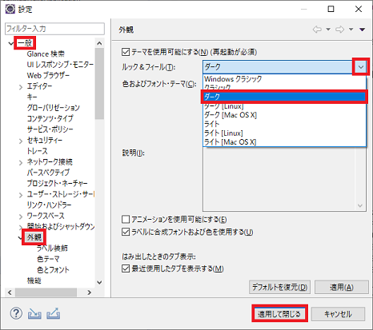
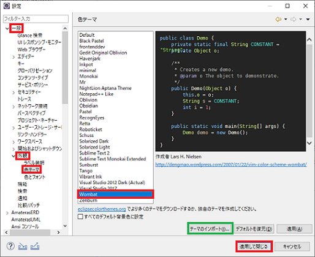
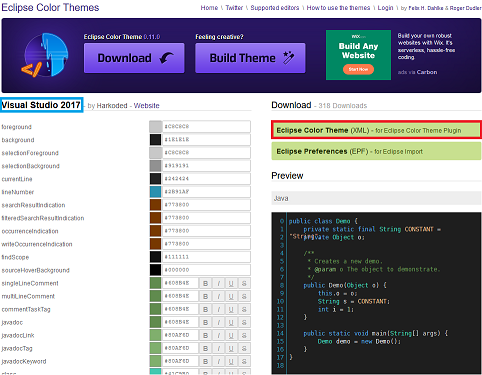

## 1. 外観を変更する

    1-1. メニューバーの「ウィンドウ(W)」→「設定(P)」を選択。
    1-2. 左側のツリーリストの「一般」→「外観」をクリック。
    1-3. 「ルック＆フィール(T)」コンボボックスのプルダウンボタンを押し目的のテーマを選ぶ。

 

    1-4. 「適応して閉じる」ボタンをクリックし適用する。

 

## 2. テーマを変更する

    2-1. メニューバーの「ウィンドウ(W)」→「設定(P)」を選択
    2-2. 左側のツリーリストの「一般」→「外観」→「色テーマ」をクリック。
    2-3. リストボックスの中から目的のテーマを選ぶ。
    　　ここでは「Wombat」を選びました。
    2-4. 「適応して閉じる」ボタンをクリックし適用する。

 

 

## 3. テーマのインポート

    3-1. <Eclipse Color Themes>のサイトで目的の「.xml」ファイルをダウンロードし、「テーマの
    　　インポート(I)」ボタンをクリック。
    3-2. 目的の.xmlファイルを選び「開く(O)」ボタンをクリックし開く。
    3-3. 色テーマのリストボックスに目的のリストが追加されるのでそれを選び、「適用して閉じる」
    　　ボタンをクリックし適用する。

 

[該当サイト：Eclipse Color Themes](http://www.eclipsecolorthemes.org/)

* * *
