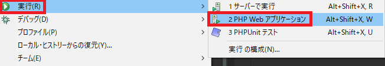

## 0. はじめに

Eclipseが入っていないなら`Eclipse PHP Development Tools`やPleiadesをダウンロードし.zipファイルを展開し使う。  
しかし今回は、JavaなどでEclipseが入っている場合の使いで導入する手順のメモ。  

<br />

## 1. Eclipse PHP Development Toolsのインストール

EclipseでPHPのプロジェクトを作成するためにプラグインをインストールします。  

1-1. メニューバーの「ヘルプ(H)」→「新規ソフトウェアのインストール」を選びダイアログを開く。  
「作業対象(W)：」のテキストボックスに` http://download.eclipse.org/tools/pdt/updates/latest`と入力し  
Enterキーを押す。  

1-2. PHP開発ツール関連がリストに表示されるのですべてのチェックボックスにチェックし「次へ(N)」ボタンを押す。  


1-3. インストールの詳細が表示されますのでそのまま「次へ(N)」ボタンを押す。  


1-4. ライセンスのレビューが表示され良ければ「使用条件の条項に同意します(A)」ラジオボタンをクリックし、  
「完了(F)」ボタンを押しインストールを開始します。  
※Eclipseの画面右下に進行状況が表示されます。完了するとEclipseの再起動が促されるので再起動します。  


<br />

## 2. Apache HTTP Server、PHPのインストールと設定

[Apache + PHP個別でPHPの環境構築](/Contents/Php/Windows/PhpWinSet)または
[Xampp一括でPHPの環境構築](/Contents/Php/Xampp/XamppPhpSet)を参考にインストールと設定をして置く。  

少なくともドキュメントルートは以下の様に設定する。  

    #DocumentRoot "/xampp/htdocs" #変更前
    #<Directory "/xampp/htdocs"> #変更前
    DocumentRoot "C:/Workspace/Php/"
    <Directory "C:/Workspace/Php/">
      Options Indexes FollowSymLinks Includes ExecCGI
      AllowOverride All
      Require all granted
    </Directory>

これで`https://localhost:80/Eclipseプロジェクト名/xxx.php`の様に扱える。  
※JavaとワークスペースPathが違う場合はEclipseのデフォルト設定となるので別途PHP用に設定するか、Javaと同じPathを  
ドキュメントルートにする。  

<br />

## 3. EclipseでPHPの配置先設定

3-1. メニューバーの「ウィンドウ(W)」→「設定(P)」でダイアログを開き左のリスト内の「PHP」→「インストール済みのPHP」  
を選び「追加(A)」ボタンを押す。  


3-2. 新規PHP実行可能ファイル画面の「名前(N)」は何でも良いが今回は`PhpDefault`とします。  
「実行可能ファイル・パス(E)：」は、`php.exe`がある場所を指定しますので`C:\Program Files\php\php.exe`や  
`C:\xampp\php\php.exe`などphp.exeを配置した場所を入力または「参照(B)」で指定します。  
「PHP iniファイル(オプション)(I)：」や「SAPIタイプ(S)」、「バージョン」は、「実行可能ファイル・パス(E)：」を指定  
すると自動で入力されます。  


入力されない場合「PHP iniファイル(オプション)(I)：」は、`php.ini`がある場所を指定します。  
よって、`C:\Program Files\php\php.ini`や`C:\xampp\php\php.ini`など自身の環境に合わせて指定します。  
「完了(F)」のボタンを押し完了します。  
以下の画像のように「実行可能ファイル(P)：」の一覧に追加されます。「適用して閉じる」ボタンを押し適用します。  


<br />

## 4. EclipseでPHPプロジェクトを作りPHPファイルを作る。

4-1. メニューバーの「ファイル(F)」→「新規(N)」→「PHPプロジェクト」を選び「PHPプロジェクトの作成」ダイアログを開く。 


新規にPHPプロジェクトなどのPHP関連が表示しない場合はEclipse右上のパースペクティブをPHPへ切り替えれば表示されるはず。  


4-3. 「プロジェクト名(N)」テキストボックスにプロジェクト名を入力し「完了(F)」ボタンを押し完了する。  


4-4. プロジェクト・エクスプローラーの対象プロジェクトを選択し、メニューバーの「ファイル(F)」→「新規(N)」→「PHPファイル」  
を選び「新規 PHPファイル」ダイアログを開く。  
「ファイル名(M)：」テキストボックスにファイル名を入力し「完了(F)」ボタンを押し完了する。  


4-5. 作成したPHPファイルを以下の様に変更し保存する。  

```php
<?php
    echo "Hello World";
?>
```

<br />

## 5. PHP Webアプリケーションで実行する

通常はこちらを使う様だ。  

5-1. プロジェクト名を右クリックし、「実行(R)」→「2 PHP Webアプリケーション」をクリックする。  



5-2. しかし、以下の様なエラーが出る。サーバーの設定や実行の設定をする必要がある。  


5-3. メニューバーの「ウィンドウ(W)」→「設定(P)」でダイアログを開き左のリスト内の「PHP」→「サーバー」  
を選び一覧の「Default PHP Web Server」を選び「編集」ボタンをクリックする。  


5-4. 「サーバー」タブの「ドキュメントルート：」テキストボックス内にApache HTTP Serverのドキュメントルート  
を入力します。今回はhttpd.confで設定されている`C:\Workspace\Php`とします。  
「完了(F)」ボタンをクリックし完了させます。  


5-5. 続いて実行の構成を設定します。プロジェクト名を右クリックし、「実行(R)」→「実行の構成(N)」をクリックする。  


5-6. 左リスト内の「PHP Web アプリケーション」を選び、ダイアログ左上の新規構成のアイコンボタンをクリックする。  
左リストに新規構成が表示され編集ができる。構成の名前は何でも良いが「名前(N)：」テキストボックスに`RunPhpProject1`と入力し、  
「ファイル」テキストボックスに起動直後の表示ページ、今回は`/PhpProject1/Sample1.php`を指定します。  
これで実行の設定は完了したので「実行(R)」ボタンを押し実行してみます。設定後はEclipseの実行ボタンアイコンで実行できます。  
※Apache HTTP Serverも同時に起動できる設定があれば良いが今の所分からないので事前にApacheも起動しておいてください。  
`https://localhost:80/Eclipseプロジェクト名/xxx.php`で**Hello World**が表示出来るはずです。  


※しかし、Eclipseの実行ボタンからでは実行できるが「5-1.」の様に「実行(R)」→「2 PHP Webアプリケーション」からでは同じ様な  
エラーが出てしまう。これについては良く分からない。  

<br />

## 6. ビルトイン・サーバーで実行する

6-1. プロジェクト名を右クリックし、「実行(R)」→「1 サーバーで実行」をクリックする。  


6-2. 使用するサーバーの選択で一覧のPHPビルトイン・サーバーが選ばれている事を確認し「サーバー名(M)：」に`英数字を使って`名前を決めます。  
**※ここがローカルホストのPHPビルトイン・サーバー**のまま、つまり日本語の名前だと次回Eclipse起動時にエラーが発生し実行が出来なくなる。  
また、他のプロジェクトを作成する事もできなくなるので注意。[EclipseでPHPプロジェクトの作成ができなくなった時の手順](/Contents/Eclipse/Php/EclipsePhpError)
今回は`DefBuiltinServer`とします。サーバー名に入力したら「次へ(N)」ボタンをクリックする。  


6-3. 実行可能なPHPを選択するため「インストール済みのPHP(I)」ボタンをクリックする。  


6-4. インストール済みのPHPの一覧で「PhpDefault」を選択し「適用して閉じる」ボタンをクリックする。  


6-5. 「実行可能ファイル(P)」コンボボックスにPhpDefaultが入りますので「次へ(N)」ボタンをクリックする。  


6-6. 「構成済み(C)：」の一覧にプロジェクト`Project1`が追加されている事を確認し「完了(F)」ボタンを押し完了する。  


※プロジェクト・エクスプローラーに`Servers`が追加されEclipse下方のサーバータブなどにも追加される。  
「6-1.」の手順でサーバーで実行をクリックすると起動できる。  
`http://localhost:8491/PhpProject1/`で表示するが`http://localhost:80/PhpProject1/Sample1.php`などと変えるか上記の  
「5-3.や5-4.」を参考にベースURLやドキュメントルートを変更し対応する。  
※また、ポートが8491等となっているのでビルトイン・サーバーというものは違う使い方をするのかもしれないがどちらでも実行できる。  

* * *
