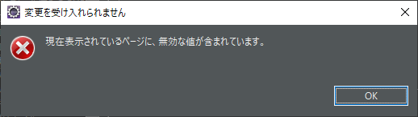
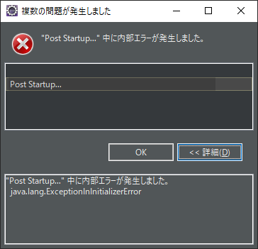
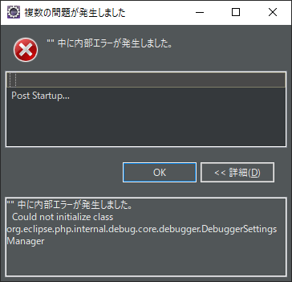

### 0. はじめに

※ある日突然、急にPHPプロジェクトが作成できなくなった。  
メニューのプロジェクトの作成ボタンを押してもダイアログが表示しない。  
裏で何か実行している気配があるがブラックボックス。  

~~関連があるか分からないがPHP設定関連のサーバーやデバッグ項目をクリックすると以下の様なメッセージが出る。~~  
PHPサーバーの設定でビルトイン・サーバーの名前を日本語で`ローカルホストのビルトイン・サーバー`にしたからの様だ。  
※PHP専用のワークスペースを作り実行の仕方がまだ良くわかっていないためか、ビルトイン・サーバーという開発向けのものだった。  
また、Javaとワークスペースを共有していた方はビルトイン・サーバーではなく`PHP Webページ`で実行していたので何が原因か  
分からない。  

~~また、Javaと同じワークスペースでPHPのプロジェクトも作成したためかEclipse起動時に以下の様なエラーメッセージが出る。~~  
PHP専用のワークスペースで作っても出たのでEclipse本体でJavaを使っている関連とみられる。  

また、メッセージが以下に変わることもある。PHP関連と思われる。  

コマンドプロンプトで`eclise.exe -clean`を実行しEclipseのキャッシュのクリーンアップ中をして開くと良いとの事だが変わらない。  
Eclipseの更新やPHP Toolsの更新を試みるが更新できるものはありませんやすでにインストールされていますなので更新できない。 

### 1. 症状・原因

よって、これらの３つのエラーメッセージとPHPプロジェクトが作成できない点は同時に起こり原因も複数存在する様だ。  
1つは、実行にビルトイン・サーバーを作成しそれが日本語の名前で作成すると起こる。  
2つ目は良くわからないがEclipse PHP Development Toolsの更新やEclipse本体の更新を行ったため何かのバージョンの不一致が  
起こってしまったのか何か不都合な事が起こっている様だ。  
PHP設定のサーバーやデバッグにデフォルト値を入れて戻そうとしてもエラーが出るため直らない。  

### 2. 解決手段

1.  ワークスペースを作り直してPHP関連を再設定する。  

* * *
