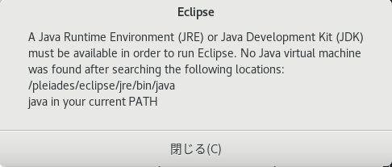
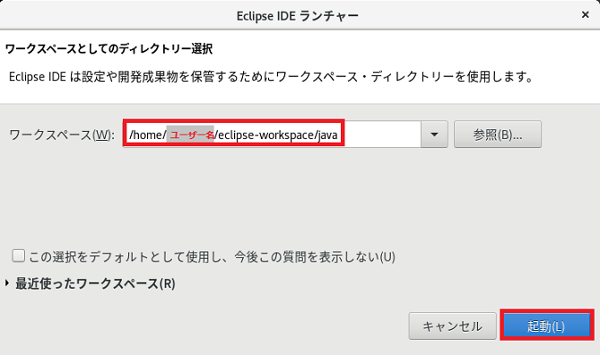

## 0. はじめに

基本的には、Windows版と同じでありGUIで操作すれば良いがLinuxコマンドでの方法をメモしていく。  

<br />

## 1. Eclipse IDE for Enterprise Java Developersのダウンロードと展開

### 1-1. Eclipse IDE for Enterprise Java Developersのダウンロード

まずは、インターネットに接続できるようにしておき以下を実行しダウンロードします。 
※ダウンロードするディレクトリは`~/ダウンロード`としますので`cd ダウンロード`へ移動しておいて下さい。  

    [username@localhost ダウンロード]$ curl -OL https://ftp.jaist.ac.jp/pub/eclipse/
    technology/epp/downloads/release/2019-12/R/eclipse-jee-2019-12-R-linux-gtk-x86_6
    4.tar.gz
      % Total    % Received % Xferd  Average Speed   Time    Time     Time  Current
                                     Dload  Upload   Total   Spent    Left  Speed
    100   402  100   402    0     0     70      0  0:00:05  0:00:05 --:--:--    91
    100  347M  100  347M    0     0   769k      0  0:07:42  0:07:42 --:--:--  663k

### 1-2. Eclipse IDE for Enterprise Java Developersの展開

ダウンロードされた.tar.gzを展開する前に展開先のディレクトリと権限を与えるためにrootでログインします。 
その後、`cd /`でルートディレクトリに移動し`makdir`で展開先ディレクトリpleiadesを作ります。  
また、pleiadesは一般ユーザーでは書き込み権限が無いので`chmod`で書き込み権限も与えます。  
権限まで与えたら一般ユーザーに戻しておきます。  

    [root@localhost ~]# cd /
    [root@localhost /]# mkdir pleiades
    [root@localhost /]# chmod 777 pleiades/

準備ができたので`/preiades`ディレクトリに展開します。  

    [username@localhost ダウンロード]$ tar -xzvf eclipse-jee-2019-12-R-linux-gtk-x86_
    64.tar.gz -C /pleiades

<br />

## 2. Pleiades日本語プラグインのダウンロードと展開、日本語プラグインの適用

### 2-1. Eclipse日本語化プラグインのダウンロード

Eclipseを日本語化するPleiadesという日本語化パッチをダウンロードします。  

    [username@localhost ダウンロード]$ curl -OL https://ftp.jaist.ac.jp/pub/mergedoc
    /pleiades/build/stable/pleiades.zip
      % Total    % Received % Xferd  Average Speed   Time    Time     Time  Current
                                     Dload  Upload   Total   Spent    Left  Speed
    100   349  100   349    0     0     63      0  0:00:05  0:00:05 --:--:--    74
    100 8386k  100 8386k    0     0   630k      0  0:00:13  0:00:13 --:--:-- 1881k

### 2-2. Eclipse日本語化プラグインの展開

ダウンロードされた.zipファイルを展開します。展開先は`/pleiades直下`に展開します。  
※eclipse本体用(/pleiades/eclipse/plugins)にもpluginsディレクトリがあるので迷わないようにして下さい。  
eclipse用のpluginsディレクトリと同梱したり/pleiades/eclipse/plugins/pluginsとなると迷いやすいかと思いました。  

    [username@localhost ダウンロード]$ unzip pleiades.zip -d /pleiades

### 2-3. Eclipseを日本語化するための設定

eclipse.iniファイルを編集し日本語化のパッチを適用するための設定をします。  
eclipse.iniファイルを開き一番下の行へ以下を追加します。  
※上の方へ追加すると適用されませんでした。どこより下へ書かないといけないか分からないので一番下へ。

```ini
-Xverify:none
-javaagent:/pleiades/plugins/jp.sourceforge.mergedoc.pleiades/pleiades.jar
```

### 2-4. Eclipseのクリーンアップ起動

Eclipseに日本語化をする設定をしましたので適用するためにクリーンアップという起動をしてみます。  

    [username@localhost ~]$ /pleiades/eclipse/eclipse -clean

すると、以下の様なダイアログメッセージが出て起動できません。  
これは、EclipseはJavaで動くためインストールされていなければならないからです。  
※インストールされていれば起動できるが、ここではEclipse専用のJavaを使う事にします。  
「閉じる(C)」ボタンをクリックして終了してください。  

  

    訳：Eclipseを実行するには、JREまたはJDKが利用可能でなければなりません。  
    次の場所を検索した後、Java仮想マシンは見つかりませんでした。  
    /pleiades/eclipse/jre/bin/java
    現在のパスにあるjava

<br />

### 3. Eclipse実行用およびJavaアプリ作成用のJDKをダウンロードし設定する

Eclipse実行用にもJavaが必要ですがJavaアプリを作成、実行する方にも必要でこれも別に用意する事にします。  
別に用意しますがVersionはとりあえず同じものを使います。  

#### 3-1. Java Development Kit(JDK)のダウンロード

今回はAdoptOpenJDKの11.0.6をダウンロードしました。  

    [username@localhost ダウンロード]$ curl -OL https://github.com/AdoptOpenJDK/open
    jdk11-binaries/releases/download/jdk-11.0.6+10/OpenJDK11U-jdk_x64_linux_hotspot_
    11.0.6.10.tar.gz
      % Total    % Received % Xferd  Average Speed   Time    Time     Time  Current
                                     Dload  Upload   Total   Spent    Left  Speed
    100   640  100   640    0     0    110      0 --:--:--  0:00:05 --:--:--   162
    100  188M  100  188M    0     0  78273      0  0:41:59  0:41:59 --:--:-- 38596

#### 3-2. Eclipseを実行するJavaを指定

Eclipse専用としてJDKを指定するのでeclipseフォルダ下のeclipse.iniファイル(構成設定)内に以下を追加します。  
※-vmargsの行より上に書く必要があります。  
-startupや–launcher.libraryなどがあるが、ここでは、一番上の先頭行に以下を追加します。

    -vm
    jdk-11.0.6+10/bin/java

<br />

### 4. Eclipseの起動と作業ディレクトリ(workspace)の指定

#### 4-1. Eclipseの起動

設定が済んだら先ほどの日本語化の適用とともにクリーンアップ起動`/pleiades/eclipse/eclipse -clean`を  
してみましょう。いかの様なロゴの下にクリーンアップ起動しているメッセージが出ます。  

  

#### 4-2. 作業ディレクトリの指定

作業ディレクトリ(workspace)はEclipseでのプロジェクトファイルなどを保存する場所を指定します。  
今回は、eclipse-workspace下に`java`ディレクトリを作成し`/home/username/eclipse-workspace/java`とします。  
良ければ「起動(L)」ボタンをクリックし起動します。  

  

<br />

### 5. Java Development Kit、Apache Tomcatの配置と使えるように設定

#### 5-1. Java Development Kit(JDK)の展開

Eclipse用のJavaは展開しましたがJavaアプリを作成する方のJavaを展開します。  

#### 5-2. Apache Tomcatのダウンロード

    [username@localhost ダウンロード]$ curl -OL https://ftp.yz.yamagata-u.ac.jp/pub/
    network/apache/tomcat/tomcat-9/v9.0.30/bin/apache-tomcat-9.0.30.tar.gz
      % Total    % Received % Xferd  Average Speed   Time    Time     Time  Current
                                     Dload  Upload   Total   Spent    Left  Speed
    100 10.5M  100 10.5M    0     0  75499      0  0:02:26  0:02:26 --:--:-- 56678

#### 5-3. Apache Tomcatの展開

ダウンロードしたApache Tomcatを展開します。

**ただ今作成中です**

* * *
