## 0. はじめに

**Pleiades All in One**のFull Editionを使えばダウンロードされた.zipファイルを展開するだけで使用が可能。  
※展開する場合はC:\\ドライブ直下の様なパスの浅い所で行わないとパス数の上限に達し展開できない場合がある。  
しかし、Fullに入っているので比較的重い。必要な物だけを入れるためのメモ書きとする。  
また、Eclipseのインストーラーを使ってもよいが、Java1.8が入っていない場合入れる必要がある事や、ダウンロードしながらのインストールなのでオフラインインストールではない。  
よって、`Eclipse IDE for Enterprise Java Developers`を入れ、その後`Pleiadesプラグイン`を入れ日本語化し、プロジェクトフォルダ用の`JDK`と`Tomcat`を開発で使えるようにする手順とする。  
<br />

## 1. Eclipse IDE for Enterprise Java Developersのダウンロードと展開

1-1. [Eclipse Foundation](https://www.eclipse.org/downloads/packages/)で`Eclipse IDE for Enterprise Java Developers`(今回はeclipse-jee-2019-06-R-win32-x86_64.zip)をダウンロードします。  

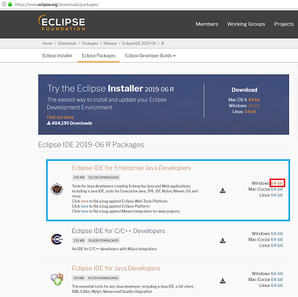

※`Eclipse IDE for Java Developers`の通常Javaの方もないと動かないのではないかと思いきや、Enterpriseの方にこの機能も内蔵されているので必要ない。  

1-2. .zipファイルを展開し、展開したものを今回は`C:\Program Files\Pleiades\`にeclipseフォルダごとコピーします。※Pleiadesフォルダは事前に作成。  
<br />

## 2. Pleiadesプラグインのダウンロードとインストール

2-1. Pleiadesのプラグイン(pleiades-win.zip)をダウンロードする。  
※MergeDocサイトのPleiadesプラグインのここではWindows版をダウンロードする事にする。  

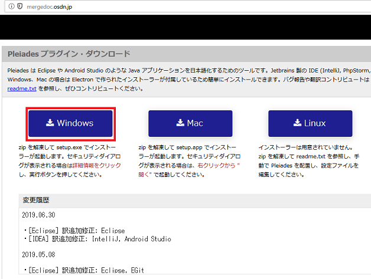

2-2. pleiades-win.zipを展開し、展開したフォルダ内の`setup.exe`をダブルクリックで起動する。  

2-3. 「選択」ボタンで日本語化するアプリケーションを選ぶ。  
ここでは、`C:\Program Files\Pleiades\eclipse\eclipse.exe`を選ぶ。  
Pleiadesが配置されるディレクトリ、Pleiadesの設定が追加されるファイルはアプリケーションを選ぶと自動でセットされる。  

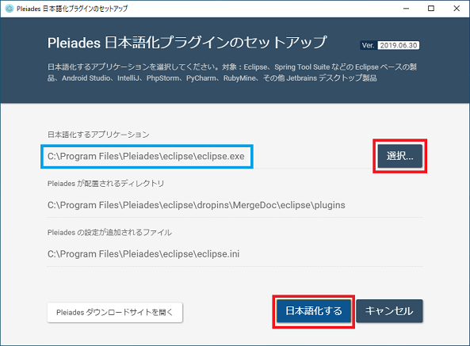

2-4. 「日本語化する」ボタンを押し日本語化パッチを当てる。「終了」ボタンを押し閉じる。  
<br />

## 3. Eclipse実行用のJREをダウンロードし設定する

3-1. 試しに、`C:\Program Files\Pleiades\eclipse\eclipse.exe`をダブルクリックし、Eclipseを立ち上げてみる。  

3-2. すると、以下の様なエラーメッセージが出る。  

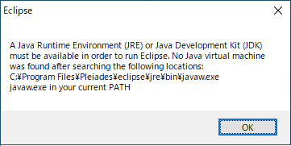

これは、Javaがインストールされていなければこの様なエラーが出る。  
**インストールされていれば起動できるが、ここではEclipse専用のJavaを使うことにするので一旦終了して以下を設定する**  

```:エラーメッセージ
Eclipseを実行するには、JREまたはJDKが利用可能でなければなりません。  
次の場所を検索した後、Java仮想マシンは見つかりませんでした。  
C：¥Program Files¥Pleiades¥eclipse¥jre¥bin¥javaw.exe
現在のパスにあるjavaw.exe
```

要は、EclipseはJavaで動くのですがJavaが見つかりませんでした。  
想定されるパスを調べてみてもやはり見つかりませんでした。という事のようだ。  

MergeDocサイトではEclipseの実行用JREを`Adopt OpenJDK 11(HotSpot)`としている様なので、  
それに揃える事にするが~~実行だけできれば良いので`JRE`のみとし~~Eclipse専用で使いたい事と、  
Windows内で使う他のJavaに影響を与えないために(別段問題ないかもしれないが)インストーラーではなく.zipファイルを展開し配置する。  
Eclipseは起動時に指定の~~JRE~~JDKを使用する事とする。  
※**上記取消線**SpringBootプラグイン(Spring Tool Suite)を使用するには、JREではなくJDK(Javac.exeが必要の様)が必要なのでやはりここではJDKとする。  

**Spring Tool Suiteプラグイン起動時のエラーメッセージ**  
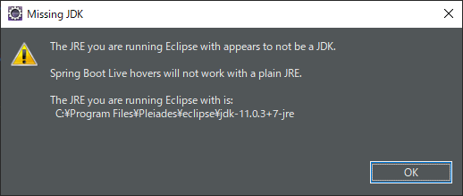

```:エラーメッセージ
Eclipseを実行しているJREはJDKではないようです。
SpringBoot Liveホバーは普通のJREでは動作しません。
Eclipseを実行しているjreは:C:\Program Files\Pleiades\eclipse\jdk-11.0.3+7-jre
```

3-3. [Adopt OpenJDKのサイト](https://adoptopenjdk.net/)に行き、「OpenJDK 11(LTS)」と「HotSpot」ラジオボタンにチェックを入れ、「Release Archive & Nightly Builds」ボタンを押す。  

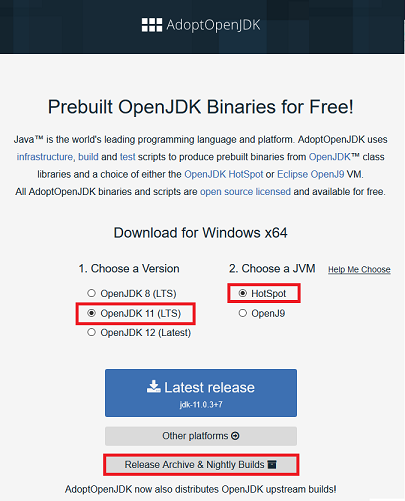

3-4. Windows x64用のBinaryの「JDK」ボタンを選びダウンロードする。  

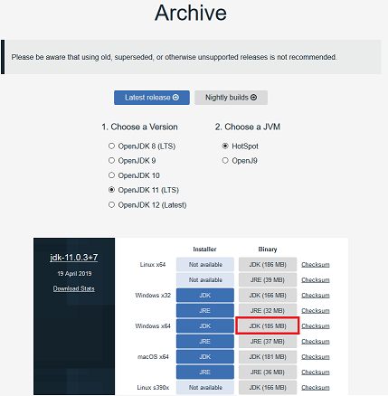

3-5. ここでは`OpenJDK11U-jdk_x64_windows_hotspot_11.0.3_7.zip`をダウンロードしたので、それを展開しその中の`jdk-11.0.3+7`フォルダごと`C:\Program Files\Pleiades\eclipse\`へコピーする。  

3-6. Eclipse専用としてJDKを指定するのでeclipseフォルダ下のeclipse.iniファイル(構成設定)内に以下を追加する。  
※`-vmargs`の行より上に書く必要がある。  
-startupや--launcher.libraryなどがあるが、ここでは、一番上の先頭に以下を追加する。  

```ini:eclipse.ini
-vm
jdk-11.0.3+7/bin/javaw.exe
```

<br />

## 4. Eclipse Pleiadesを起動し、作業ディレクトリ(workspace)のフォルダを決める

4-1. Eclipseが起動できる準備ができたので、`C:\Program Files\Pleiades\eclipse\eclipse.exe`をダブルクリックしEclipseを立ち上げてみる。  
※毎回フォルダを開くのは効率が悪いのでショートカットをデスクトップにでも配置する。  
※jdkのダウンロードでx86用を間違えてダウンロードした場合は以下の様なエラーメッセージとeclipse.iniファイルの中身の表示が出る。
x64用のEclipseなのでx64用をセットする。  

```:エラーメッセージ
java was started but returned exit code=13
(訳：Javaは開始されましたが終了コード= 13を返しました)
```

4-2. ワークスペースの選択
Projectフォルダを保存するワークスペースフォルダを設定しますが、ここでは事前に「Workspace」フォルダとその中に「Java」フォルダを事前に作って置き、  
ダイアログボックスの「参照(B)」ボタンを押し`C:\Workspace\Java\`を指定し「起動(L)」ボタンをクリックしてEclipseを起動する。  

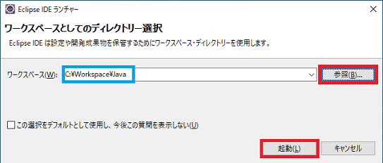

ここれでEclipseが起動できるはずです。  
<br />

## 5. JDK、Tomcatの配置と使えるように設定

5-1. JDKとTomcatをダウンロードし展開し配置する。  
プロジェクト用のJDKやTomcatはeclipseフォルダ下(eclipseフォルダより外)へ`java\11\`や`tomcat\9\`などとし直接.zipファイルを展開した物を配置する事にする。  
よって、まずは`C:\Program Files\Pleiades\java\11`と`C:\Program Files\Pleiades\tomcat\9`となるようフォルダを作成する。  
次に、JDKはEclipse用で使っている`C:\Program Files\Pleiades\eclipse\jdk-11.0.3+7`フォルダ内を丸ごと  
`C:\Program Files\Pleiades\java\11\`フォルダ下へコピー。  
※また、今回はJDK11だけだがJDK1.8が必要なら`C:\Program Files\Pleiades\java\8\`などとしダウンロード＆コピーする。  

次に、Tomcatをダウンロードする。[Apache Tomcat](https://tomcat.apache.org/)へ行き、  
左のリストの「Tomcat9」をクリックし、表示されたページのCore内の「64-bit/Windows.zip」をクリックしダウンロードする。  
ここでは、9.0.21のバージョンをダウンロードしました。  
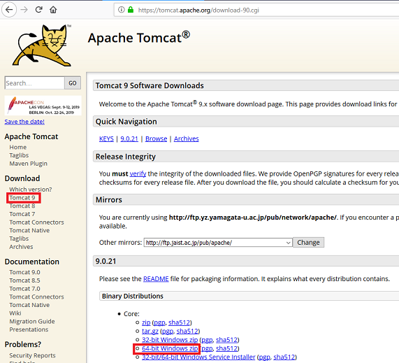

ダウンロードされたファイルを展開し`apache-tomcat-9.0.21`内を丸ごと`C:\Program Files\Pleiades\tomcat\9`へコピーする。  

5-2. JDK11の設定をしEclipseでJava11の開発が出来るようににする。  
「ウィンドウ(W)」→「設定(P)」の左側リスト内の「Java」→「インストール済みのJRE」を選択し、「追加(A)」ボタンをクリック。  
「標準 VM」を選び、「次へ(N)」ボタンをクリック。  
「ディレクトリ(O)」ボタンをクリックし、`C:\Program Files\Pleiades\java\11`を指定し、「JRE名(N)」テキストボックス内は11.0.3とする。  
「完了(E)」ボタンを押し確定する。  

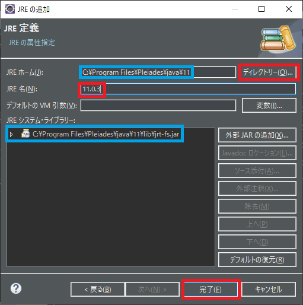

※これは新規Javaプロジェクトの「プロジェクト固有のJREを使用」で選択出来るようになります。  
「実行環境JREを使用」の「JavaSE-11」と紐づけるには先ほどの「設定」画面で、「Java」→「インストール済みのJRE」→「実行環境」を選び、  
「実行環境(E)」リスト内の「JavaSE-11」を選択し、「互換性があるJRE(C)」リスト内は先ほど設定した名前の「11.0.3」などと出るので選択。  
「適用して閉じる」ボタンをクリックし完了させる。  

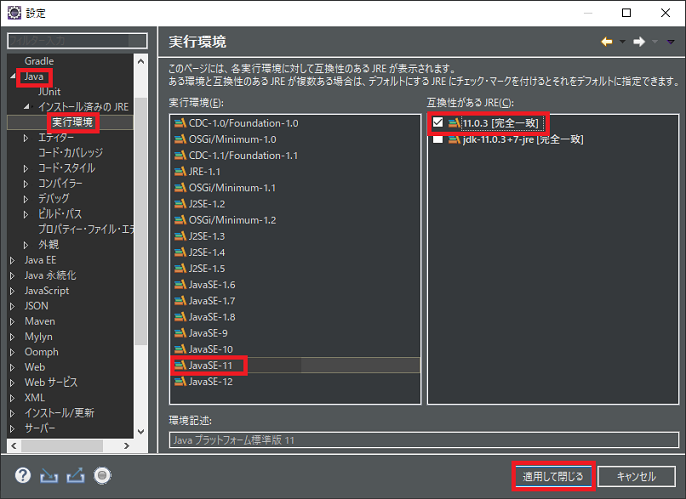

5-3. Tomcat9の設定をしEclipseでTomcatを使えるようにする。  
「ウィンドウ(W)」→「設定(P)」の左側リスト内の「サーバー」→「ランタイム環境」を選択し、「追加(A)」ボタンをクリック。  
新規サーバーランタイム環境ダイアログのリストの「Apache」→「Apache Tomcat v9.0」を選び、「次へ(N)」ボタンをクリック。  
「参照(R)」ボタンをクリックし、`C:\Program Files\Pleiades\tomcat\9`を指定し、「JRE(J)」コンボボックスは5-2.で指定した11.0.3を選ぶ。  
「完了(F)」ボタンを押し完了し、「Apache Tomcat v9.0」が追加されている事を確認後「適用して閉じる」ボタンをクリックし完了させる。  

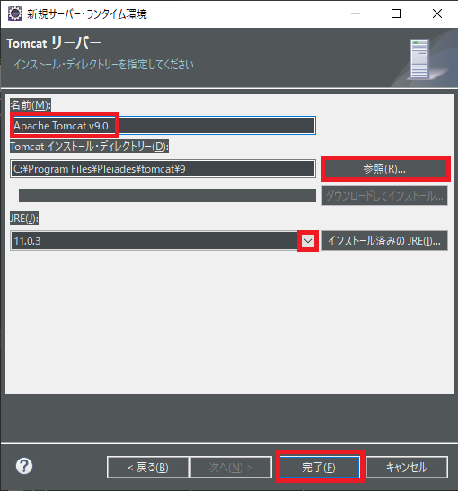

※Javaの動的Webプロジェクトなどでの使用するには[EclipseのApacheサーバーにTomcatを追加する](../SvrTomcat/SvrTomcat.md)の設定も必要です。  

* * *
