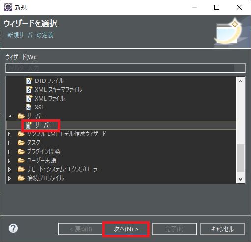
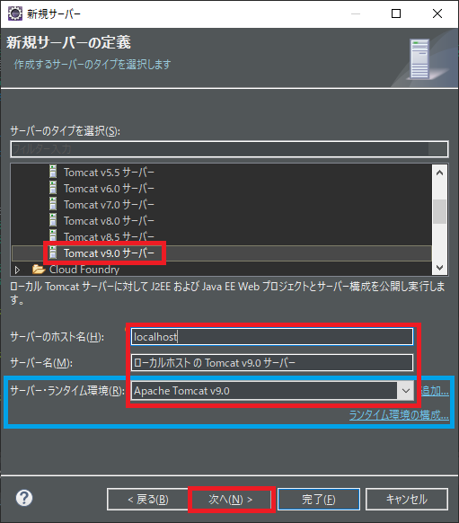
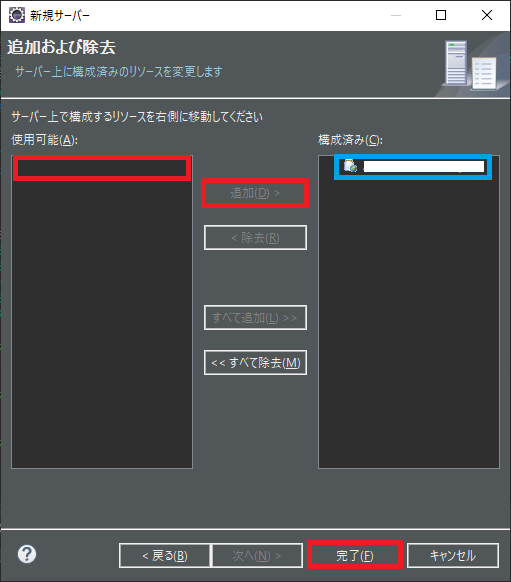
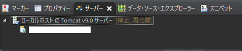

## 0. はじめに

EclipseでTomcatが使えるようになっている事。  
※Javaでは[Enterprise Java Developersの環境構築手順](../Install/InstallOrigin.md)下方参照。  

### 1. サーバーの追加

 1-1. メニューバーの「ファイル(F)」→「新規(N)」→「その他(O)」をクリックしダイアログを開く。  
 1-2. リストの「サーバー」→「サーバー」を選び、「次へ(N)」ボタンをクリックする。  

 1-3. ここでは、サーバーのタイプ：「Tomcat v9.0 サーバー」を選び、その他はデフォルトで`localhost`を使うのでそのままとする。  
 サーバー名も分かれば何でも良いのでそのままとする。サーバー・ランタイム環境はEclipseでTomcatが使用可能な状態ならば表示される。  
 これもここでは１つしか設定していないのでそのまま「次へ(N)」ボタンを押す。  

 1-4. 「使用可能欄(A)」にJavaの動的Webプロジェクトなどのプロジェクトがあれば表示されるので目的のプロジェクトを選択し、  
 「追加(D)」ボタンをクリックし、「構成済み(C)」欄に移動させる。「完了(F)」ボタンで完了させる。

 1-5. JavaEEパースペクティブなどでは画面下枠の「サーバー」タブに以下の画像の様に追加される。  

 画像では「停止,再公開」となっているので開始するにはサーバーを右クリックし「開始(S)」をクリックすれば開始する。  

* * *
