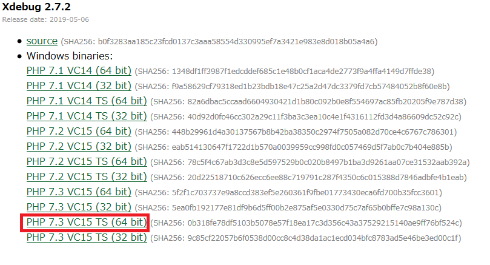
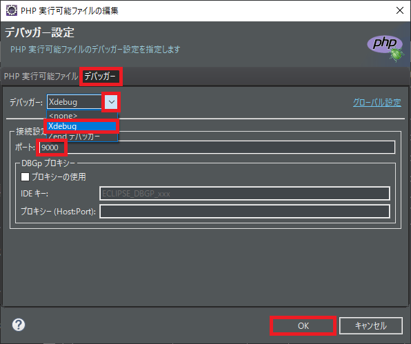
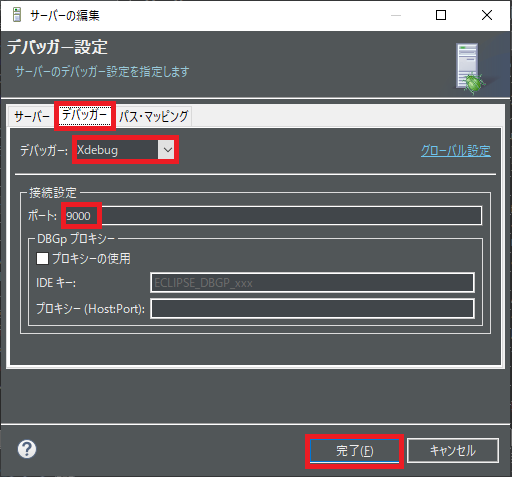

## 0. はじめに

[EclipseでPHP開発環境の構築手順](../Php/EclipsePhp)で設定が済んでいる事。  

 

## 1. Xdebug.dllのダウンロードと配置

[Xdebug.org](https://xdebug.org/download)でPHPのバージョンに合う.dllをダウンロードする。  
今回は、PHP7.3系のスレッドセーフ版`PHP 7.3 VC15 TS (64 bit)`をダウンロードします。  
`php_xdebug-2.7.2-7.3-vc15-x86_64.dll`のみなのでこれをphpフォルダの`ext`フォルダー内に入れます。  

 

## 2. php.ini設定ファイルの書き換え

php.iniファイル内に以下を追加します。  
`xdebug.remote_enable = 1`が無いとブレークポイントの配置や停止ができません。

    [XDebug]
    zend_extension=xdebug-2.7.2-7.3-vc15-x86_64
    xdebug.remote_host = "localhost"
    xdebug.remote_port = 9000
    xdebug.remote_enable = 1

 

## 3. EclipseでXdebugを使う設定

メニューバーの「ウィンドウ(W)」→「設定(P)」を選び設定ダイアログを開く。  
左メニューの「PHP」→「インストール済みのPHP」をクリックし`PhpDefault`を選び「編集(E)」ボタンをクリックする。  
デバッガータブの「デバッガー：」コンボボックス内の`Xdebug`を選ぶ。  
「ポート：」テキストボックスに`9000`と入力する。  
「OK」ボタンをクリックする。  

左メニューの「PHP」→「サーバー」をクリックし`Default PHP Web Server`を選び「編集」ボタンをクリックする。  
デバッガータブの「デバッガー：」コンボボックス内の`Xdebug`を選ぶ。  
「ポート：」テキストボックスに`9000`と入力する。  
「完了(F)」ボタンをクリックする。

設定ダイアログも「適用して閉じる」ボタンを押す。  

### 4. ブレークポイントの配置と実行

PHPファイルのコード左側の行番号のさらに左側に縦長のスペースがあるのでここでブレークポイントを付ける。  
デバッグの「PHP Webアプリケーション」で実行ができる。  
デバッグのパースペクティブを開くようにメッセージも出る。  
変数に現在何が入っているかは変数タブやソース中の変数にマウスポインタを当てても確認できる。  
ただし、変数タブの表示へは変数が宣言された行を通過しないと表示されない。  

* * *
