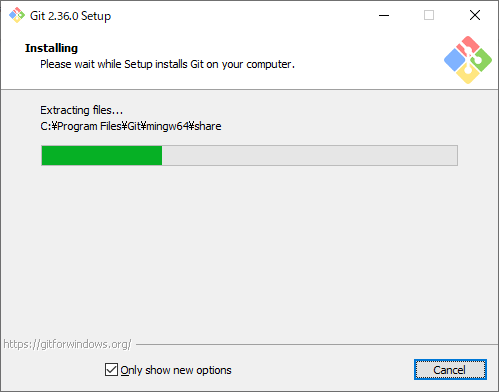

## 0. はじめに

事前にローカルにGit for WindowsまたはMacなどをインストールしている事。  
事前にGitHubに登録している事。  
WindowsではGit Bashやコマンドプロンプト、Macではターミナルで操作する事とする。  

<br />

## 1. Gitローカル内の作業  

### 1-0. GitのUpdate  
すでに、インストールされているGitをコマンドでUpdateするコマンド。  
Updateするには、下記コマンドを入力し確認メッセージが出ますのでyを押しEnterを押します。  
**Windows版**  

    $ git update-git-for-windows
    Git for Windows 2.36.0.windows.1 (64-bit)
    Update 2.36.1.windows.1 is available
    Download and install Git for Windows 2.36.1 [N/y]? y
    #########################                                              36.1%

Update用インターフェースが現れインストールされます。  



Gitのバージョン確認  

    $ git --version
    git version 2.36.0.windows.1


### 1-1. ローカルに個人識別情報の登録 config設定

ここでのユーザー名はGitHubのユーザー名とは別の名前でも良い  
以下の`--global`は、どのGitリポジトリにも適用されるものでGit for Windowsなどをインストールした  
最初の1回設定すれば良い。  
また、これの設定はユーザーフォルダ内に`.config`ファイルとして作成され保存されている。  

    $ git config –-global user.name "ユーザ名"
    $ git config --global user.email "メールアドレス"

個別のリポジトリや１つのPCで複数のGitHubのアカウントを操作する(サブアカウント)場合はリポジトリごとに  
設定しなければならず引数を`--local`とする。リポジトリごとなので1-2.の`git init`でリポジトリを作成した後に行う。  
config設定を行う前に`git add`や`git commit`などを行ってしまうと`--global`ユーザーでの行うことになりGitHubに  
`--global`ユーザーでpushしてしまうので注意。  

    $ git config –-local user.name "ユーザ名>"
    $ git config --local user.email "メールアドレス"

※サブアカウントにメインアカウントのユーザーでPushした形となるため(メールアドレスで紐づけられるのかも)。  

Macでは、日本語ファイル名を使う場合に対応するため以下を設定しておいた方がよい。

```
$ git config --global core.precomposeunicode true
```

### 1-2. config情報の表示

1-1.で設定した内容を表示します。  

    $ git config --global --list
    $ git config --local --list

### 1-3. ローカルリポジトリの作成

`cd`コマンドでローカルリポジトリを作成したいフォルダに移動しておいた上で以下を実行します。  

    $ git init

### 1-4. ローカルリポジトリのステータス表示

ローカルリポジトリフォルダ内に新しいファイルが作成されたか、変更があったかなどを確認できる。

    $ git status

追加、変更、削除などがあればそのファイルは赤色で表示されます。  
以下の1-5.で`add`を実行したファイルは黄緑色で表示されます。  
ローカルリポジトリ内のファイルの追加や削除どのファイルも変更された箇所がなければ以下のメッセージが出ます。  

    $ nothing to commit, working tree clean

### 1-5. ローカルリポジトリのコミット対象のファイル追加

１ファイル単位(拡張子単位では\*.xxx)

    $ git add ファイル名

変更があったすべてのファイル  

```prompt
$ git add --all
```

### 1-6. コミット対象のファイル追加した内容の取り消し

1-5.で誤って追加した内容の取り消しができます。  

    $ git rm ファイル名

### 1-7. ローカルリポジトリのコミット

1-5.で`add`を実行したものをローカルリポジトリに確定します。  

    $ git commit -m "コミット名"

ローカルリポジトリ内に更新された内容がない場合(コミット済みなど)は以下のように表示されます。  

```
On branch <ブランチ名>
nothing to commit, working tree clean
```

### 1-6. ローカルリポジトリにGitHubのリモートリポジトリ情報を追加

これは、GitHubにリモートのリポジトリを作成するのではなくローカルリポジトリにリモート情報を登録し、  
`push`や`pull`などを行うためにローカルとリモートの紐づけ設定を行うためのものです。  
**https接続の場合**  

    $ git remote add origin https://github.com/githubユーザー名/リモートリポジトリ名.git

上記では、`origin`という名前を付けましたがリモート情報に対するリモート名と言うことなので何でも良い。  
※名前を変えた場合は`git push origin master`などの`origin`をその名前に変えて実行します。  

git remote add〜の値を間違えた場合以下のようなメッセージが出る

    $ fatal:remote origin already exists.

**SSH接続の場合**  
https接続ではなく鍵を作成＆GitHubに登録し通信する場合は以下のようにする。  
※この後の秘密鍵と公開鍵を登録し、GitHubに公開鍵を追加登録の設定が必要です。  

```prompt
$ git remote add origin git@github.com:githubユーザー名/リモートリポジトリ名.git
```

### 1-7. リモートリポジトリ情報の確認

1-6.で行ったリモートリポジトリ情報の確認を以下でできます。  

    $ git remote -v
    または
    $ cat .git/config
    または
    $ git confgig --local --list

### 1-8.リモートリポジトリ情報の削除

1-6.で誤って登録したリモートリポジトリ情報を削除したい場合は以下でできます。  

    $ git remote rm origin

<br />

## 2. ローカルとリモートリポジトリの操作にかかわる設定

### 2-1. 秘密鍵と公開鍵を作成し、GitHubに公開鍵を追加登録

**鍵をローカル(自分のPC)に追加**

    $ ssh-keygen -t ed25519 -b 4096

Windowsはユーザーフォルダ下`.ssh/id_ed25519とid_ed25519_pub`にMacはユーザーフォルダ下`~/.ssh/id_ed25519とid_ed25519.pub`に  
鍵が作成される。  
※`-b`オプションは鍵の長さ。  
※`ssh-keygen -t rsa`でrsaアルゴリズムでの作成もできるが比較的古くなっている技術なのでed25519が推奨となっている。  
※読み取り専用パーミッションの変更は行わなくてもできるが以下で行える。  
`cd ~/.ssh`などで.sshフォルダへ移動しておく事。  

    $ chmod 600 id_ed25519

**GitHubに公開鍵を追加**  
Windowsの場合は、`id_ed25519_pub`の中身をテキストエディタで開きテキストすべてコピーしGitHubの`Personal settings`の  
`SSH and GPG keys`タブの`New SSH key`をクリックし貼り付け。鍵名は鍵に対する名前なので何でも良い。  

Macの場合では、これらは隠しファイルとなって作成されている。  
また、テキストエディタを開いてコピペは便利が悪いので以下のコマンドを打つとクリップボードにコピーされる。  
その後、GitHubの`New SSH key`にペーストする。

    $ pbcopy < ~/.ssh/id_ed25519.pub
    または
    $ cat ~/.ssh/id_ed25519.pub | pbcopy

### 2-2. １つのPCで複数のGitHubアカウントを作成しそれぞれの鍵を使いpushし使い分ける

**2つ目の鍵の作成**   

    $ cd .ssh

でユーザーディレクトリの`.ssh`フォルダへ移動した上で以下を実行する事。  

    $ ssh-keygen -t ed25519 -b 4096 -C "メールアドレス" -f futatsume_ed25519

パスフレーズを聞かれるが設定していなければそのままEnter。  
※実行したディレクトリ内に作成されるので注意が必要(そのために上記の`.ssh`へ移動)。
**-C "メールアドレス"**は、無くてもよい。    

`~/.ssh/`下にfutatsume_rsaとfutatsume_rsa.pubファイルが出来る。  
futatsume_rsa.pubファイル内のテキストをコピーし、2つ目のGitHubアカウントのNew SSH Keyに貼り付け登録する。  
また、使い分けるために`~/.ssh/configファイル`に以下を追加。  
※無い場合は、拡張子無しのconfigファイルを追加(.txtファイルとなるなら拡張子名を表示をし拡張子を消す)。  
**configファイル**

```config
Host id
  HostName github.com
  User git
  Port 22
  IdentityFile ~/.ssh/id_ed25519
  TCPKeepAlive yes
  IdentitiesOnly yes

Host futatsume
  HostName github.com
  User git
  Port 22
  IdentityFile ~/.ssh/futatsume_ed25519
  TCPKeepAlive yes
  IdentitiesOnly yes
```

GitHubと紐づけられているか確認します。successfullyが出ればOK。  

    $ ssh -T futatsume
    Hi GitHubアカウント名 You've successfully authenticated, but GitHub does not provide shell access.

しかし、何故か上記`SSH接続`のためのリモート情報登録`git@github.com:～`でpushすると以下の様なパーミッションエラーが出る。  

    ERROR: Permission to GitHubアカウント名/リポジトリ名.git denied to ローカルアカウント名.
    fatal: Could not read from remote repository.

    Please make sure you have the correct access rights
    and the repository exists.

よって、リモートリポジトリ情報の登録を以下の様に変える。

    $ git remote add origin2 futatsume:githubユーザー名/リモートリポジトリ名.git

これで`push`できると思う。`git@github.com`ではなく`config`ファイルに登録した`futatsume`という名前を使う様です。  
※ただし、これは2つめのGitHubアカウント(サブ)に対する方法であり、メインGitHubアカウントでは`git@github.com`で良い様です。  

### 2-3. ローカルリポジトリにコミットされたファイルや内容をリモートリポジトリ(GitHub)へ送る

    $ git push origin master

※リモートリポジトリの追加で名前を`origin`にしなかった場合はその名前に変えて実行します。 

リモートリポジトリとローカルリポジトリの内容が同じ最新の状態では以下のように表示されます。
```
Everything up-to-date
```

**強制的にpush**  
リモートリポジトリの内容は消えても良くローカルリポジトリの内容をリモートリポジトリに反映したい場合などは以下を実行。  

    $ git push origin -f master

### 2-4. リモートリポジトリ(GitHub)の内容をローカルリポジトリへ取り込む

    $ git pull origin master

### 2-5. リモートとローカルのファイルの不一致

リモートとローカルリポジトリの不一致が発生する場合がある。  
※例えば、GitHubでリポジトリを作成する際に`Readme.txt`を作成するにチェックを入れ作成した場合ローカルには、Readme.txt
は無く不一致が発生しているためである。以下を実行すると解消されるがローカルリポジトリの内容は書き換わるので注意。  

    $ git fetch
    $ git rebase origin/master

<br />

## 3. GitHubでメールアドレスを公開しない設定にしている場合  

GitHubアカウントのSettingsのEmailsの`Keep my email addresses private(訳：メールアドレスを非公開にする)`や`Block command line pushes that expose my email(訳：メールを公開するコマンドラインプッシュをブロックする)`にチェックが入っているとプッシュ時に以下のようなエラーメッセージを出す。
また、分からないがGithubアカウントのメールアドレスと同じメールアドレスの場合だけ警告がでるのかもしれない。

```
remote: error: GH007: Your push would publish a private email address.
remote: You can make your email public or disable this protection by visiting:
remote: http://github.com/settings/emails
To git@github.com:githubアカウント名/リモートリポジトリ名.git
 ! [remote rejected] master -> master (push declined due to email privacy restrictions)
error: failed to push some refs to 'git@github.com:githubアカウント名/リモートリポジトリ名.git'
```

```
訳
エラー：GH007：プッシュするとプライベートメールアドレスが公開されます。
リモート：次のサイトにアクセスして、メールを公開するか、この保護を無効にすることができます。
リモート：http：//github.com/settings/emails
git@github.com:githubアカウント名/リモートリポジトリ名.gitへ
 ！ [リモート拒否]マスター->マスター（メールのプライバシー制限によりプッシュが拒否されました）
エラー：いくつかの参照を「git@github.com:githubアカウント名/リモートリポジトリ名.git」にプッシュできませんでした
```

この場合は、`git config --local user.email`や`git config --global user.email`を設定しないかGithubアカウントで使っているemailアドレス  
と同じメールアドレスを設定しないようにする。  
※私の場合`git config --global user.email`は適当な名前のメールアドレスを設定しているからなのかこちらは`.gitconfig`に残っていてもプッシュできた。  
※これを設定してコミットした場合はコミットログへ残るので戻さなくてはならない。  

<br />

## 4. セキュリティの強化で22番ポートを閉じている場合  
ネットワーク機器やパソコンのセキュリティの強化でSSH(22番)ポートを閉じている場合リモートリポジトリへPUSHすると以下のようなメッセージが出る  

```
$ git push origin master
ssh: connect to host ssh.github.com port 22: Connection timed out
fatal: Could not read from remote repository.

Please make sure you have the correct access rights
and the repository exists.
```

```
$ git push origin master
訳
ssh：ホストに接続しますssh.github.comポート22：接続がタイムアウトしました
致命的：リモートリポジトリから読み取ることができませんでした。

正しいアクセス権があることを確認してください
リポジトリが存在します。
```

SSHの接続確認をすると以下のようなメッセージが出ます。  

```
$ ssh -T git@ssh.github.com
ssh: connect to host ssh.github.com port 22: Connection timed out
```

```
訳
$ ssh -T git@ssh.github.com
ssh：ホストに接続しますssh.github.comポート22：接続がタイムアウトしました
```

そこで、GitHubではこのような方を対象にHTTPS(443番)ポートを使ってSSH接続する`SSH over HTTPS`を提供しているようです。  
通常は`github.com:22`でアクセスしますが`ssh.github.com:443`にすると443番ポートでSSHで接続できるようです。  

まず、`~/.ssh/id_ed25519`などの公開鍵がすでにある状態から以下のコマンドを実行します。  
known_hostファイルに接続情報を書き込みますか？と表示されるので`yes`を入力しEnterを押します。  
すると、successfully(接続成功)と出ましたら接続成功です。

```
$ ssh -T git@ssh.github.com -p 443 -i ~/.ssh/id_ed25519
The authenticity of host '[ssh.github.com]:443 ([18.181.13.223]:443)' can't be established.
ED25519 key fingerprint is SHA256:xxxxxxxxxxxxxxxxxxxxxxxxxxxxxxxxxxxxxxxxxxx.
This host key is known by the following other names/addresses:
    ~/.ssh/known_hosts:1: github.com
Are you sure you want to continue connecting (yes/no/[fingerprint])? yes
Warning: Permanently added '[ssh.github.com]:443' (ED25519) to the list of known hosts.
Hi <リモートリポジトリ名>! You've successfully authenticated, but GitHub does not provide shell access.
```

次に、`configファイル`を変更します。  
まず、Hostが**id**などになっている場合は、`github.com`に変更してください。  
ここがそのままだと、22番ポートへ接続しに行ってしまうので要注意。私はここでつまづいていました。  
次に、HostNameを`ssh.github.com`、Portを`443`に変更します。  
※443番ポート以外では受け付けてくれませんでした。  

```
Host github.com
  HostName ssh.github.com
  User git
  Port 443
  IdentityFile ~/.ssh/id_ed25519
  TCPKeepAlive yes
  IdentitiesOnly yes
```

そして、いつもの通常の接続確認を行う方法で接続確認をして下さい。  
接続成功したらPushできると思いますので終了です。  

```
$ ssh -T git@github.com
Hi fuchu-pheasant01! You've successfully authenticated, but GitHub does not provide shell access.
```

[参考資料](https://docs.github.com/ja/authentication/troubleshooting-ssh/using-ssh-over-the-https-port)  

* * *
