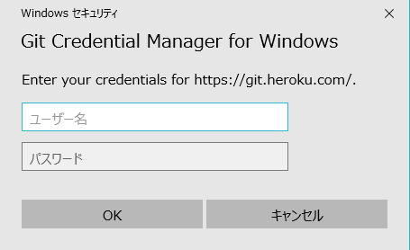

PaasサービスHerokuでのJavaアプリをGitでPushしデプロイするまでの手順  

## 0. 事前準備

HerokuCLIをインストールしてコマンドプロンプトなどで操作できるようにしておく事。
Herokuへアップするアプリを作りそのフォルダに.gitを作ってコミットまでして置く。  
まだ良くわからないが、Git BashなどでPushするとエラーが出るがコマンドプロンプトでherokuにログインしPushするとエラーが  
でないなど良く分からない事もある。  

<br />

## 1. ログイン

    $ heroku login --interactive

\--interactiveを入れないと既定のブラウザが開きログイン画面が出る。  
heroku cli はデフォルトでブラウザが開くように設定してあるようだ。  

<br />

## 2. アプリの作成、変更、削除

### 2-1. Herokuへアプリ作成

ローカル作業用のフォルダを作り、以下のディレクトリ下で次のコマンドを入力する。

    $ heroku create <アプリ名>

もしくは、Windowsは以下でも良いのかもしれない。  

    $ heroku apps:create <アプリ名>

アプリ名が既に使われている場合は以下の様なメッセージが出る。  

    ！ Name must start with a letter, end with a letter or digit and can only contain lowercase letters, digits, and
     !    dashes.

 ※アプリ名を付けなければ自動的に名前が付けられ、その後以下のメッセージが出てHeroku上にgitリポジトリが作成される。
 ローカルgitリポジトリと紐づけされるらしい。

    Creating ⬢ <アプリ名>... done
    https://<アプリ名>.herokuapp.com/ | https://git.heroku.com/<アプリ名>.git

<br />

### 2-2. アプリ名を変更する

リポジトリのディレクトリ内で変更する場合  

    $ heroku rename <新しい名前>

リポジトリ外で変更する場合  

    $ heroku rename <新しい名前> --app <古い名前>

ブラウザでHerokuへログインしアプリ名をクリックしSettings内で変更もできる。  

変更したアプリ名をリポジトリに反映するには、Heroku アプリへの SSH プロトコル／パスを指定し直す。

<br />

### 2-3. Herokuからアプリを削除する

アプリを削除したい場合は以下の様なコマンドを打つ。  

    $ heroku apps:destroy --app <アプリ名> --confirm <アプリ名>

<br />

## 3. アプリにBuildPackをセットし自動認識させる

アプリがどの言語を使用して開発されたものかを認識してもらうために行う様です。  
しかしこれは、Herokuへアカウントを登録し初回のアプリの時だけで良いのかそもそも必要ないのか分からないですが、  
Herokuの扱い方が分からなかったので一応このコマンドも使ったため書いて置く。  
少なくとも２つ目のアプリからは必要はない。  

    $ heroku buildpacks:set heroku/java
    Buildpack set. Next release on <アプリ名> will use heroku/java.
    Run git push heroku master to create a new release using this buildpack.

また、アプリ作成と同時にもできる様です。  

    $ heroku create <アプリ名> --buildpack heroku/java

<br />

## 4. Git認証

### 4-1. SSH認証で通信  
**2022年5月29日追記**  
[SSH Git Transport has reached End of Life](https://devcenter.heroku.com/changelog-items/2301)  
2021年11月30日をもってSSH接続は非推奨となりサポートされなくなりました。2022年3月にSSH接続では不可能となりデプロイ時に以下のようなメッセージが現れます。  
```
ssh: connect to host heroku.com port 22: Connection timed out
```
現在は、HTTPS通信で接続する必要があるので4-2を参照ください。  

#### 4-1-1. ローカルGitリポジトリにHerokuのリポジトリを登録

※アプリ名は、`herokuapp.com`は含めない事。  

    $ git remote add heroku git@heroku.com:<アプリ名>.git

ローカルGitリポジトリのHerokuリポジトリを削除する場合は以下を実行します。  

    $ git remote rm heroku

#### 4-1-2. SSH公開鍵をHerokuに登録する

GitHubで使っている公開鍵をHerokuでも使い回す場合以下の様に打つ。  

    $ heroku keys:add

> 引数がない場合、デフォルトの場所 (~/.ssh/id_rsa.pub​ または ~/.ssh/id_dsa.pub​) からキーを検索します。別のキーファイルを使用する場合は、
> それを引数として指定します。必ず、キーの公開部分 (.pub で終わるファイル) を指定してください。キーの秘密部分は決して第三者に送信しないでください。 

SSH鍵が１つしかない場合は以下の様なメッセージとなりYes/noを求められ`y`を押すと登録できます。    

    Found an SSH public key at C:\Users\<PCﾕｰｻﾞｰ名>\.ssh\<鍵名>_rsa.pub
    ? Would you like to upload it to Heroku? Yes
    Uploading C:\Users\<PCユーザー名>\.ssh\<鍵名>_rsa.pub SSH key... done

SSH鍵が複数ある場合は以下の様に選択するよう求められますので上下キーで選択しEnterを押します。  
`※濃い青緑色が選択されている鍵です` 

    ? Which SSH key would you like to upload?
      C:\Users\<PCユーザー名>\.ssh\<鍵名１>_rsa.pub
    > C:\Users\<PCユーザー名>\.ssh\<鍵名２>_rsa.pub

**※鍵名２を選んだ場合**  

    ? Which SSH key would you like to upload? C:\Users\<PCﾕｰｻﾞｰ名>\.ssh\<鍵名２>_rsa.pub
    Uploading C:\Users\<PCﾕｰｻﾞｰ名>\.ssh\<鍵名２>_rsa.pub SSH key... done

**特定の公開鍵を指定して登録する方法**  
`heroku keys:add`の後に引数として公開鍵ファイル名を指定します。  
ed25519タイプの鍵を生成するには[ここ](https://fuchu-pheasant01.github.io/Contents/GitGitHub/GitGitHub)を参照してください。  
※ssh公開鍵があるフォルダに移動して行ってください。  

    $ heroku keys:add xxxxx_ed25519.pub
    Uploading xxxxx_ed25519.pub SSH key... done


#### 4-1-3. Herokuに登録されているSSH公開鍵を表示する

    $ heroku keys
    === <Heroku登録メールアドレス> keys
    ssh-rsa AAAAB3NzaC...xxxxxxxxxx <PCユーザー名>@<コンピュータ名>
    ssh-ed25519 AAAAC3NzaC...xxxxxxxxxx <メールアドレス>

#### 4-1-4. Herokuに登録されているSSH公開鍵の削除  

    $ heroku keys:remove <PCユーザー名>@<コンピュータ名>
    Removing <PCユーザー名>@<コンピュータ名> SSH key... done

#### 4-1-5. Herokuリポジトリへデプロイ

ローカルリポジトリへディレクトリを移動し、`add`、`commit`を実行し以下を実行します。  

    $ git push heroku master

**以下の様なエラーが表れました**

    Unable to negotiate with 50.19.85.132 port 22: no matching host key type found. Their offer: ssh-rsa
    fatal: Could not read from remote repository.

    Please make sure you have the correct access rights
    and the repository exists.

    訳：50.19.85.132ポート22とネゴシエートできません：一致するホストキータイプが見つかりません。彼らの申し出：ssh-rsa
    致命的：リモートリポジトリから読み取ることができませんでした。

    正しいアクセス権があることを確認してください
    リポジトリが存在します。

`ssh-rsa(sha1?)`は、OpenSSH8.7などで警告がでるようになったらしい。しかし、ed25519を使おうとしているのに何故か分からない。  
以下に、`HostkeyAlgorithms +ssh-rsa`を追加して回避しました。  

    Host heroku.com
      Hostname heroku.com
      User git
      port 22
      IdentityFile ~/.ssh/<鍵名>_rsa
      TCPKeepAlive yes
      IdentitiesOnly yes
      HostkeyAlgorithms +ssh-rsa


**さらに以下の様な警告が表れました**  

    The authenticity of host 'heroku.com (50.19.85.156)' can't be established.
    RSA key fingerprint is SHA256:xxxxxxxxxxxxxxxxxxxxxxxxxxxxxxxxxxxxxxxxxxx.
    This key is not known by any other names
    Are you sure you want to continue connecting (yes/no/[fingerprint])? yes
    Warning: Permanently added 'heroku.com,50.19.85.154' (RSA) to the list of known hosts.

    訳：ホスト 'heroku.com（50.19.85.156）'の信頼性を確立できません。
    RSAキーフィンガープリントはSHA256：xxxxxxxxxxxxxxxxxxxxxxxxxxxxxxxxxxxxxxxxxxxです。
    このキーは他の名前では知られていません
    接続を続行してもよろしいですか（はい/いいえ/ [指紋]）？はい
    警告：既知のホストのリストに「heroku.com、50.19.85.154」（RSA）が永久に追加されました。

鍵が入っているディレクトリの`config`ファイルに以下を追加しましたが改善されませんでした。  
heroku様に鍵を作らずgithubの鍵を共用で使っているからなのかは分かりませんが上記エラーで信頼する(yes)を選び解決させました  
ので次回はheroku専用の鍵を作って解決できるか試してみます。  

    Host heroku.com
      Hostname heroku.com
      User git
      port 22
      IdentityFile ~/.ssh/<鍵名>_rsa
      TCPKeepAlive yes
      IdentitiesOnly yes


<br />

### 4-2. HTTPS認証で通信

#### 4-2-1. ローカルGitリポジトリにHerokuのリポジトリを登録

    git remote add heroku https://git.heroku.com/<アプリ名>.git

#### 4-2-2. Herokuリポジトリへデプロイ

これでgit push heroku masterなどでプッシュすると以下の様な認証ダイアログが開きます。  

  

この認証は、herokuのログインユーザー名とパスワードではない様です。 
heroku auth:tokenで得られるトークンキーを入力しなければならない様です。  
また、ユーザー名は何でも良いみたいですがherokuのユーザー名が良いかもしれない。  

    $ heroku auth:token
     »   Warning: token will expire 10/21/2020
     »   Use heroku authorizations:create to generate a long-term token
    xxxx5d-5xxxxxxxxxxxxx4c　←キー


間違えてherokuのユーザー名とパスワードを入力した場合以下の様なメッセージが出ます。  
また、ブラウザでherokuにログインした状態でも変わりません。 

    $ git push heroku master
    remote: !       WARNING:
    remote: !       Do not authenticate with username and password using git.
    remote: !       Run `heroku login` to update your credentials, then retry the git command.
    remote: !       See documentation for details: https://devcenter.heroku.com/articles/git#http-git-authentication
    fatal: Authentication failed for 'https://git.heroku.com/<アプリ名>.git/'

しかし、その後私は上のログインに成功していないのにどういう訳かPushできました。  
これは、当初GitクライアントのGit Bashでこれらの操作を行っていたからなのかもしれない。 
まず、ブラウザのheroku管理画面をログアウトする。  
次に、コマンドプロンプトでherokuにログインする(ここで認証が免除されるのかもしれない)  
その後、pushする。  

<br />

## 5. HerokuリポジトリへのPush(デプロイ)

**デプロイ成功時**  
デプロイに成功すると以下の様なメッセージが出ます。  

    remote: Compressing source files... done.
    remote: Building source:
    remote:
    remote: -----> Building on the Heroku-18 stack
    remote: -----> Using buildpack: heroku/java
    remote: -----> Java app detected
    remote: -----> Installing JDK 17... done
    remote: -----> Installing Maven 3.6.2... done
    remote: -----> Executing Maven
    remote:        $ ./mvnw -DskipTests clean dependency:list install
    remote:        [INFO] Scanning for projects...

    省略

    remote:        [INFO] ------------------------------------------------------------------------
    remote:        [INFO] BUILD SUCCESS
    remote:        [INFO] ------------------------------------------------------------------------
    remote:        [INFO] Total time:  13.914 s
    remote:        [INFO] Finished at: 2022-01-20T05:20:37Z
    remote:        [INFO] ------------------------------------------------------------------------
    remote: -----> Discovering process types
    remote:        Procfile declares types     -> (none)
    remote:        Default types for buildpack -> web
    remote:
    remote: -----> Compressing...
    remote:        Done: 102M
    remote: -----> Launching...
    remote:        Released v16
    remote:        https://polarbear-leaning02.herokuapp.com/ deployed to Heroku
    remote:
    remote: This app is using the Heroku-18 stack, which is supported until April 30th, 2023.
    remote: A newer stack is available: Heroku-20. To upgrade, see:
    remote: https://devcenter.heroku.com/articles/upgrading-to-the-latest-stack
    remote:
    remote: Verifying deploy... done.
    To heroku.com:<アプリ名>.git
     + xxxxxxx...xxxxxxx master -> master (forced update)

**失敗時(リポジトリに前回の内容が残っている場合)**  
Herokuのリポジトリに前回Pushした内容が残っている場合Herokuのリポジトリとローカルリポジトリに差がありマッチしません。  
pushに`-f`オプションをして強制的にプッシュします。  

    Warning: Permanently added the RSA host key for IP address '50.19.85.132' to the list of known hosts.
    To <アプリ名>.git
     ! [rejected]        master -> master (fetch first)
    error: failed to push some refs to 'git@heroku.com:<アプリ名>.git'
    hint: Updates were rejected because the remote contains work that you do
    hint: not have locally. This is usually caused by another repository pushing
    hint: to the same ref. You may want to first integrate the remote changes
    hint: (e.g., 'git pull ...') before pushing again.
    hint: See the 'Note about fast-forwards' in 'git push --help' for details.

<br />

## 6. 作成したアプリをブラウザで確認

以下の様にコマンドからでも開けるが直接ブラウザのURLにアプリのURL`https://<アプリ名>.herokuapp.com/`を入力すると開けます。  

    $ heroku open

以下の様なエラーが出る場合もあるが、対処法をメモしていなかったので次回。  

     »   Error: Missing required flag:
     »     -a, --app APP  app to run command against
     »   See more help with --help

<br />

## 7. system.properties

Javaは、このファイルがルートディレクトリに無いとエラーを起こす。

    Failed to execute goal org.apache.maven.plugins:maven-compiler-plugin:3.8.0:compile 
    (default-compile) on project <Javaのプロジェクト名>: Fatal error compiling: invalid target release: 11
    -> [Help 1]

このsystemと言う名前の.properties拡張子でファイルを作成しその中身を以下の様に書きます(Java11の例です)。  

    java.runtime.version=11

<br />

以下の様なエラーが出る場合もあるが、対処法をメモしていなかったので次回。  

     »   Error: Missing required flag:
     »     -a, --app APP  app to run command against
     »   See more help with --help

* * *
