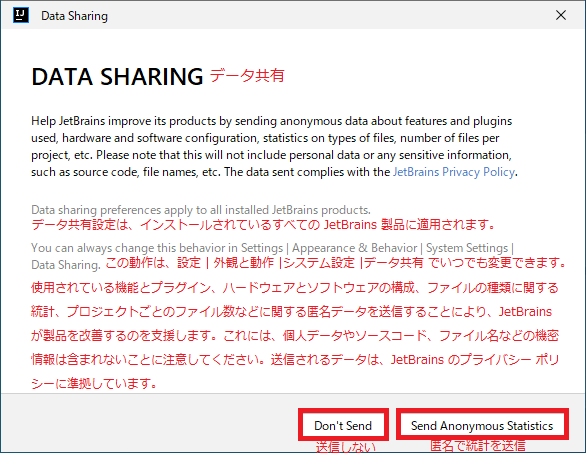

## 0. はじめに  
ここでは、snapパッケージでインストールする方法です。  
※JetBrains IntelliJ IDEAのCommunityとUltimateは2025.3から１つに統一されたようです。  

<br />

## 1. JetBrains IntelliJ IDEAのインストール   
### 1-1. snapがインストールされているか確認  
snapがインストールされているか以下で確認できます。  
インストールされていない場合は`snapd`をインストールできます。  
```
$ snap list snapd
Name   Version  Rev    Tracking       Publisher   Notes
snapd  2.73     25935  latest/stable  canonical✓  snapd
```

### 1-2. JetBrains IntelliJ IDEA のインストール  
```
$ sudo snap install intellij-idea-community --classic
```
※snapでインストールしたパッケージの依存関係は独立しています。  

### 1-3. snapでインストールしたパッケージ一覧確認  
IntlliJ IDEAをインストールされたか以下のコマンドで確認できます。  

```
$ snap list intellij-idea-community
```

### 1-4. 将来的にインストールしたパッケージを最新に更新する  
将来的にパッケージを更新するには以下のコマンドで更新します。  
```
$ snap refresh intellij-idea-community
```

### 1-5. 将来的にインストールされたパッケージを削除する  
将来的にパッケージを削除したい場合は以下のコマンドで削除できます。  

```
$ sudo snap remove intellij-idea-community
```

<br />

## 2. JetBrains IntelliJ IDEAのセットアップ  

アイコンをダブルクリックし起動すると規約に同意するか表示されます。  
規約を読み良ければ、チェックボックスをクリックし「Continue」ボタンをクリックします。  

  

次に、このアプリの使用状況などを参考のために匿名でJetBrainsに送信するかを選択します。  
個人情報やソースコードなどの機密情報ではありませんが送信するかお好きな方のボタンをクリックします。  

  

セットアップが完了しアプリケーションを使えるようになります。  

  

___