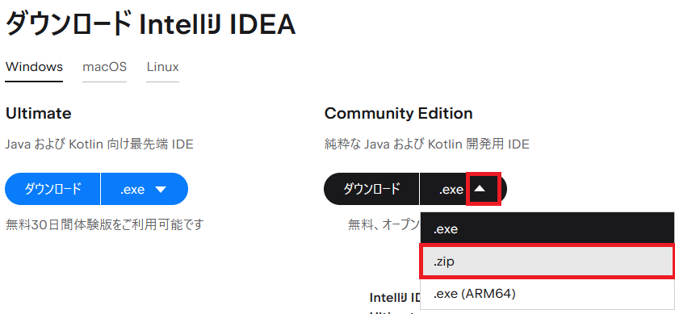
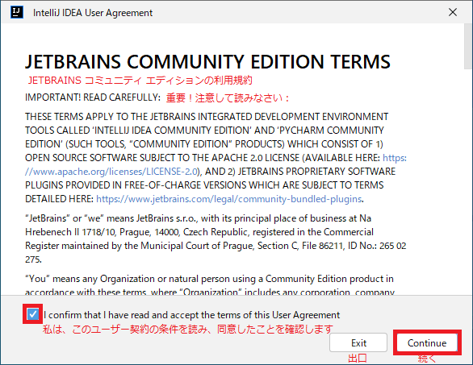

## 0. はじめに  
ここでは、`.zip`ファイルをダウンロードしインストーラーではない方法で書いていきます。  

 

## 1. JetBrains IntelliJ IDEAのダウンロードおよび配置   
### 1-1. JetBrains IntelliJ IDEAのダウンロード  
[IntelliJ IDEAダウンロード](https://www.jetbrains.com/ja-jp/idea/download/#section=windows)  
上記のページへ行きダウンロードボタン右の矢印マーク(↓)をクリックしプルダウンメニューを出します。  
その中の`.zip`をクリックしダウンロードします。  

  

### 1-2. zipファイルの展開(解凍)と配置  
ダウンロードされたzipファイルを展開しパソコンの適当な位置へフォルダごと配置します。  
フォルダ内の`ideaIC-xxxx.x.x.win/bin/idea64.exe`(xは年数、半期番号)ファイルが実行ファイルですのでこれをダブルクリックして起動し使っていきます。  
※毎回フォルダを開き実行する訳にもいかないのでショートカットを作成しデスクトップなどにおいて使いましょう。  

 

## 2. JetBrains IntelliJ IDEAのセットアップ  

アイコンをダブルクリックし起動すると規約に同意するか表示されます。  
規約を読み良ければ、チェックボックスをクリックし「Continue」ボタンをクリックします。  

  

次に、このアプリの使用状況などを参考のために匿名でJetBrainsに送信するかを選択します。  
個人情報やソースコードなどの機密情報ではありませんが送信するかお好きな方のボタンをクリックします。  

  

セットアップが完了しアプリケーションを使えるようになります。  

  

___