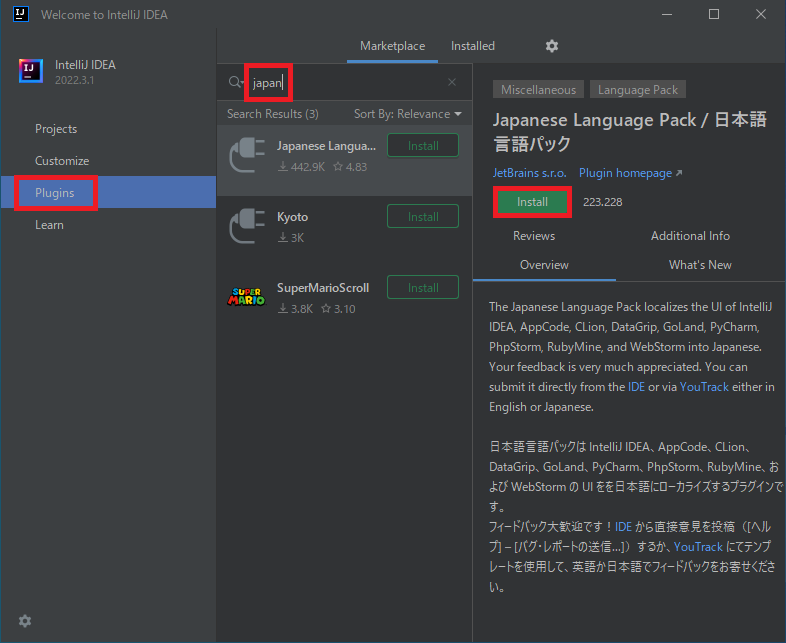
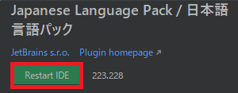
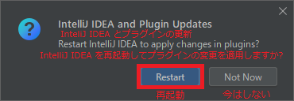
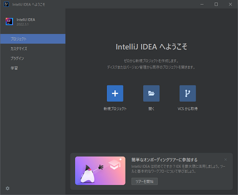

## 0. はじめに  
IntelliJ IDEAを日本語で使えるよう日本語化のプラグインをインストールします。  

 

## 1. JetBrains IntelliJ IDEA日本語プラグインのインストール  
 
使用しているプロジェクトが表示されているならプロジェクトを閉じます。  
左メニューの「Plugins」をクリックし、検索バーに`japan`と入力します。  
Japanease Language Packが表示されますので`Install`ボタンをクリックしインストールします。  

  

インストールが完了すると**Installボタン**の表示が`RestartIDE`に変わりますのでRestartIDEボタンをクリックします。  

  

再起動を促すダイアログメッセージが出ますので`Restart`ボタンをクリックし再起動させます。  

  

再起動すると日本語表示に変った開発環境を使えるようになります。  

  

___