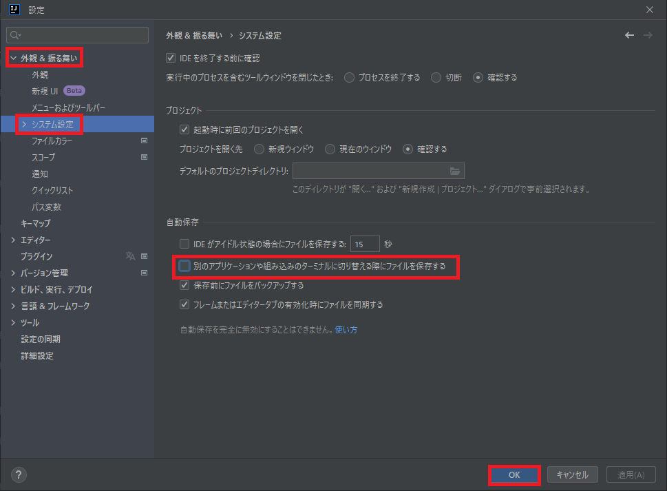
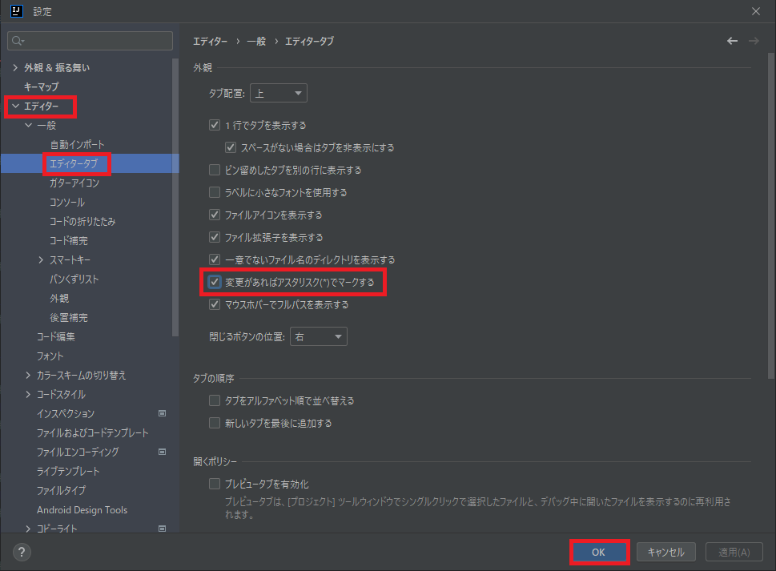
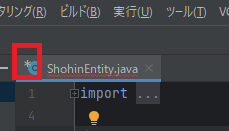

## 0. はじめに  
IntelliJ IDEAを使うにあたって良くある設定を書いていきます。  

 

## 1. ソースコードの自動保存解除と未保存のタブにアスタリスクマーク表示    
### 1-1. ソースコードの自動保存解除  
基本的にIntelliJ IDEAは、ソースコードを自動でこまめに保存します。  
そこで、自動保存されたくない場合に以下の設定をしておくと自分のタイミングで保存することができます。  
※しかし、これを行っても完全に自動保存されないようにはできないようです。  

メニューの「ファイル(F)」→「設定(T)」をクリックします。  
設定ダイアログが表示されますので、左メニューの「外観＆振る舞い」→「システム設定」をクリックします。  
その中の**自動保存欄**の中に`別のアプリケーションや組み込みのターミナルに切り替える際にファイルを保存する`がありますがチェックが入った状態になっていますのでチェックボックスをクリックしチェックを外します。  
チェックを外したら右下の「OK」ボタンを押し閉じます。  

  

これで、自分のタイミングで保存することができます。  
保存のやり方は、メニューの「ファイル(F)」→「すべて保存(S)」をクリックして保存できます。  

### 1-2. 未保存のファイルのタブにアスタリスクマークを表示する  
先ほどソースコードの自動保存を解除しましたが、未保存のファイルがどれなのか分からない状態となっています。なぜ、未保存のファイルタブにマークが付いていないのか？また、付けるかの設定をさせているのか不明ですがその設定をしていきます。  

メニューの「ファイル(F)」→「設定(T)」をクリックします。  
設定ダイアログが表示されますので、左メニューの「エディター」→「エディタータブ」をクリックします。  
その中の**外観**の中に`変更があればアスタリスク(*)でマークする`のチェックボックスをクリックしチェックを入れます。  
チェックを入れたら右下の「OK」ボタンを押し閉じます。  

  

設定は完了です。  
適当なソースコードを編集しアスタリスクマークが表示されるか確認してみましょう。  

  

___