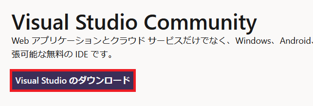

## 0. はじめに  
ここでは、Microsoft Visual Studio 2022 Community Editionのインストーラー版でインストールをする方法を書いていきます。  
また、アプリをダウンロードしながらインストールしますので**インターネットに接続**している必要があります。  

 

## 1. Microsoft Visual Studio 2022 Community Editonをダウンロードする  
まずは、Visual Studioをダウンロードします。  

[ダウンロード先](https://visualstudio.microsoft.com/ja/vs/community/)  
上記ダウンロード先の**Visual Studioのダウンロード**ボタンをクリックしダウンロードします。  

  

 

## 2. Microsoft Visual Studio 2022 Community Editonをインストールする  
ダウンロードした`VisualStudioSetup.exe`ファイルをダブルクリックしインストーラーを起動します。  
すると以下のようなダイアログが表示されます。  
「次へ(N)」ボタンをクリックしますがMicrosoftのソフトウェアライセンスに同意したことになるので事前に読んでおきましょう。  
良ければ、「続行(O)」ボタンをクリックし続行します。  

  

次に、インストールするためのVisual Studio Installerを準備していますのでしばらくお待ちください。  

  

次に、Visual Studioの基本的な機能に追加して様々な開発向けの機能を追加できます。  
ここでは、ASP.NET MVCやWeb APIなどを開発するための`ASP.NETとWeb開発`とWindows FormsやWPFデスクトップアプリなどを開発するための`.NETデスクトップ開発`のチェックボックスにチェックを入れます。  

右下に必要な補助記憶装置に必要な容量が表示されていますのでご使用状況に応じて必要なもののみを入れてください。  

良ければ右下「インストール(I)」ボタンをクリックしインストールを開始します。  

※さらに個別に必要な機能がいる場合は「個別のコンポーネント」タブをクリックし必要なものに追加でチェックをして下さい。  

  

インストールが開始しインストールが始まります。しばらくお待ちください。  
※アプリをダウンロードしながらインストールしますのでインターネットの環境が必要です。  

  

これで、インストールが完了しましたのでウィンドウ右上の「×」ボタンをクリックし終了させます。  

  

それと同時にインストール終了後、Visual Studioを起動するにチェックが入っていますのでアプリケーションが起動していると思います。  
※起動していない場合は、スタートメニューから起動してください。  

以下のようなVisual Studioにサインインを求められますがここでは割愛しますので「今はスキップする。」をクリックし次へ進みます。  
※昔のVersionでは３０日以内にMicrosoftのアカウントを取得しサインインしてライセンスを取得するようなことをやっていましたがおそらく今はそれは無くなっていると思われますのでこのままでも使い続けれると思います。  

  

次に、Visual Studioの外観テーマを選びます。  
お好きなものを選び良ければ「Visual Studioの開始」ボタンをクリックし起動させます。  

  

起動するための準備に少し時間がかかるかもしれませんがしばらくお待ちください。  

  

以下のような画面になりましたら完了です。  
右の新しいプロジェクトの作成などで開発を開始できます。  

  

___