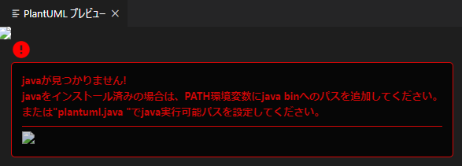

## 0. はじめに

プログラミングでは統合開発環境(IDE)、メモ取りやUML図の作成にはBoostnoteでマークダウンとPlantUMLを使う  
事によりあれこれアプリを使い分けなくて良いと思った。  
しかし、Microsoft Visual Studio(IDE)では問題無いがEclipseではコードの印刷機能が良くなく無駄に余白がある。  
よって当初は、マークダウンも使える割と気に入ったSublime Text3エディタでExportHTMLパッケージを導入し印刷  
していた。Atomエディタも良さそうだったが印刷機能がそもそも無い。  
メモアプリはBoostnoteがUML図やPlantUMLも標準で使える(Boost Noteの方はまだ使えない)のでこれを使っていま  
したがこのUML図を画像ファイルとしてエクスポート保存できない。  
PDFとしては出力できますがこのPDFをMicrosoft Excelなどで使おうとすると簡単にはいかず。  
PDFを開いてさらに画像ファイルとして保存しなおすのも手間が少しかかる。  
いろいろアプリを使い分けないといけないと思いましたが、Microsoft Visual Studio Codeの様々なプラグインを  
導入することにより、コードの印刷、PlantUMLのテキストベースでUML図を作成できそれを画像としてエクスポート  
できる。マークダウンでメモも取れるのでSublime Text3とBoostnoteからの移行ができるかもしれません。  

<br />

## 1. Microsoft Visual Studio Codeを日本語化する

まずは、このアプリを日本語化にしてみます。  

### 1-1. Japanese Language Pack for Visual Studio Codeプラグインのインストール

ウィンドウ左側Extensionsタブをクリックし(またはCtrl + Shift + Xキー)Extensions Marketplace検索ボッ  
クスへ`japanese`と入力する。  
候補が出てくるので`Japanese Language Pack for Visual Studio Code`をクリックして選び「Install」ボタンを  
押しインストールする。  

  

`In order to use VS Code in Japanese, VS Code needs to restart.`(訳：VS Codeを日本語で使用するには、  
VS Codeを再起動する必要があります。)とウィンドウ右下へダイアログメッセージが出るので「Restart Now」  
ボタンをクリックしVisual Studio Codeアプリを再起動する。  

  

再起動後は、日本語に代わっているはずです。  

<br />

## 2. コードの印刷機能を追加する

### 2-1. PrintCodeプラグインのインストール

ウィンドウ左側Extensionsタブをクリックし(またはCtrl + Shift + Xキー)Extensions Marketplace検索ボックス  
へ`printcode`と入力する。  
候補が出てくるので`PrintCode`をクリックして選び「Install」ボタンを押しインストールする。  

  

アプリの再起動を促すダイアログメッセージは出ませんでしたが念のため再起動すると良いでしょう。  

### 2-2. 印刷のためのテストコードを作成

メニューバーの「ファイル(F)」→「新規ファイル」で新しいファイルを起動し以下の様に.java用のファイルを作成。  

```java
package develop;

import java.util.String;

public class Develop1 {
    private String str;
    public static void main(String[] args) {
        str = "メッセージ";
        System.out.println(str);
    }
}
```

メニューバーの「ファイル(F)」→「名前を付けて保存」を選び「ファイルの種類(T)」コンボボックスで`Java(*.java;*.jav)`  
を選択し「名前(N)」テキストボックスへファイル名を付け適当な場所へ保存して下さい。  

### 2-3. テストコードの印刷

プラグインの機能を使うための操作をし印刷してみます。  
メニューバーの「表示(V)」→「コマンドパレット」をクリックし(またはCtrl + Shift + Pキー)検索ボックスを出します。  
`printcode`と入力し出てきた候補(ここでは１つですが)の**PrintCode**を選びます。  

  

既定のブラウザとその印刷ダイアログが表示され「印刷」ボタンなどを押すと印刷できます。  
※また、この印刷機能は内部で1度htmlファイルに変換してそのhtmlファイルの印刷を行おうとするものです。  

  

しかし、シンタックスハイライトが消えており文字列やコメント以外は黒字のみでクラス名や戻り値などの色が色分け  
されていません。  
JavaScriptなど言語によってはもう少し対応されているものもありますが現状ではできなさそうです。  
色付きが良ければSublimeText3などになりそうです。  

<br />

## 3. UML図の作成のためのPlantUMLを追加する

### 3-1. PlantUMLプラグインのインストール

ウィンドウ左側Extensionsタブをクリックし(またはCtrl + Shift + Xキー)Extensions Marketplace検索ボックスへ  
`plantuml`と入力する。  
候補が出てくるので`PlantUML`をクリックして選び「Install」ボタンを押しインストールする。  

  

アプリの再起動を促すダイアログメッセージは出ませんでしたが念のため再起動すると良いでしょう。  

### 3-2. PlantUMLのプレビューを表示

Windowsでは`Alt + Dキー`(MacではOption + dキー)を押すとUML図がプレビューで右側へ表示されます。  
※Javaを環境変数PATHへ設定していない場合は以下の様なメッセージが出ますので設定してください。  

  

また、色んなUML図を作成しているとシーケンス図とアクティビティ図以外では以下の様なエラーメッセージがプレビュー  
に表示されてしまいます。実はまだこれだけでは完全にUML図をすべて使えません。  
`Graphviz`というライブラリーをインストールする必要があります。  

  

```
dot実行可能ファイル：null
dot実行可能ファイルが見つかりません
Graphvizが見つかりません。試してみてください

@startuml
testdot
@enduml

または

java -jar plantuml.jar -testdot

```

### 3-4. Graphvizのインストールと環境変数PATH設定

よって、`Graphviz`というライブラリーをインストールする必要がある様です。  
[Graphvis(Windows版)](https://graphviz.gitlab.io/_pages/Download/Download_windows.html)で.zip版をインストールします。 

  

.zipファイルを展開し適当なディレクトリへ配置し`～\release\bin`を環境変数のPATHへ設定してください。  

これでクラス図などのUML図も表示されるはずです。 

### 3-4. プレビューされた画像の保存

プレビューされたUML図を画像として保存してみます。  
メニューバーの「表示(V)」→「コマンドパレット」をクリックし(またはCtrl + Shift + Pキー)検索ボックス  
を出します。  
`plantuml`と入力し出てきた候補(ここでは１つですが)の**カーソル位置のダイアグラムをエクスポート**を選びます。  
※プレビュータブではなくソースコードタブがアクティブ(有効)になっている必要があります。  

  

pngなどの形式を選ぶとソースコードのある場所へフォルダが作成されその中に画像保存されます。  

* * *
