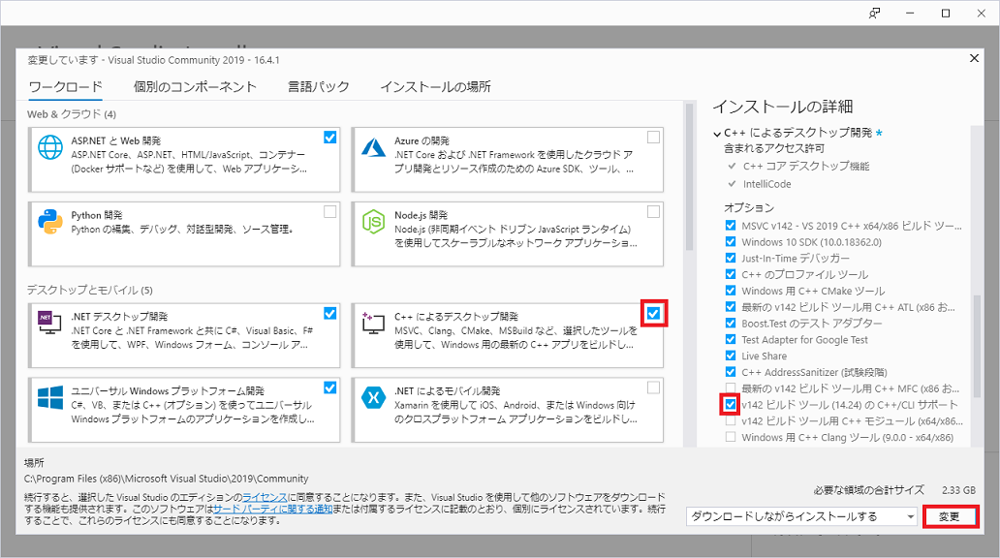
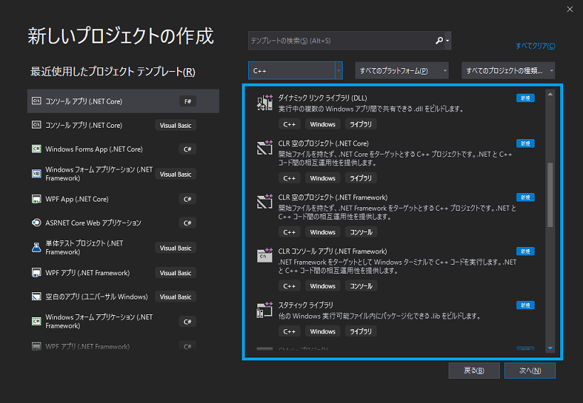

## 1. Microsoft Visual Studio 2019でC++/CLIを使うための環境構築

※Visual Studio Installerで標準的なインストール(.NETデスクトップ開発やASP.NETとWeb開発)が済んでいるものとします。  

Visual Studio Installerのワークロードタブをクリック。 

`C++によるデスクトップ開発`にチェックを入れ、右側リストのインストールの詳細内で`v142ビルドツール(14.24)のC++/CLIのサポート`  
にチェックを入れ右下の「変更」ボタンを押しダウンロード兼インストールする。  

Visual Studioの新しいプロジェクトで以下の様にC++用のテンプレートが使用できるようになる。  
※CLIは`CLR空のプロジェクト`を選べば使用する事ができる。初回作成時にエラーメッセージが出るが一度プロジェクトを閉じ開きなおすと使える。  

* * *
