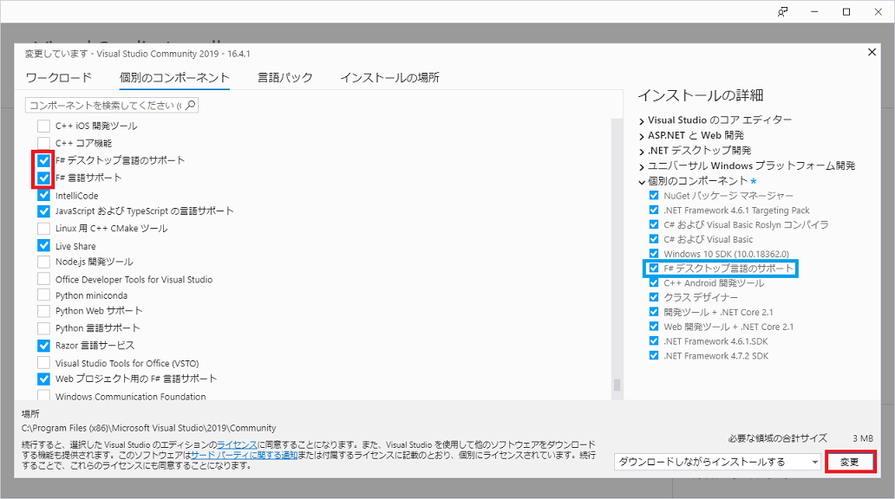

## 1. Microsoft Visual Studio 2019でF#を使うための環境構築

※Visual Studio Installerで標準的なインストール(.NETデスクトップ開発やASP.NETとWeb開発)が済んでいるものとします。  

Visual Studio Installerの個別のコンポーネントタブをクリック。 

`F#デスクトップ言語のサポート`と`F#言語サポート`にチェックを入れ右下の「変更」ボタンを押しダウンロード兼インストールする。  

## 2. F#のソリューションエクスプローラのファイルやプログラムの順番について

F#は、並び順が関係しており例えばimportする名前空間をopen命令でコード上部へ書くがエクスプローラーのファイルの並び順が違うと認識  
されずエラーとなる。  
継承など基底クラスのファイルを認識させるためには、エクスプローラー内の基底クラスファイルを上にあげ派生クラスは下に配置する事。  
また、プログラムの各順番も気を付けなければならない。  

* * *
