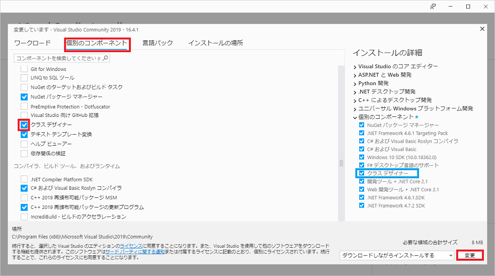
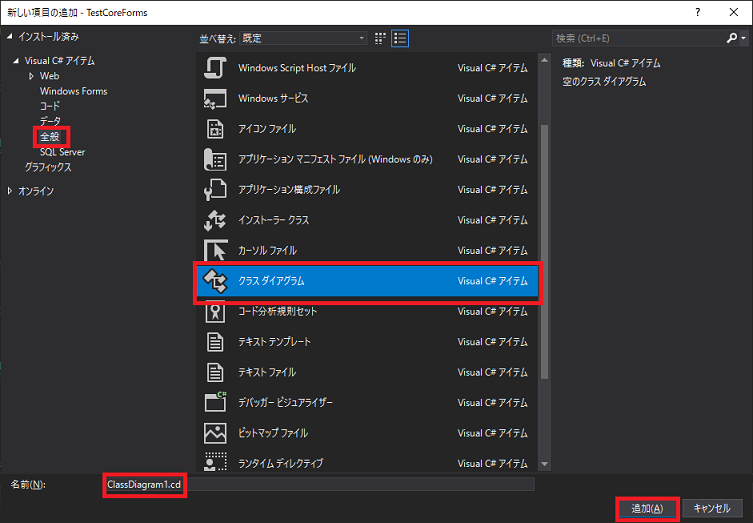
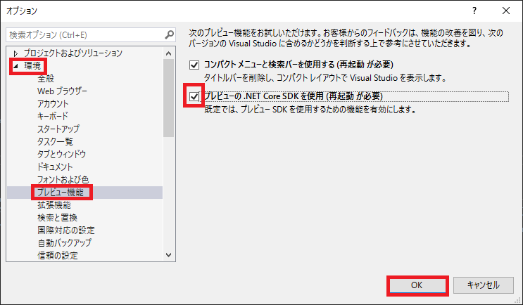
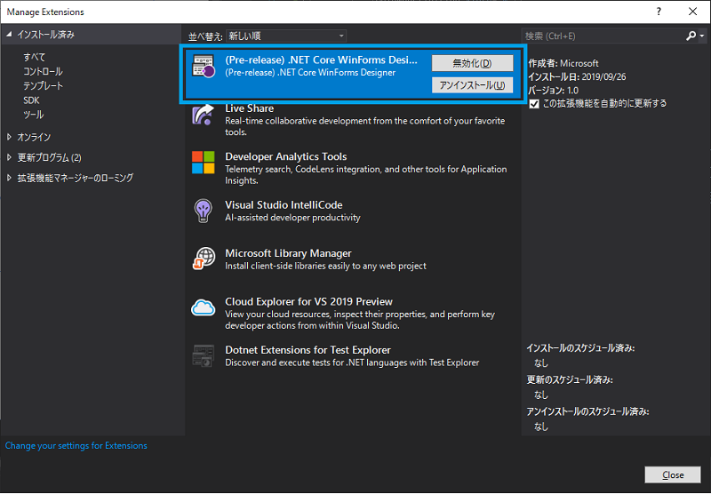

## 0. はじめに

基本的にMicrosoft Visual Studio 2019向けのインストール手順とする。  

 

## 1. クラスダイアグラムのインストール

1-1. Microsoft Visual Studio Installerを開き、「個別のコンポーネント」タブをクリック。  
リストの中の「クラスデザイナー」チェックボックスをクリックしチェックを入れ右下の「更新」ボタンを押し、  
ダウンロード兼インストールを行う。

1-2. Microsoft Visual Studioを開き適応なプロジェクトを作成しておく。  
ソリューションエクスプローラーのプロジェクト名を右クリックし、「追加」→「新しい項目」を選びダイアログを開く。  
左側リストの「全般」をクリックし真ん中リスト内の「クラスダイアグラム」をクリック選択し、「名前(N)」テキスト  
ボックスに名前を入力し「追加(A)」ボタンを押す。プロジェクトにクラスダイアグラムが追加される。  

1-3. 以下の様な白い背景に説明文が表示される。  
ツールボックスからクラスや関連付けをドラッグしてクラスを作成できる。  
また、既存のクラスがある場合はドラッグしてクラス図を自動で作成する事もできる。  

 

## 2. .NET Core 3.0のWPF、Windows FormsアプリケーションのGUIデザイナーを表示させる

2020年05月20日現在、Microsoft Visual Studio `16.3.x`のWPFとすべてのMicrosoft Visual StudioバージョンのWindows Formsアプリケーションは  
GUIデザイナーが導入されていません。  
Microsoft Visual Studio `16.3.x`では拡張機能プレビュー版(提供されていないコントロールも存在する)のみ一時公開されて使用可能となっていました。  
Microsoft Visual Studio `16.4.0`からWPFではデザイナーが対応されました。  
Microsoft Visual Studio `16.4.x`~`16.5.x`のWindows Formsアプリケーションは拡張機能プレビューが対応していないためGUIデザイナーの使用は不可能の様です。  
~~現在、Microsoft Visual Studio Preview版である`16.5.x`をインストールすると拡張機能なしで標準で使用できます。~~  
Microsoft Visual Studio 16.5.0でWindows Formsのデザイナー機能が一時機能していましたがその後すぐに削除されました。  
Microsoft Visual Studio 16.6.0では、設定でプレビュー機能をONにすると限定的にWindows Formsのデザイナーを使用する事がようやく可能になりました。  
[Windows Forms Designer for .NET Core Released](https://devblogs.microsoft.com/dotnet/windows-forms-designer-for-net-core-released/)  
16.3.xも一時公開されていたvisxファイルからインストールし使う事ができるが現在は公開されていない？  
また、正式なWindows Formsデザイナーの対応は少なくとも`16.7`以降もしくは.NET 5がリリースするタイミングと同時期になる様だ。  

### 2-1. WPFおよびWindows FormsのUIデザイナーPreview版の設定(16.3.x用)

~~メニューバーの「ツール(T)」→「オプション(O)」でオプションダイアログを開く。
左メニューの「環境」→「プレビュー機能」をクリックする。  
「プレビューの.NET Core SDKを使用(再起動が必要)」チェックボックスをクリックしチェックを入れる。  
「OK」ボタンを押す。VisualStudioの再起動をする。  
これで、WPFアプリケーションのGUIデザインは可能となるがWindows Formsアプリケーションの方は別途拡張機能.vsixファイルも必要。~~  

### 2-2. WinFormsのGUIデザイナー(.NET Core WinForms Designer)

メニューバーの「ツール(T)」→「オプション(O)」をクリックしオプションダイアログを開きます。  
左メニューの「環境」→「プレビュー機能」をクリックする。  
「Use the preview Windows Forms designer for .NET Core apps(requires restart)」チェックボックスをクリックしONにし「OK」ボタンをクリックし  
適用する。その後、ソリューションエクスプローラーのFormsクラスをダブルクリックしデザイナーを表示させます。  
※ツールボックスが無い場合は、メニューバーの「表示(V)」→「ツールボックス(X)」をクリックすると表示されます。  
現在は、DataGridViewおよびToolStripContainer以外は使用可能とありますがまだButtonがありません。近日公開予定となっておりますのでButtonにおいて  
は近く導入されると思われます。  

~~Microsoftの[.NET Core 3.0アナウンスブログ](https://devblogs.microsoft.com/dotnet/announcing-net-core-3-0/)内の  
WPF and Windows Forms記事の[separate download(個別のダウンロード)](https://aka.ms/winforms-designer)で  
winformsdesigner.setup.vsixをダウンロードできる。これをダブルクリックし手順に沿ってインストールする。~~  

~~また、メニューバーの「拡張機能(X)」→「拡張機能の管理(M)」からでもインストールが可能。  
以下、拡張機能のインストール状況。~~  

* * *
