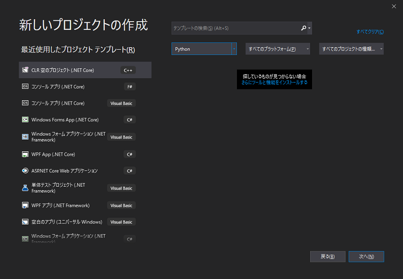
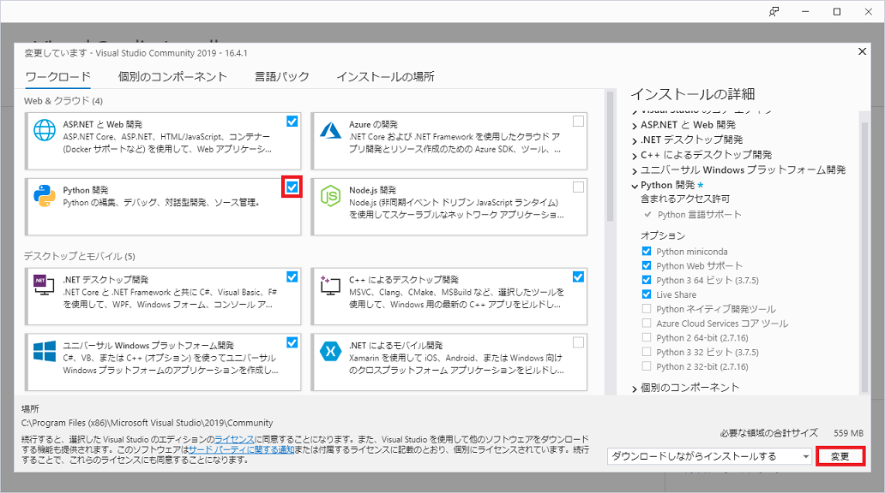
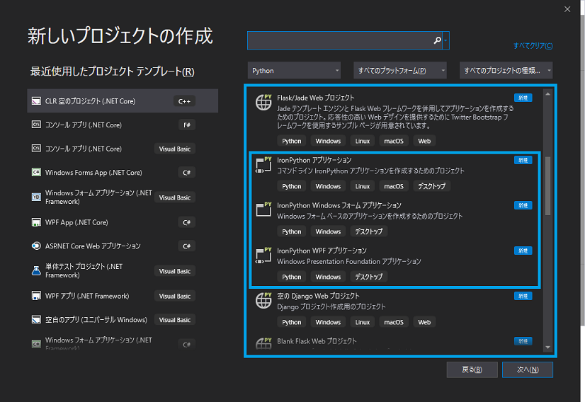
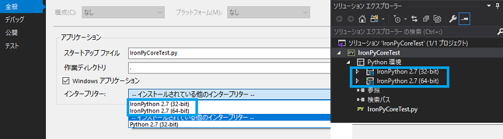
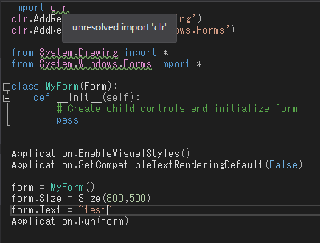

## 0. はじめに

Visual Studioの標準インストールではPython関連のインストールは行われてないので2019では以下の様な画面となり、  
Python関連のプロジェクトテンプレートが選択できないと思われる。  
  

 

## 1. Microsoft Visual Studio 2019でIronPythonを使うための環境構築

※Visual Studio Installerで標準的なインストール(.NETデスクトップ開発やASP.NETとWeb開発)が済んでいるものとします。  

Visual Studio Installerのワークロードタブをクリック。 

`Python開発`にチェックを入れ右下の「変更」ボタンを押しダウンロード兼インストールする。  

Visual Studioの新しいプロジェクトで以下の様にPython用のテンプレートが使用できるようになる。  
※IronPythonは`IronPythonアプリケーション`や`IronPython Windows フォームアプリケーション`、`IronPython WPF アプリケーション`  
などが対象です。  

※本体がVisualStudioで含まれているのか分からないがVisual StudioのソリューションエクスプローラーのPython環境でPython3.7(64-bit)など  
ではなく、IronPythonの項目が表示されていなければ実行しても反応がない。  
この手順ではプロジェクトのプロパティに表示しなかったので以下のURLでIronPython本体をダウンロードしインストールする。  

[IronPython2.7.9 GitHub](https://github.com/IronLanguages/ironpython2/releases/tag/ipy-2.7.9)  

インストールするとプロジェクトのプロパティにIronPythonの項目が表示されるようになる。

  

IronPythonの項目を選びプロジェクトに追加し実行するとデスクトップ画面が表示される。  

取り合えず実行は出来るようになったが以下のimport関連のエラーが発生しているがこれを解決する手段がまだ分からない。  

  

* * *
