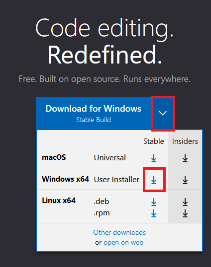
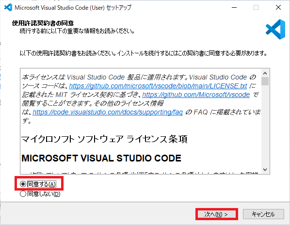
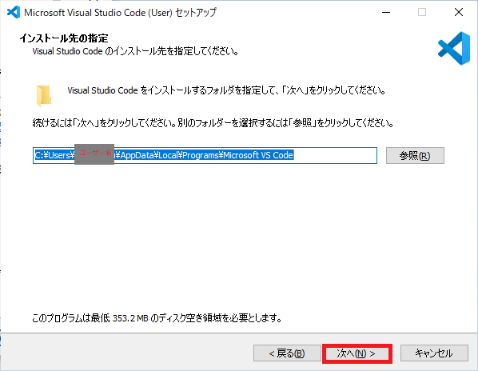
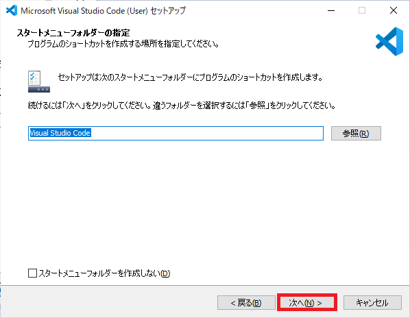
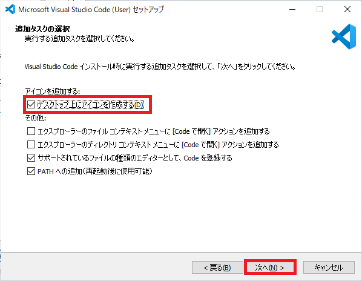
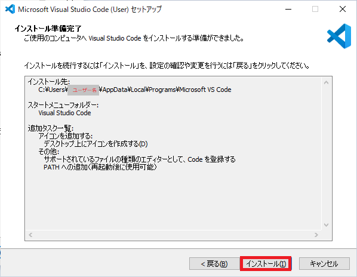
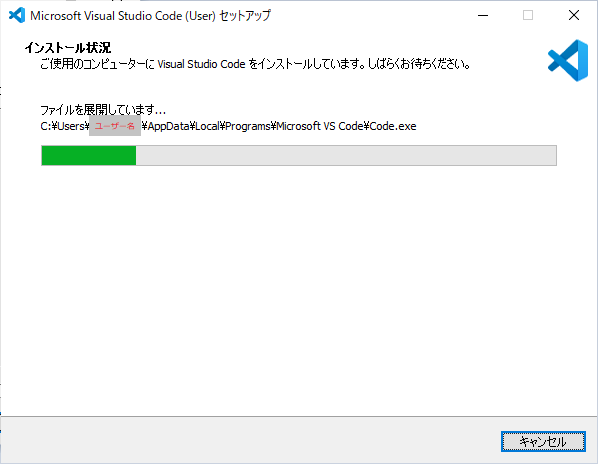
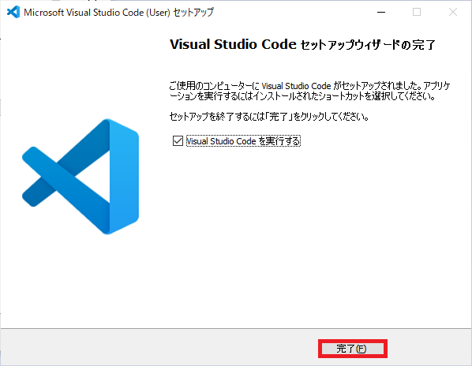
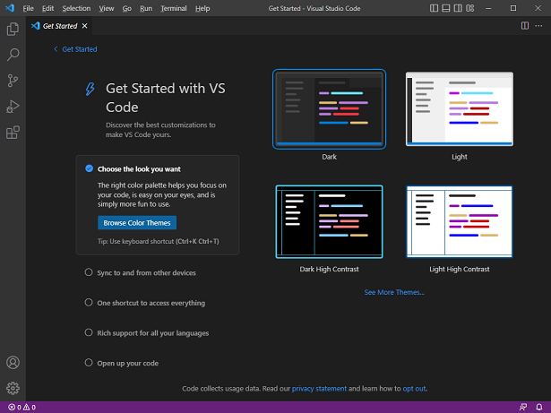

## 0. はじめに  
ここでは、インストーラー版でインストールをする方法を書いていきます。  

 

## 1. Microsoft Visual Studio Codeをダウンロードする  
まずは、Visual Studio Codeをダウンロードします。  

[ダウンロード先](https://code.visualstudio.com/)  
上記ダウンロード先の**Download for Windows**横の下矢印マーク(↓)をクリックしプルダウンメニューを出します。  
その中のWindows x64行とStable列に該当するマスの下矢印をクリックしダウンロードします。  
※これは、Windowsのカレントユーザーのみのインストーラーですがどのユーザーでも使えるようなインストーラーは**Ohter downloads**をクリックしその中にSystemInstallerがありますのでそれでインストールしてください。  

  

 

## 2. Microsoft Visual Studio Codeをインストールする  
ダウンロードした`.exe`ファイルをダブルクリックしインストーラーを起動します。  
すると、以下のような使用許諾契約書が表示されます。  
使用許諾書を読み、良ければ「同意する(A)」ラジオボタンをクリックし「次へ(N)」ボタンをクリックします。  

  

次に、インストールするフォルダのPathを指定します。  
※ここでは、特にデフォルトの場所へインストールしますので別の場所へインストールする場合は参照ボタンをクリックして指定して下さい。  

ここでは、そのまま「次へ(N)」ボタンをクリックし次へ進みます。  

  

次に、スタートメニューにショートカットを作成する場所を指定します。  
ここでも、特にデフォルトで問題ないので「次へ(N)」ボタンをクリックし進みます。  

  

次に、様々な設定を追加することができますがデスクトップにアイコンだけは追加しておこうと思いますのでチェックボックスをクリックし選択します。  
※ご使用の状況により選んで下さい。  

選択したら「次へ(N)」ボタンをクリックし次へ進みます。  

  

インストール前にここまでの操作に間違いないかを確認するための一覧が出ます。  
確認し良ければ「インストール(I)」ボタンをクリックしインストールを開始します。  

  

インストールが開始しインストールされます。※しばらくお待ちください。  

  

これで、インストールが完了しましたので「完了(F)」ボタンをクリックし終了させます。  

  

Visual Studio Codeが起動し使えるようになると思います。  
お好きな外観を画面右側で指定できますのでお好きなカラー外観を指定しましょう。  
次回は、デスクトップやスタートメニューにショートカットがありますのでそれで起動しましょう。  

  

___