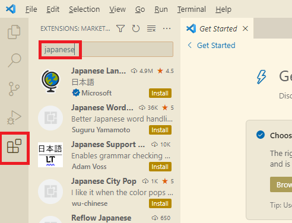
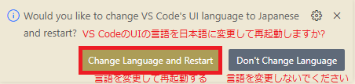
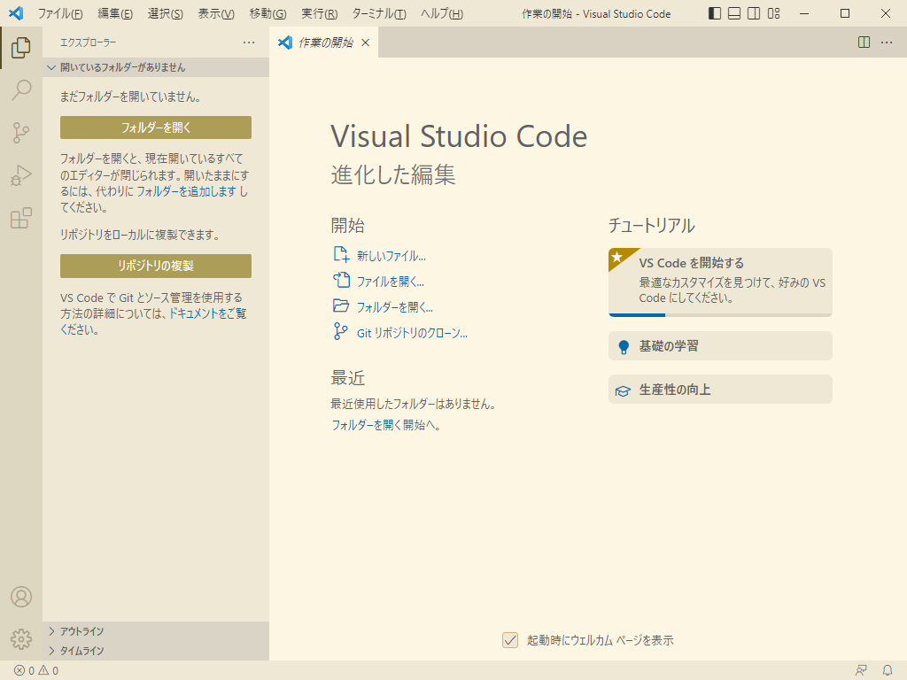
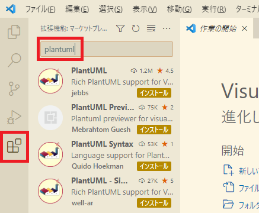
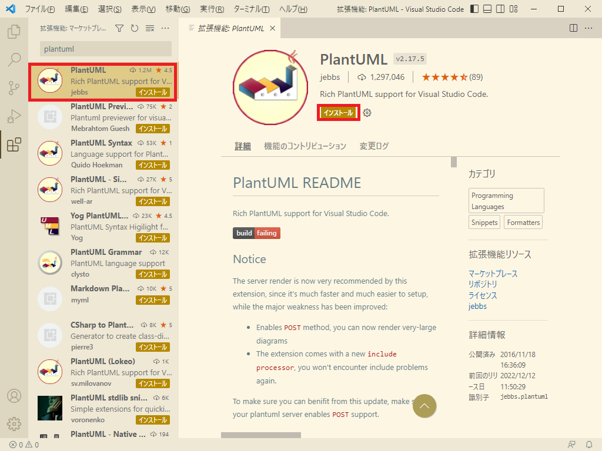
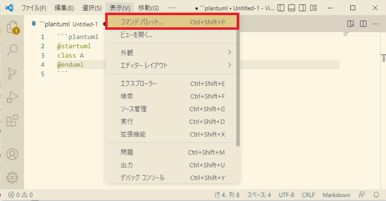
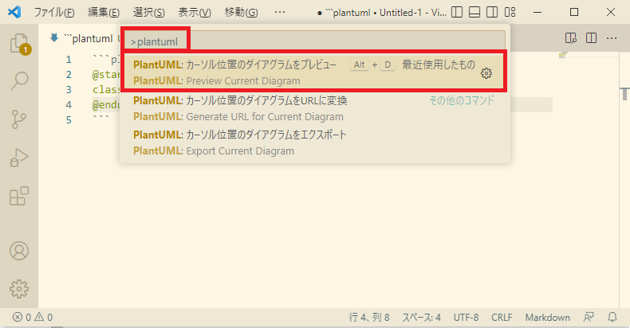
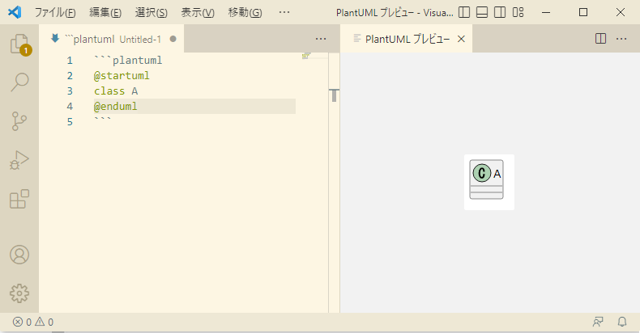

## 0. はじめに  
Eclipseの印刷機能は無駄に余白があり余り便利ではないためテキストエディタで開いて印刷していました。  
また、BoostNote、Atom、SublimeTextなど様々なテキストエディタでコードからのUMLの作成を行おうとしていました。  
しかし、無料サポートの終了やサービスの終了などもあり結局Visual Studio Codeのプラグインに行きつきました。  
コードからのUMLの作成と印刷機能があるテキストエディタも中々無いのが現状のようです。  

そこで、Visual Studio Codeによる様々なプラグインの追加についての手順を書きます。  

<br />

## 1. Microsoft Visual Studio Codeを日本語化する  
まずは、このアプリを日本語化にしてみます。  

### 1-1. Japanese Language Pack for Visual Studio Codeプラグインのインストール  
ウィンドウ左側Extensions(拡張機能)タブをクリックし(またはCtrl + Shift + Xキー)Extensions Marketplace検索ボックスへ`japanese`と入力する。    

  

候補が出てくるので`Japanese Language Pack for Visual Studio Code`をクリックして選び「Install」ボタンを押しインストールする。

  

インストールされると以下のようなダイアログメッセージがウィンドウ右下へ表示されます。  

  

有効にするには再起動する必要があるということなので「Change Language and Restart」ボタンをクリックしVisual Studio Codeアプリを再起動します。  

再起動後は、日本語に代わっているはずです。  

  

<br />

## 2. UML図の作成のためのPlantUMLを追加する  
コードからUML図を作成する便利なツールも存在しその中の１つがPlantUMLと呼ばれるものがあります。  
ここでは、Visual Studio Codeで使えるように手順を書いていきます。  

### 2-1. PlantUMLプラグインのインストール  
まずは、プラグインのインストールを行います。  
ウィンドウ左側Extensions(拡張機能)タブをクリックし(またはCtrl + Shift + Xキー)Extensions Marketplace検索ボックスへ`plantuml`と入力する。  

  

候補が出てくるので`PlantUML`をクリックして選び「Install」ボタンを押しインストールする。  

  

アプリの再起動を促すダイアログメッセージは出ませんでしたが念のため再起動すると良いでしょう。  

### 2-2. PlantUmlを使うための準備  
Visual Studio Codeだけでなく別のテキストエディタのプラグインでもそうですがこのPlantUMLはそのままでは使えないようです。  
その準備を１つづして行きます。  

#### 2-2-1. jarファイルを配置する  
`plantuml.jar`ファイルをダウンロードし`C:\ユーザー\`にjarファイルを配置してください。  
[ダウンロード先](https://plantuml.com/ja/download)  
このファイルが本体なので無いとそもそも動作しません。  
先ほどのプラグインのインストールはこれをVisual Studio Code上で動作させるためにあるようです。  

#### 2-2-2. WindowsにJavaのPathを通す  
次に、Windowsの環境変数のPathに`javac.exe`があるフォルダのpathを通しておきます。  
[詳しくはこちらを参照](../../PathSetting/PathSettingWin)  
Javaで動作するようですのでこれが必要です。  

#### 2-2-3. 適当なPlantUMLコードを用意する  
マークダウン形式(.md)のファイル内に以下のようなPlantUMLコードも書いていきます。  

```


```plantuml
@startuml
Class A
@enduml
```この文字は削除
```

### 2-3. PlantUMLのプレビューを表示  

PlantUMLコードを書いた`そのコード上のどこかにカーソルを置いて`おいてください。  
**※カーソルを置いてないと表示されません。**  

メニューの「表示(V)」→「コマンドパレット」をクリックします。  

  

`plantuml`と検索ボックスへ入力すると候補が表示されるので`カーソル位置のダイアグラムをプレビュー`をクリックします。  

  

以下のようなコードに対したプレビュー表示されると思います。  

  

※また、`Graphviz`というライブラリーをインストールしないとシーケンス図とアクティビティ図以外では以下の様なエラーメッセージがプレビューに表示されすべてのUML図を使えないかもしれません。  

```
dot実行可能ファイル：null
dot実行可能ファイルが見つかりません
Graphvizが見つかりません。試してみてください

@startuml
testdot
@enduml

または

java -jar plantuml.jar -testdot

```

#### Graphvizのインストールと環境変数PATH設定

よって、`Graphviz`というライブラリーをインストールする必要がある様です。  
[Graphvis(Windows版)](https://graphviz.gitlab.io/_pages/Download/Download_windows.html)で.zip版をインストールします。 

.zipファイルを展開し適当なディレクトリへ配置し`～\release\bin`をWindowsの環境変数のPATHへ設定してください。  

これでクラス図などのUML図も表示されるはずです。 

### 2-4. プレビューされた画像の保存

プレビューされたUML図を画像として保存します。  
メニューバーの「表示(V)」→「コマンドパレット」をクリックし(またはCtrl + Shift + Pキー)検索ボックスを出します。  
`plantuml`と入力し出てきた候補の`カーソル位置のダイアグラムをエクスポート`を選びます。  
※これもソースコードにカーソルを置いておく必要があります。  

PlantUML(マークダウンファイル)ソースコードと同じ場所へフォルダが作成されその中に同じ名前で画像保存されます。  

<br />

## 3. コードの印刷機能を追加する
**準備中**  
### 3-1. PrintCodeプラグインのインストール

ウィンドウ左側Extensionsタブをクリックし(またはCtrl + Shift + Xキー)Extensions Marketplace検索ボックス  
へ`printcode`と入力する。  
候補が出てくるので`PrintCode`をクリックして選び「Install」ボタンを押しインストールする。  

  

アプリの再起動を促すダイアログメッセージは出ませんでしたが念のため再起動すると良いでしょう。  

### 3-2. 印刷のためのテストコードを作成

メニューバーの「ファイル(F)」→「新規ファイル」で新しいファイルを起動し以下の様に.java用のファイルを作成。  

```java
package develop;

import java.util.String;

public class Develop1 {
    private String str;
    public static void main(String[] args) {
        str = "メッセージ";
        System.out.println(str);
    }
}
```

メニューバーの「ファイル(F)」→「名前を付けて保存」を選び「ファイルの種類(T)」コンボボックスで`Java(*.java;*.jav)`  
を選択し「名前(N)」テキストボックスへファイル名を付け適当な場所へ保存して下さい。  

### 3-3. テストコードの印刷

プラグインの機能を使うための操作をし印刷してみます。  
メニューバーの「表示(V)」→「コマンドパレット」をクリックし(またはCtrl + Shift + Pキー)検索ボックスを出します。  
`printcode`と入力し出てきた候補(ここでは１つですが)の**PrintCode**を選びます。  

  

既定のブラウザとその印刷ダイアログが表示され「印刷」ボタンなどを押すと印刷できます。  
※また、この印刷機能は内部で1度htmlファイルに変換してそのhtmlファイルの印刷を行おうとするものです。  

  

しかし、シンタックスハイライトが消えており文字列やコメント以外は黒字のみでクラス名や戻り値などの色が色分け  
されていません。  
JavaScriptなど言語によってはもう少し対応されているものもありますが現状ではできなさそうです。  
色付きが良ければSublimeText3などになりそうです。  

<br />

___