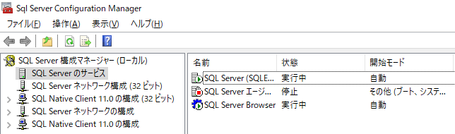
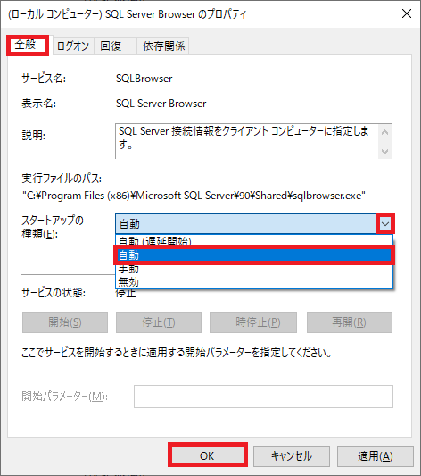
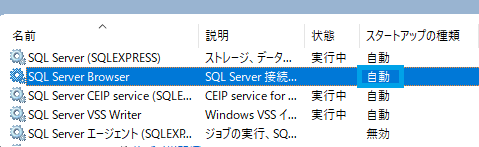
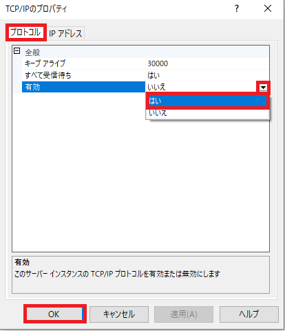
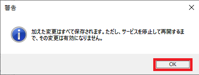
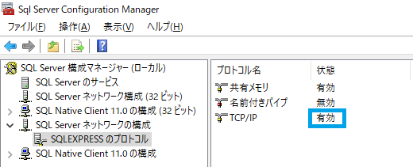
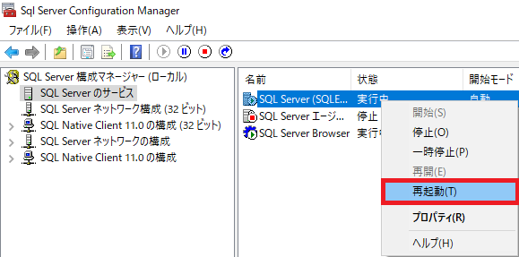
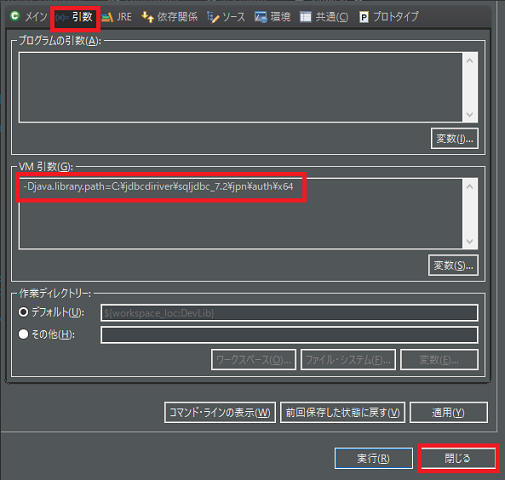

## 1. SQL Server Browserの起動

既定のインスタンスではなく名前付きインスタンスでかつポート番号を指定しない動的ポートを使う場合はSQL Server Browserの起動が必要。  
Standard Editonなどは、インスタンスが１つで固定のSQL ServerのTCPポート1433をデフォルトにしている様だが、Express Editionはデフォルトで動的ポートの設定になっている。  
起動ができていないと次の様なエラーが出る。 

    com.microsoft.sqlserver.jdbc.SQLServerException: ホスト localhost、名前付きインスタンス sqlexpress への接続が失敗しました。
    エラー: "java.net.SocketTimeoutException: Receive timed out"。
    サーバーとインスタンスの名前を調べ、ポート 1434 への UDP トラフィックがファイアウォールにブロックされていないことを確認してください。
    SQL Server 2005 以降では、SQL Server Browser サービスがホスト上で実行されていることを確認してください。

1-1. SQL Server Browserの起動の設定  
構成マネージャー(SQL Server Configuration Manager)で左のリストの「SQL Serverのサービス」を選び、  
その中の「SQL Server Browser」を右クリックで「開始(S)」を選べば選択できる。  
※しかし、手動で毎回するよりはWindowsの起動と同時に自動起動の設定の方が良いでしょう。  



また、SQL Serverをインストール直後は右クリックでメニューを出しても開始や再開がデフォルトでは選択できない。  
方法は、「コントロールパネル」→「管理ツール」→「サービス」でサービスの一覧を開き、無効になっている「SQL Server Browser」を右クリックし「プロパティ(R)」をクリック。  
「スタートアップの種類(E)」コンボボックスを「自動」にし、「OK」ボタンをクリックする。  



※サービスで自動になっている事を確認  



<br />

## 2. TCP/IPの有効

構成マネージャーでTCP/IPを有効にしていないと以下のメッセージが出る。  

```:エラーメッセージ
com.microsoft.sqlserver.jdbc.SQLServerException: サーバー sqlexpress は、TCP/IP をリッスンするように構成されていません。
```

2-1. 構成マネージャー(SQL Server Configuration Manager)で左のリストの「SQL Serverネットワークの構成」→「&lt;インスタンス名>のプロトコル」を  
右クリックし、「プロパティ(R)」を選びダイアログを開く。  
「有効」コンボボックスを「はい」にし、「OK」ボタンをクリックし適用する。   



※以下の様なメッセージが出るのでSQL Serverの再起動が必要となる。  
また、TCP/IPが「有効」になっている事を確認。  





※SQL Serverの再起動を行います。  
左リストの「SQL Serverのサービス」を選び、その中の「SQL Server(インスタンス名)」を右クリックし「再起動(T)」を選び再起動する。  


<br />

## 3. Windows統合認証での接続

接続文字列には`integratedSecurity=true`とするが、このままだと次の様なエラーが出る。  

```:エラーメッセージ
com.microsoft.sqlserver.jdbc.SQLServerException: このドライバーは、統合認証を行えるようには構成されていません。
ClientConnectionId:<長いID>
```

エラーを出さないためには、`sqljdbc_auth.dll`を読み込ませる必要がある。  
ダウンロードしたJDBCドライバーフォルダ内にあるので、これを次のいずれかの方法で対応しなければならない。    

1.  Windowsのシステムディレクトリ内にコピーして自動で読み込んでもらう。  
2.  Eclipseで使うなら実行の構成のVM引数に指定する。
    プロジェクトを右クリックしプルダウンメニューの「実行(R)」→「実行の構成(N)」でダイアログを開く。  
    「引数」タブをクリックし、「VM引数(G)」テキストボックスに`-Djava.library.path=C:\xxx`にPathを指定する。  
    「閉じる」ボタンを押し適用する。  



### **Microsoftドキュメント抜粋**

> #### Windows 上で統合認証を使用する接続
>
> JDBC ドライバーでは、integratedSecurity 接続文字列プロパティを通じて、Windows オペレーティング システム上でのタイプ 2 の統合認証の使用がサポートされています。 統合認証を使用するには、JDBC ドライバーがインストールされているコンピューターの Windows システム パス上のディレクトリに sqljdbc_auth.dll ファイルをコピーします。  

> sqljdbc_auth.dll ファイルは次の場所にインストールされています。  
> \`&lt;"インストール ディレクトリ">\\sqljdbc_&lt;"バージョン">\\&lt;"言語">\\auth\`  

> サポートされている任意のオペレーティング システムのMicrosoft SQL Server 用 JDBC Driverを参照してくださいを使用した Kerberos 統合認証を SQL Server への接続で追加された機能の説明のMicrosoft SQL Server 用 JDBC Driver 4.0アプリケーションに接続できるようにする、データベース タイプ 4 の Kerberos 統合認証を使用します。  

> 注意
> 32 ビットの Java 仮想マシン (JVM) を実行している場合は、オペレーティング システムのバージョンが x64 であっても、x86 フォルダーの sqljdbc_auth.dll ファイルを使用してください。 64 ビットの JVM を x64 プロセッサ上で実行している場合は、x64 フォルダーの sqljdbc_auth.dll ファイルを使用してください。  
>
> または、java.library.path システム プロパティを設定して sqljdbc_auth.dll のディレクトリを指定することもできます。 たとえば、JDBC ドライバーが既定のディレクトリにインストールされている場合、Java アプリケーションの起動時に次の仮想マシン (VM) 引数を使用することで、DLL の場所を指定できます。  
>
> `-Djava.library.path=C:\Microsoft JDBC Driver 6.4 for SQL Server\sqljdbc_<version>\enu\auth\x86`  

* * *