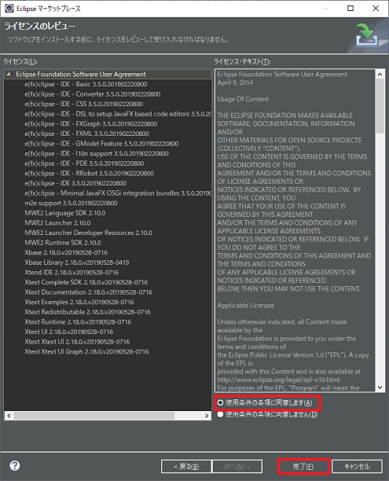
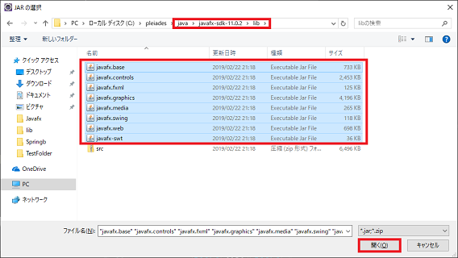
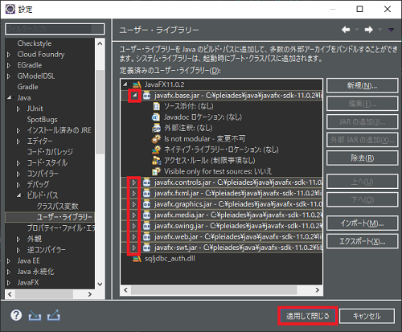

## 0. はじめに

JDK11からはJavaFXが同梱されなくなり使用するにはOpenJFXを使う必要がある。  
という事は、JavaFxは主流から外れるか分からないが一応この様にやればできるという事をメモ。  
`OpenJFXは、OpenJDKと同じように、クラスパスの例外を除いてGPLの下でライセンスされているフリーソフトウェアです。`   

    IDE : Eclipse 2019-06(4.12.0) Pleiades
    Java : Adopt OpenJDK 11.0.4
    JavaFX : OpenJFX 11.0.2

## 1. 事前準備

OpenJFXのインストールとユーザーライブラリーの追加を行います。  

### 1-1. OpenJFXのインストール

<https://openjfx.io/> のダウンロードサイトへアクセス。

    1-1-1. 目的のプラットフォームのSDKをダウンロードする。
    　　   ここではWindowsのSDKをダウンロードします。
         


    1-1-2. .zipファイルを展開しjavafx-sdk-11.0.2ファイルを丸ごと適当な場所へ移す。
           ここでは以下の様なフォルダ下へコピーします。フォルダはなければ作成してして下さい。  
           C:\pleiades\javalib\javafx-sdk-11.0.2\

### 1-2. e(fx)clipseプラグインのインストール

JavaFxプロジェクトを作成するためのプラグインをインストールする必要があります。  

    1-2-1. メニューバーの「ヘルプ(H)」→「Eclipseマーケットプレース(M)」をクリックし「Eclipseマーケットプレース」
           ダイアログボックスを開く。
    1-2-2. 「Search」タブをクリックし「検索(I)」テキストボックスに「javafx」と入力しEnterを押す。
           すると、絞り込まれますのでe(fx)clipseの「インストール」ボタンをクリック。
           


    1-2-3. ライセンステキスト(I)を読み良ければ「使用条件の条項に同意します(A)」ラジオボタンを選びます。
    1-2-4. 「完了(F)」ボタンを押しインストールします。
           Eclipseの右下バーでインストールされている事を確認、少し時間がかかります。



    1-2-5. インストールされるとIDEの再起動を促されるので「今すぐ再起動(R)」を押しEclipseを再起動させる。

<br />

### 1-3. ユーザーライブラリーの登録追加

そのままダイレクトに外部jarを取り込んでも良いが.jarファイル群をまとめたユーザーライブラリーの追加をしておきます。  

    1-3-1. メニューバーの「ウィンドウ(W)」→「設定(P)」を選択し「選択」ダイアログを開く。
    1-3-2. 「設定」ダイアログのツリーリスト内の「Java」→「ビルド・パス」→「ユーザー・ライブラリー」
    　　  を選択し、「新規(N)」ボタンをクリックする。
        


    1-3-3. 「ユーザー・ライブラリー名」テキストボックスにJavaFX11.0.2と入力し、「OK」ボタンを押す。


    1-3-4. 作成されたユーザー・ライブラリーを選択し、「外部JARの追加(X)」ボタンを押す。


    1-3-5.  C:\pleiades\javalib\javafx-sdk-11.0.2\lib\フォルダに移動し、.jarファイルをまとめてドラッグ選択する。
    　　  「開く(O)」ボタンを押し開く。



    1-3-6. 以下の画像の様に追加される。このままでも良いがツリーの▷ボタンを押して閉じておく。
    　　  「適用して閉じる」ボタンを押しウィンドウを閉じる。



これでプロジェクトでユーザー・ライブラリーとして追加できるようになる。  
<br />

## 2. 新規Javaプロジェクトの作成

    2-1. 「新規(N)」→「その他(O)」をクリックし。「ウィザードを選択」ダイアログを開く。
    2-2. ツリーの「JavaFX」→「JavaFXプロジェクト」を選択し「次へ(N)」をクリックする。


    2-3. 「プロジェクト名(P)」テキストボックス内にJavaFxLeaningと入力し、「実行環境JREの使用(V)」
    　　  コンボボックスの「JavaSE-11」を選ぶ。
        　  「次へ(N)」をクリックする。
           


    2-4. ライブラリ(L)タブをクリックし「モジュールパス」を選択する。
    　  「ライブラリーの追加(I)」ボタンをクリックし「ライブラリーの追加」ダイアログを開く。


    2-5. リストボックスの「ユーザー・ライブラリー」を選択し、「次へ(N)」をクリック。


    2-6. 「JavaFX11.0.2」にチェックを入れ、「完了(F)」ボタンをクリックし完了する。


    2-7. 「JavaFX11.0.2」のユーザー・ライブラリーがモジュールパスへ追加される。
    　　 「完了(F)」ボタンを押しプロジェクト作成を完了する。


    以下の様なプロジェクトが出来きます。


<br />

## 3. 実行時のVM引数を設定する。

その前に、実行時のVM引数を設定せず実行してみます。

    3-1. パッケージ・エクスプローラーのプロジェクト名の上で右クリックし「実行(R)」→
    　  「2. Javaアプリケーション」をクリックする。
       


    3-2. 「Main - application」をクリックし実行してみる。


#### **しかしコンソールに以下の様なエラーが出ます。**

```:コンソール
エラー: メイン・クラスapplication.Mainを検出およびロードできませんでした
原因: java.lang.NoClassDefFoundError: javafx/application/Application
```

これを発生させないために「実行時のVM引数」を設定します。

    3-3. 「3-1.」の画像で表示されている「実行時の構成(N)」をクリックし「実行構成」ダイアログを開く。
    3-4. ツリーの「Javaアプリケーション」→「Main」を選び、引数タブをクリック。
    　   「VM引数(G)」テキストボックス内に以下を入力する。
        

    --module-path "\C:\pleiades\java\javafx-sdk-11.0.2\lib" --add-modules=javafx.controls,javafx.fxml

    　  「実行(R)」ボタンを押し設定を完了し実行されます。
       


#### **空のウィンドウが出れば成功です。**

**--module-path**には実行時にJavaFXのライブラリー(.jar)を実行するようにライブラリーファイルのある場所を指定する。  
**--add-modules**にはjavafx.fxmlがあればそれを読み込み実行します。  
無くても実行はできます。  


※Windowsではこれで出来ますがMacではエラーメッセージが出てダメでした。  
エラー内容はこのメモを残す時にMacの環境ではなかったので次回。  

* * *
