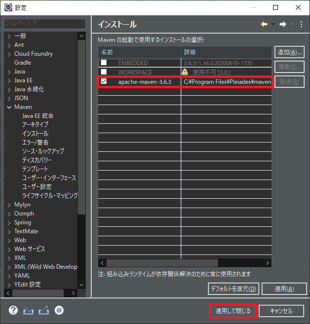

## 0. はじめに

Spring BootなどでEclipse Maven プラグインのm2eclipse(EMBEDDED)でMaven Installなどを行うとクラスパスへSLF4Jの複数バインディングされた  
という警告が発生します。  

    SLF4J: Class path contains multiple SLF4J bindings.
    SLF4J: Found binding in [jar:file:/C:/Program%20Files/Pleiades/eclipse/plugins/org.eclipse.m2e.maven.runtime.slf4j.simple_1.16.0.20200610-1735/jars/slf4j-simple-1.7.5.jar!/org/slf4j/impl/StaticLoggerBinder.class]
    SLF4J: Found binding in [file:/C:/Program%20Files/Pleiades/eclipse/configuration/org.eclipse.osgi/5/0/.cp/org/slf4j/impl/StaticLoggerBinder.class]
    SLF4J: See http://www.slf4j.org/codes.html#multiple_bindings for an explanation.
    SLF4J: Actual binding is of type [org.slf4j.impl.SimpleLoggerFactory]
    SLF4J: Class path contains multiple SLF4J bindings.
    SLF4J: Found binding in [jar:file:/C:/Program%20Files/Pleiades/eclipse/plugins/org.eclipse.m2e.maven.runtime.slf4j.simple_1.16.0.20200610-1735/jars/slf4j-simple-1.7.5.jar!/org/slf4j/impl/StaticLoggerBinder.class]
    SLF4J: Found binding in [file:/C:/Program%20Files/Pleiades/eclipse/configuration/org.eclipse.osgi/5/0/.cp/org/slf4j/impl/StaticLoggerBinder.class]
    SLF4J: See http://www.slf4j.org/codes.html#multiple_bindings for an explanation.
    SLF4J: Actual binding is of type [org.slf4j.impl.SimpleLoggerFactory]

    日本語訳
    SLF4J: クラスパスには、複数のSLF4Jバインディングが含まれています。
    SLF4J: [jar:file:～]でバインディングが見つかりました
    SLF4J: [file:～]でバインディングが見つかりました
    SLF4J: 説明については、http：//www.slf4j.org/codes.html#multiple_bindingsを参照してください。
    SLF4J: 実際のバインディングのタイプは[org.slf4j.impl.SimpleLoggerFactory]です。

通常、複数のバインディング警告が発生する時は`jar:file`と`jar:file`で発生し片方のjarファイルをpom.xmlファイルで除外するようです。  

[エラーメッセージの詳細URL](https://www.slf4j.org/codes.html#multiple_bindings)  

上記、URLを参考に`<exclusion>`タグを追加し除外する。  
下記のSpring Boot例では、logback-classic.jarのorg.slf4j.implパッケージとlog4j-over-slf4j.jarのorg.slf4jパッケージ内にあるclass  
ファイルをすべて除外するという意味。  

```xml
<dependency>
    <groupId>org.springframework.boot</groupId>
    <artifactId>spring-boot-starter</artifactId>
    <exclusions>
        <exclusion>
            <artifactId>logback-classic</artifactId>
            <groupId>org.slf4j.impl</groupId>
        </exclusion>
        <exclusion>
            <artifactId>log4j-over-slf4j</artifactId>
            <groupId>org.slf4j</groupId>
        </exclusion>
    </exclusions>
</dependency>
```

ですが今回の警告は、EclipseのMavenプラグインであるm2eclipse(EMBEDDED)の警告であり調べるとどうもm2eclipseプラグインのバグの様です。  

[Eclipse Bug 506676](https://bugs.eclipse.org/bugs/show_bug.cgi?id=506676)  

Eclipseの2020-06から2020-09にかけてのバグである様ですが、私の場合Eclipse 2020-09でSpring Tool Suite 4.8.1とSpring Boot 2.3.5を11月  
5日に実行した段階では警告は出ていないと記憶しています。11月12日以降Spring Boot 2.4.0が出た後にMaven CleanやMaven Installを行おうと  
した際に発生しました。  
また、この警告が発生した後Spring Boot 2.3.5に戻しても警告は消えなくなりました。  

<br />

## 1. 解決策

### 1-1. バグが解消されるまで待つ

[Eclipse Bug 506676](https://bugs.eclipse.org/bugs/show_bug.cgi?id=506676)  
m2eプラグインのバグなので解消されるまで待つ。  

### 1-2. 別途用意したMavenを指定し使う

別途、MavenをインストールしそのMavenをEclipseで指定して使う方法で解決できます。  
メニューの「ウィンドウ(W)」→「設定(P)」でダイアログを表示します。  
ダイアログ左リストの「Maven」→「インストール」をクリックします。  
現在は、`EMBEDDED`となっているので「追加(A)」ボタンを押し「新規Mavenラインタイムダイアログ」を表示させます。  

  

「ディレクトリ」ボタンをクリックし別途用意したMavenフォルダを指定し(binフォルダを含むフォルダ)「完了(F)」ボタンをクリックし適用します。  

  

追加した外部Mavenがリストに表示されますのでそのチェックボックスをクリックして選択し「適用して閉じる」ボタンを押し終了します。  

  

* * *
