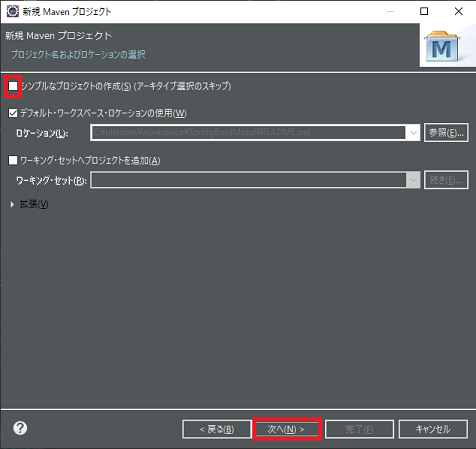
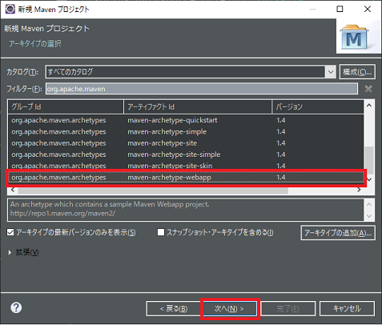
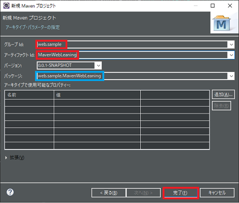
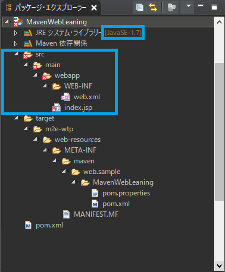
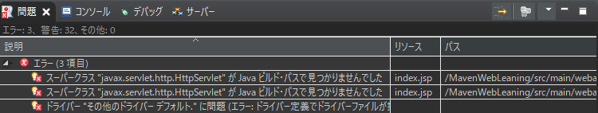
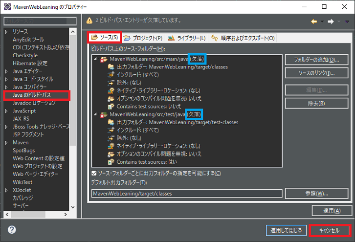
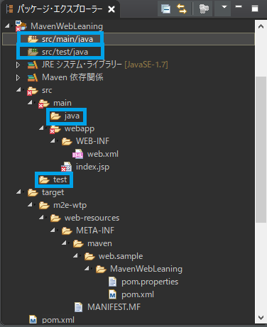
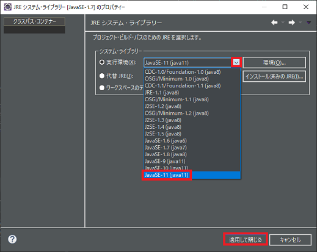
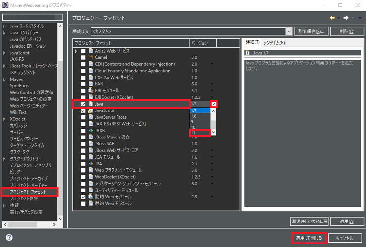

## 1. Mavenプロジェクトの作成

    1-1. 「ファイル(F)」→「新規(N)」→「その他(O)」を選びウィザード選択ダイアログを開く。
    1-2. リストのMavenフォルダのMavenプロジェクトを選択し「次へ(N)」ボタンをクリック。
    1-3. 「シンプルなプロジェクトの作成(S)」のチェックボックスが外れている事を確認し「次へ(N)」
    　　ボタンをクリック。



    1-4. 一覧から maven-archetype-webを選び「次へ(N)」をクリック。「フィルター(F)」に
           org.apache.maven.archetypesを入力して絞り検索しても良い。
           ※一覧表示されるのが少し遅い場合があるので少し待つ必要がある。



    1-5. グループIdとアーティファクトIdを入力する。グループIdとアーティファクトIdの組み合わせで
    　　パッケージ名が決められる。また、アーティファクトIdがプロジェクト名となる。
       　入力後「完了(F)」をクリックするとプロジェクトが作成される。



    1-6. 以下の様なプロジェクトが作成される。
           しかし、エラー表示やフォルダが足らない、Javaのバージョンが古いなどがあるのでそのあたりを
           調整する事にする。





<br />

## 2. 足らないフォルダを追加

    2-1. src/main内にjavaフォルダが、srcフォルダ内にtestフォルダとそのtestフォルダ内にjavaフォルダが
    　   無い。従って、プロジェクトのプロパティのソースタブに以下の様な (欠落) 表示がされている。
          ※src/main/javaとsrc/test/javaとなる様にフォルダを作成する。
          



    2-2. フォルダを作成すると以下の青枠の様に追加される。
           作成されているのに表示されない場合はプロジェクトを右クリックしリフレッシュを選び更新。



<br />

## 3. Javaのバージョンを変える

    3-1. JavaのシステムライブラリーがJavaSE-1.7となっているのでJava11に変える。
          「JREシステムライブラリー」を右クリックしダイアログを開く。



    3-2. 「実行環境(X)」ラジオボタンのコンボボックスをクリックし「JavaSE-11(Java11)」を選択し、
    　　「適用して閉じる」ボタンを押し適用する。
    　　プロジェクトツリーのライブラリフォルダのJREシステムライブラリーがJavaSE-11となる。
    3-3. しかし、JavaSE-11としたため「Javaコンパイラー・レベルが、インストールされているJava
    　　プロジェクト・ファセットのバージョンと一致しません」というエラーが発生するので、
      　 プロジェクトを右クリックしプロパティを選びダイアログを開き設定する。
    3-4. 左のリストの中から「プロジェクト・ファセット」を選び「Java」チェックボックスの
    　　コンボボックスをクリックし、「11」を選びJREシステムライブラリーと一致させる。
           「適用して閉じる」ボタンを押し適用する。



<br />

## 4. Mavenのpom.xmlにServletのjarを指定する

    4-1. pom.xmlファイルの<dependencys>と</dependencys>内に以下の内容を追加する。
    　   ※バージョンは2019/05/12日現在の最新なので最新を指定すると良い。
           ※MvnRepositoryサイトのjavax.servlet-apiを参照すると良い。

```xml
<!-- https://mvnrepository.com/artifact/javax.servlet/javax.servlet-api -->
<dependency>
    <groupId>javax.servlet</groupId>
    <artifactId>javax.servlet-api</artifactId>
    <version>4.0.1</version>
    <scope>provided</scope>
</dependency>
```

これで、**「スーパークラス "javax.servlet.http.HttpServlet" が Java ビルド・パスで見つかりませんでした」**というエラーが消えパッケージ・エクスプローラーのフォルダやindex.jspのｘ印が消える。

<br />

## 5. Mavenのコンパイラーのバージョンを指定する

    5-1. pom.xmlファイルの<properties>と</properties>内を以下の様に変更する。

　　   ここでは、11を指定する事にする。

```pom.xml
<properties>
  <project.build.sourceEncoding>UTF-8</project.build.sourceEncoding>
  <java.version>11</java.version>
  <maven.compiler.source>11</maven.compiler.source>
  <maven.compiler.target>11</maven.compiler.target>
 </properties>
```

これで、プロジェクトを右クリックし「実行(R)」→「１サーバーで実行」で実行し、ブラウザのURL
に`localhost:8080/プロジェクト名/index.jsp`で`HelloWorld!`が表示される。
`src/main/java`内にサーブレットなどのファイルを入れ、`src/main/webapp/WEB-INF`内以下にjspファイル
を入れて使えばMavenを使った動的Webプロジェクトで行うような事ができそうだ。

* * *