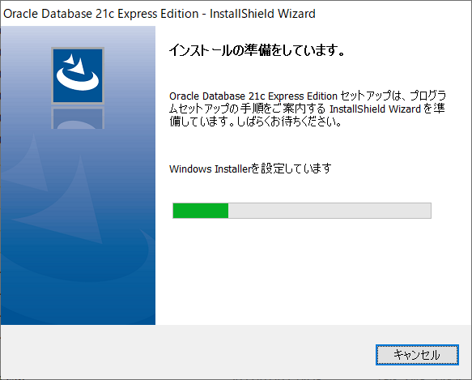

## 0. はじめに  
ここでは、Oracle Database 21c Express EditionのWindows版のインストールの方法を書いていきます。  
Express Editionはサポート対象外なので更新パッチは提供されないので注意が必要です。  
また、データベースをグラフィカルなGUIインターフェースで操作するデータベース管理ツールはインストールされませんので別途インストールして下さい。  
※コマンドラインCUIインターフェースで操作する`sql * plus`はインストールされます。  

 

## 1. Oracle Database 21c Express Editonをダウンロードする  
まずは、Oracle Database 21c Express Editionをダウンロードします。  

[ダウンロード先](https://www.oracle.com/jp/database/technologies/xe-downloads.html)  
上記ダウンロード先の**Oracle Database 21c Express Edition for Windows x64**ボタンをクリックしダウンロードします。  

  

ダウンロードした`OracleXE213_Win64.zip`ファイルを適当な場所へ展開(解凍)しておきます。  

 

## 2. Oracle Database 21c Express Editionをインストールする  
展開しておいたフォルダ内に`Setup.exe`ファイルがありますのでダブルクリックしインストーラーを起動します。  

  

すると以下のようなダイアログが表示されます。  
「次へ(N)」ボタンをクリックし先へ進みます。  

  

次に、使用許諾条項が表示されます。  
よく読んで良ければ、「使用許諾条項を受け入れます(A)」ラジオボタンをクリックしチェックを入れ「次へ(N)」ボタンをクリックし次へ進みます。  

  

次に、Oracle Databaseをインストールする場所を指定します。  
ここでは、デフォルトの場所へインストールしますのでそのまま「次へ(N)」ボタンをクリックし次へ進みます。別の場所へインストールする場合は、変更ボタンを押し指定して変更しておいてください。  

  

次に、管理者権限を持つSYS、SYSTEM、PDBADMINアカウントユーザーのパスワードを登録します。  
考えたパスワードをテキストボックス欄に入力し、確認の方も同様に入力します。  
入力したら「次へ(N)」ボタンをクリックし進みます。  

  

インストールするまでの設定が終わりました。最終的に以下のようなフォルダの配置でインストールされるということが表示されます。  
良ければ、「インストール(I)」ボタンをクリックしインストールを開始します。  

  

インストール中ですしばらくお待ちください。  

  

途中以下のようなダイアログも表示されますがそのままインストールされるまで待ちます。  

  

以下のように表示されましたらインストール完了です。  
※今後、様々なサービスで使うアドレスやポート番号はそれぞれ以下のアドレスとなっておりますので初学者の方はメモなどに控えておいた方が良いかもしれません。  

  

___