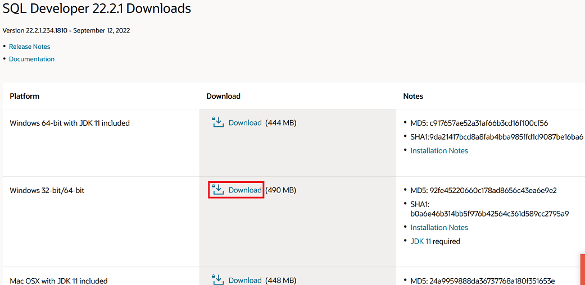
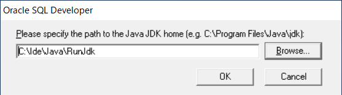
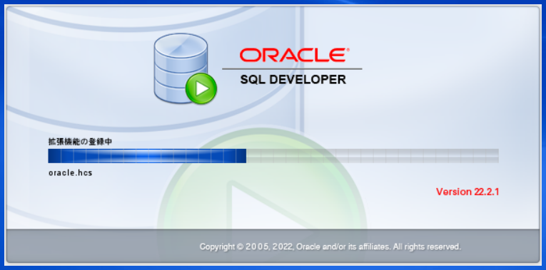
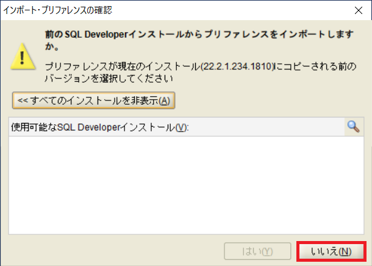
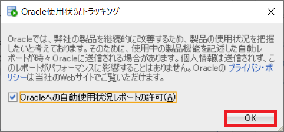
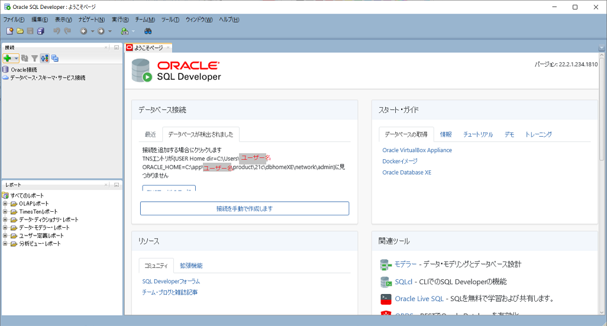

## 0. はじめに  
ここでは、Oracle DatabaseをGUIで操作する管理ツールSQL Developer22.2.1のWindows版のインストールの方法を書いていきます。  
この管理ツールを使うためにはJDK8以上が必要のようです。  
ここでは、JDKがすでにインストールまたは展開されているものを使うことにしますのでJDK同梱ではないものをダウンロードします。  

 

## 1. Oracle SQL Developerをダウンロードする  
まずは、Oracle SQL Developerをダウンロードします。  

[ダウンロード先](https://www.oracle.com/database/sqldeveloper/technologies/download/)  
上記ダウンロード先のWindows 32-bit/64-bitの**Download**ボタンをクリックしダウンロードします。  
※日本語サイトは、新しいVersionをまだ提供していなので英語サイトでアクセスします。  

  

 

## 2. Oracle SQL Developerをインストールする  
ダウンロードした`sqldeveloper-22.2.1.234.1810-no-jre.zip`ファイルを適当な場所へ展開(解凍)しておきます。  
インストールといっても展開するだけで使えますので展開されたフォルダは都合の良い場所へ移動して使って下さい。  
展開したフォルダ内に`sqldeveloper.exe`ファイルがあります。これが実行ファイルですのでショートカットを作りデスクトップにでも配置しておきます。  
実行ファイルまたはそのショートカットをダブルクリックし起動します。  

以下のような警告が表示されますが発行元がOracle America,Incであることを確認して実行ボタンをクリックします。  

  

JDKを同梱していないものをダウンロードしましたので以下のようなダイアログが表示されます。  
別途JDKをインストールまたは展開しているものを使いますのでそのフォルダを指定します。  
※指定するのはJava実行ファイルがあるbinフォルダではなくbinフォルダを含めた上位フォルダで指定します。  
※また、ちなみにJDK17でも動作しました。  

  

起動されるのを待ちます。

  

以下のような警告が出ますが過去にSQL Developerをインストールしたことは無いので「いいえ」ボタンをクリックし進みます。  

  

Oracleに使用状況を送信するか問われます。  
許可するかはご自身の判断でチェックボックスをクリック操作し「OK」ボタンをクリックし進みます。  

  

これでセットアップ作業は完了です。  

  

___