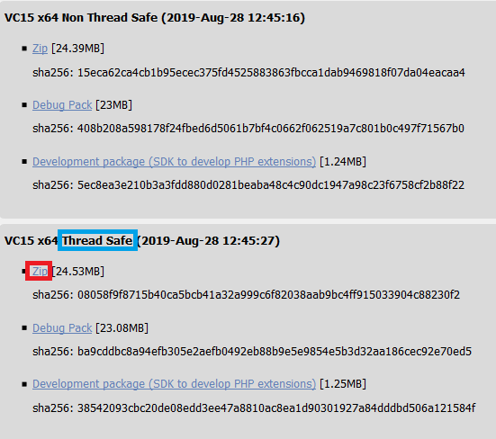

## 0. はじめに

Xamppなど一括で環境が揃うものもあるがここでは個別に構築してみる。  

<br />

## 1. ダウンロードと展開

### 1-1. Apache HTTP Serverのダウンロード

[Apache Http Server](https://www.apachelounge.com/download/)  
でWindows用のApache HTTP Serverの.zip版をダウンロードする。  


.zipファイルを展開しその中の`Apache24`フォルダごと今回は`C:\Program Files`にコピーする。  
`C:\Program Files\Apache24\bin`などとなるようにする。  

### 1-2. PHPのダウンロード

[PHP](https://www.php.net/downloads.php)のWindows downloadsをクリックし、  
そのリンク先のThread Safe版の.zip版を今回はダウンロードすることにする。  



.zipファイルを展開しその展開したフォルダの名前を`php-x.x.x-Win32-VCxx-x64`から単に`php`と  
今回は名前を変え`C:\Program Files`にコピーする。  
`C:\Program Files\php\ext`などとなるようにする。  

<br />

## 2. Apache HTTP Serverの設定と起動／停止

### 2-1. Apacheのルートディレクトリの変更

まずは、取り合えずApache HTTP Serverを起動してみる。  
`C:\Program Files\Apache24\bin\httpd.exe`をダブルクリックしてみる。  
しかし、ダブルクリック後黒い画面が出てすぐ閉じてしまう。  
実は、同時にエラーメッセージも出ている。logファイルやコマンドプロンプトからhttpd.exeを実行してみるとエラーも分かる。  

    httpd.exe: Syntax error on line 39 of C:/Program Files/Apache24/conf/httpd.conf: ServerRoot must be a valid directory

これは、Apacheを起動するためルートディレクトリのPathが違うという事の様だ。よって設定ファイルを変更する事にする。  
また、Apache HTTP Serverの停止はウィンドウのXボタンで閉じると停止する。  
Apache HTTP Serverの設定は`C:\Program Files\Apache24\conf`に`httpd.conf`という名前のファイルに書かれている。  
そのファイルの比較的上の方に以下の様に書かれている。  

    Define SRVROOT "c:/Apache24"

    ServerRoot "${SRVROOT}"

ここを、`C:\Program Files\Apache24`としたので以下の様に変更する必要がある。  
実は、`C:\`下へApache24フォルダをコピーしたのであれば変更なしで起動できる。  
※ディレクトリパスの最後にスラッシュを追加しないでください。と記述があるのでApache24の後ろに`/`は付けない。  

    Define SRVROOT "C:/Program Files/Apache24"

    ServerRoot "${SRVROOT}"

一旦SRVROOTという定数に定義してから指定している。  
これを1行で以下の様にしても動く。しかし、Define SRVROOTの行を消したりコメントにしてはいけない。  
SRVROOTは他でも使っているので`Config variable ${SRVROOT} is not defined`と変数がありませんというエラーが起きる。  

    ServerRoot "C:/Program Files/Apache24"

**また、Apache HTTP Serverで発生したエラーは`C:\Program Files\Apache24\logs\error.txt`へエラーログが残る**  

### 2-2. 自分自身のサーバー名の変更

もう１つ、デフォルトでは以下の様なエラーが出てしまいます。  
これは、自動で識別はできるが自分自身のサーバー名を明示的に指定して下さいとの事。  

    AH00558 httpd: Could not reliably determine the server's fully qualified domain name, using アドレス.
    Set the 'ServerName' directive globally to suppress this message

今回は、ローカルで試すのでServerNameを以下の様に書き換えます(#行はコメント)。  

    #ServerName www.example.com:80
    ServerName localhost:80

### 2-3. ドキュメントルートの変更

初期状態はルート`https://localhost:80/`がディレクトリの`${SRVROOT}/htdocs`になっている。  
htdocsフォルダにソースなどを入れてこのまま使っても良いがここでは、ルートディレクトリを変更してみる。  
最初に、`C:\Workspace\Php\`という階層でフォルダを作っておきこれをルートディレクトリとする。  
`C:\Program Files\Apache24\conf\httpd.conf`を開き以下の箇所を変更する。  

C:\\Workspace\\JavaフォルダにPhpTestプロジェクトを作りTest.phpファイルを作った場合
※<http://localhost/PhpTest/Test.php>

    #DocumentRoot "${SRVROOT}/htdocs" #変更前
    #<Directory "${SRVROOT}/htdocs"> #変更前
    DocumentRoot "C:/Workspace/Php/"
    <Directory "C:/Workspace/Php/">
      Options Indexes FollowSymLinks Includes ExecCGI
      AllowOverride All
      Require all granted
    </Directory>

### 2-4. ApacheでPHPを使う様にする設定

PHP関連は何も書かれていないので追加で書く。どこでも良いが`IfMoule dir_module`にも追加するのでその付近に追加する。  

    #以下３行を追加
    LoadModule php7_module "C:/Program Files/php/php7apache2_4.dll"
    AddHandler application/x-httpd-php .php
    PHPIniDir "/Program Files/php"
    #
    # DirectoryIndex: sets the file that Apache will serve if a directory
    # is requested.
    #
    <IfModule dir_module>
      #index.phpを追加
      DirectoryIndex index.html index.php
    </IfModule>

※php5シリーズではphp5_moduleなどと数字の所を変える  

## 3. phpの設定

### 3-1. はじめに

設定ファイルはphp.iniというファイルだが、ダウンロードしてきたものにはphp.iniファイルはphpフォルダ内に  
php.ini-developmentとなっている。`-development`を消し、php.iniファイルとする。

### 3-1. PHPで設定が適用されているかの確認

まず、.phpソースファイルなど確認するものが無いのでTest.phpファイルというテキストファイルを`C:\Workspace\Php`  
に作り以下の様にを入力し保存する。  

```php
<?php
  phpinfo();
?>
```

これで準備ができたのでXamppのコントロールパネルでApache HTTP Serverを起動して、  
ブラウザのURLアドレスバーに`https://loclahost:80/Test.php`と入力しアクセスする。  


### 3-2. OpenSSL、LDAPを使えるように表示してみる

別途、OpenSSLの.zipをダウンロードするか、Apache + OpenSSL同梱のサイトで.zipファイルをダウンロードするかし、  
その中のlibeay32.dllとssleay32.dllをphpフォルダへ入れる。  

**共通の設定**
php.iniファイル内のextension_dirを以下の様にPathを変更、または無い場合追加する。  
※これで例えば`extension=openssl`は`C:\Program Files\php\ext\php_openssl.dll`を読みに行く。  

    extension_dir="C:\Program Files\php\ext"

**opensslを適用、表示する**  
#extension=opensslのコメントを外し、openssl.cafileを以下の様に変更する。  
※extension=php_openssl.dll(Linuxでは.dllではなく.so)などファイル名をダイレクトに書く方法はレガシーの方法の様だ。  

    extension=openssl
    [openssl]
    openssl.cafile = "\Program Files\apache24\bin\curl-ca-bundle.crt"

※curl-ca-bundle.crtの証明書とcurl.exeは無くても表示するが取り合えずXamppからコピーしている。  
作り方や別途ダウンロードする方法は次回メモする。  

**ldapを適用、表示する**
\#extension=ldapのコメントを外す。 

    extension=ldap

しかし、これだけではldapが表示されない。Apacheのerrorログを見てみる。  
`PHP Startup: Unable to load dynamic library 'ldap’ (tried: C:\\Program Files\\php\\ext\\ldap`
とエラーログが出ている。これは、php.exeをシステム環境変数にPathを設定するか、またはphpフォルダ内の  
libeay32.dllとssleay32.dllをWindowsのSystemフォルダへ移動しパソコンの再起動をかける。  

* * *
