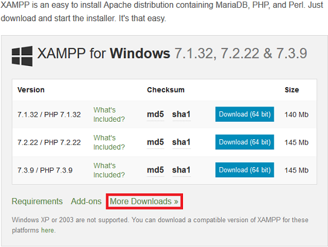
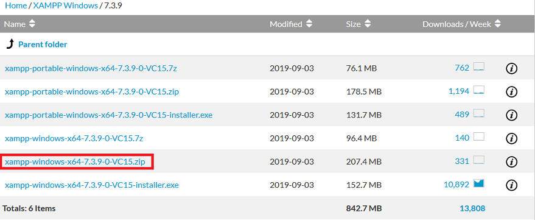
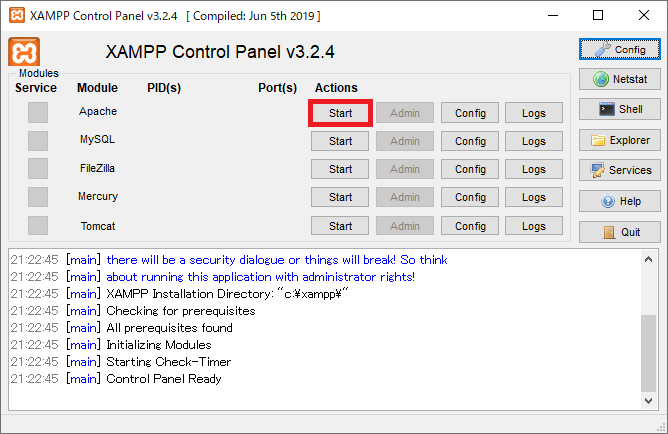
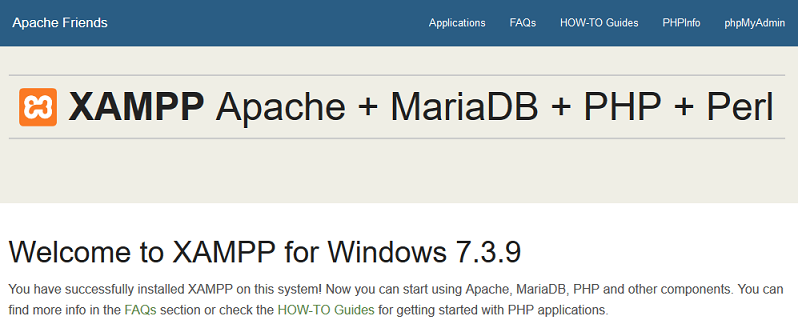

## 0. はじめに

XAMMPは、PHP、Apache HTTP Server、MySQLなどが一括で入っており、ある程度デフォルトでもすぐに使えるように設定されている。  
よってそれぞれ個別にインストールするよりは敷居が低い。  

<br />

## 1. Xamppをダウンロード、展開する

インストーラー版と.zip版があるのでここでは.zip版で説明する。  
[Xamppのダウンロード](https://www.apachefriends.org/download.html)  
上記へアクセスし「More Downloads」をクリックする。  



「XAMMP Windows」クリックし、現在最新の「7.3.9」をクリックする。  
portableではなく通常の.zip版をダウンロードするので  
「xampp-windows-x64-7.3.9-0-VC15.zip」をクリックしダウンロードする。  



今回はダウンロードした.zipファイルを展開し、xamppフォルダ事`C:\`に移動。
`C:\xampp\apache`などとなるようにする。

<br />

## 2. XamppでApache HTTP Serverの起動とルートディレクトリの変更

### 2-1. Apache HTTP Serverの起動

`C:\xampp\xampp-control.exe`をダブルクリックしXamppを起動する。  
コントロールパネルが起動するのでApache横の「Start」ボタンをクリックしApache HTTP Serverを起動する。  



起動出来たのでブラウザのURLアドレスバーに`https://localhost/`を入力しサンプルページを表示してみる。  
ここでは自動的にリダイレクトし`https://localhost/dashboard/`が表示される。  



XamppでApache HTTP Serverを終了するにはApache横のボタンが「Stop」になっているボタンをクリックし終了させる。  

### 2-2. ドキュメントルートの変更

初期状態はルート`https://localhost:80/`がディレクトリの`\xampp\htdocs\`になっている。  
htdocsフォルダにソースなどを入れてこのまま使っても良いがここでは、ルートディレクトリを変更してみる。  
最初に、`C:\Workspace\Php\`という階層でフォルダを作っておきこれをルートディレクトリとする。  
`C:\xampp\apache\conf\httpd.conf`を開き以下の箇所を変更する。  

    #DocumentRoot "/xampp/htdocs" #変更前
    #<Directory "/xampp/htdocs"> #変更前
    DocumentRoot "C:/Workspace/Php/"
    <Directory "C:/Workspace/Php/">
      Options Indexes FollowSymLinks Includes ExecCGI
      AllowOverride All
      Require all granted
    </Directory>

これで変更は完了だが、.phpソースファイルなど確認するものが無いので`C:/Workspace/Php/`に`Test.php`ファイル  
を作り以下の様にを入力し保存する。  

```php
<?php
    echo "Hello World";
?>
```

これで準備ができたのでXamppのコントロールパネルでApache HTTP Serverを起動して、ブラウザのURLアドレスバーに  
`https://loclahost:80/Test.php`と入力しアクセスする。  
`Hello World`と表示が確認できれば確認完了です。  

* * *
