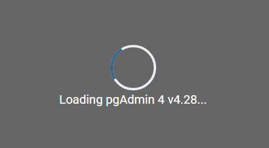
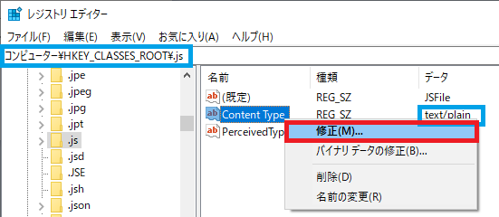
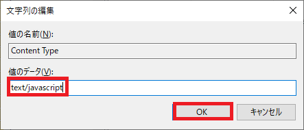
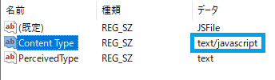

## 0. はじめに

pgAdmin v4.28を使用するためにブラウザを起動すると以下の様な**Loading(読み込み中)** が永遠と続き読み込みできない問題が発生する場合があります。  

  

これは、WindowsのみでおそらくpgAdmin v4.27を導入済みからpgAdmin v4.28へアップグレードする様なパターンで発生する様でpgAdminをインストールした  
事のないパソコンへpgAdmin v4.28をインストールすると発生しないと思われます(パソコンの再インストールする事があれば試す事にします)。  
pgAdminは、インストール時にレジストリにも設定を保存していますがpgAdmin v4.28でセキュリティを考慮し対策を行ったがアップグレードする様なパターン  
では敢えて行わないようにしているのかバグなのか分かりませんがインストール時にレジストリを自動で書き換えてくれない様です。  
具体的には、`HKEY_CLASSES_ROOT\.js\Content Type`のMIMEタイプが`text/plain`となっている場合に発生しこれを`text/javascript`に変更するとブラウザ  
へ読み込めるようになります。  

[pgAdmin v4.28トラブルシューティング](https://www.pgadmin.org/faq/#12)  

> ### pgAdmin v4.28トラブルシューティング抜粋(日本語訳)
>
> #### トラブルシューティング
>
> WindowsでpgAdmin4 v4.28以降を起動すると、読み込みページが閉じません。どうして？  

> pgAdmin 4 v4.28には、追加のセキュリティ機能が含まれています。そのうちの1つは、[コンテンツスニッフィング](https://en.wikipedia.org/wiki/Content_sniffing)によって  
> 引き起こされるセキュリティの問題を防ぐことを目的としています。  

> 残念ながら、一部のWindowsシステムは誤って構成されているため、pgAdminで使用されるJavascriptの読み込みに失敗します。ブラウザで開発者ツールを開く  
> と、次のようなエラーが表示されます。  

    'http://127.0.0.1:57313/static/vendor/require/require.min.js?ver=42800'からのスクリプトの実行を拒否しました
    そのMIMEタイプ（ 'text / plain'）は実行可能ではなく、厳密なMIMEタイプであるため
    チェックが有効になっています。

    （index）：39キャッチされていないReferenceError：requireは（index）：39で定義されていません

> これは、**HKEY_CLASSES_ROOT.js\\ContentType**のレジストリキーの値が**text/plain**に設定されている場合に発生します。この問題を解決するには、レジストリ  
> エディタを使用して、**HKEY_CLASSES_ROOT.js\\ContentType**の値を次のようにリセットします。  

> **text / javascript**  

> 最後に、pgAdminサーバーを再起動します。  

pgAdmin v4.27までは、`text/plain`であってもセキュリティ対策は行われないので問題なく読み込むと思われます。  
Microsoft EdgeやFirefoxでのブラウザには依存していませんのでどのブラウザでも読み込まない場合は読み込みませんし読み込む場合は読み込みます。  
また、Apple MacOSなどのOSではレジストリはありませんので問題ありません。  
pgAdminでの問題ですので不具合の発生中であってもPostgreSQLのPSQLでSQL文は適用できます。  
この不具合を発生させてしまうとpgAdmin v4.28をアンインストールしpgAdmin v4.27へ戻すと今度はブラウザの起動まで行かずクラッシュしアプリケーションが終了  
してしまいます。  
敢えて`text/plain`にしておきたい場合は、pgAdmin v4.26まで戻すと正しく読み込みまで進む様です。  

**参考記事**  

[pgadmin support1](https://www.postgresql-archive.org/pg-Admin-4-v4-28-Errors-on-launch-td6162407.html)  
[pgadmin support2](https://www.postgresql-archive.org/PgAdmin-v4-28-td6162879.html)  
[stack overflow1](https://stackoverflow.com/questions/64829748/pgadmin-is-not-loading)  
[stack overflow2](https://stackoverflow.com/questions/64840826/pgadmin-4-v4-28-keeps-loading)  

これが、pgAdmin v4.29などで解消されるかは分かりません。  

 

## 1. 解決手順

一応、pgAdminのプロセスを終了させるかパソコンを再起動してから行って下さい。  

OSのWindowsマークを右クリックし「ファイル名を指定して実行(R)」をクリックしダイアログを出します。  
「名前(D)」テキストボックスに`regedit`と入力し「OK」ボタンを押し**レジストリ エディタ**を起動します。  
`HKEY_CLASSES_ROOT\.js\Content Type`が`text/plain`となっていると思います。  
「Content Type」を右クリックしプルダウンメニューの「修正」をクリックします。  

  

名前の編集ダイアログの「値のデータ(V)」テキストボックスを`text/javascript`に変更し「OK」ボタンをクリックし適用します。  

  

適用するとContent Typeが変更されます。  

  

pgAdminを起動し直すと読み込みまで成功するはずです。  

 

## 2. その他の参考メモ

今回の問題には直接関係はありませんがpgAdminやPostgreSQL自体をアンインストールした際のメモを控えておきます。  

### 2-1. pgAdminのみのアンインストール

pgAdminは単独でインストールした場合とPostgreSQLインストール時にまとめてインストールした場合とでアンインストールする方法が違います。  
単独でインストールした場合はアンインストールアプリケーションがあるのでダブルクリックするかコントロールパネルのプログラムのアンインストール  
などで削除します。  
まとめてインストールした場合は、PostgreSQLアンインストールアプリを実行し個別にアンインストールするを選び(英語です)pgAdminだけチェックし  
削除します。  
また、WindowsユーザーフォルダのAppDataのLocalフォルダなどにもpgAdmin系のフォルダがありますので個別に削除する必要があります。  
また、pgAdminの起動ブラウザの指定などのConfig設定はレジストリ`HKEY_CURRENT_USER\SOFTWARE\pgadmin\pgadmin4`に書き込まれておりこれは残り  
ますのでこれらまで削除する必要がある場合は個別に行う必要もあります。  
また、`HKEY_LOCAL_MACHINE\SOFTWARE\pgAdmin 4`などにもインストール先情報などがあります。  

### 2-2. PostgreSQLおよびpgAdminを一括アンインストール

PostgreSQLおよびpgAdminを一括アンインストールしたい場合は、PostgreSQLのアンインストールアプリですべてアンインストールするを選び(英語です)  
削除します。  
PostgreSQLアンインストールアプリで完全削除してもDataフォルダだけは残るようになっているので`C:\Program Files\PostgreSQL\Data`フォルダ内を  
すべてゴミ箱へ入れて削除します。  
また、PostgreSQLのレジストリ関連も`HKEY_LOCAL_MACHINE\SOFTWARE\PostgreSQL`などにも書き込まれておりこれは残りますのでこれらまで削除する必要  
がある場合は個別に行う必要もあります。  

* * *
