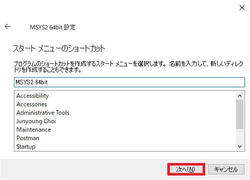

## 0. はじめに

Windowsでインストーラーを使わずに7-zip版のRubyのインストールを行った手順です。  
レジストリーを操作しないから良いかと思いましたがインストーラーのDevkit内蔵版の方が簡単です。  
特にDevkitを入れる事に手間が少しかかります。  
また、Jekyllというサイトジェネレーターを使う目的でインストールしましたので同時にそれも行います。  
次回インストールする時は、Jekyll無しでまず行おうと思います。また、少し順序を間違えてもいましたので正式な所は次回に。  

 

## 1. Rubyのダウンロード、展開、配置

1-1. [Ruby Installer for Windows](https://rubyinstaller.org/downloads/)で`7-zip`版をダウンロードします。  

  

1-2. ダウンロードした7-zipファイルを適当な場所へ展開します。  
展開したフォルダーの名前を`Ruby2.7.1-1`と変更しCドライブ直下に配置します。  
以下の様になるように配置します。

    c:
    	\Ruby2.7.1-1
        	\bin
            \include
            \lib
            \ridk_use
            \share
            \ssl
            LICENSE.txt

Rubyはこの中のbinフォルダ内にあります。Rubyを操作するにはコマンドプロンプトでbinフォルダまで移動しコマンドの実行を  
行わなければなりませんので必要な人はこのbinフォルダーを環境変数のPathに指定して下さい。  
ここでは、とりあえず省略しますのでこれ以下のコマンドはすべてbinフォルダーへ移動して実行しているものとして下さい。  

 

## 2. Bundler、Devkitを導入する

Rubyを使うにはBundlerやDevkit、などのgemを管理するツールを入れておくと良い様です。  
まず、はじめにrubyとgem(ジェム)のバージョンが出るか確認しておきます。  

    $ ruby -v
    ruby 2.7.1p83 (2020-03-31 revision a0c7c23c9c) [x64-mingw32]

続いてgemを確認します。  

    $ gem -v
    3.1.2

### 2-1. bundlerとjekyllのインストール

gemでjekyll bundlerをインストールします。  
gemでインストールしたライブラリーは`C:\ruby2.7.1-1\lib\ruby\gems\2.7.0\gems`に入っていく様です。  

    $ gem install jekyll bundler
    Fetching public_suffix-4.0.4.gem
    Fetching addressable-2.7.0.gem
    Fetching colorator-1.1.0.gem
    Fetching http_parser.rb-0.6.0.gem
    Fetching eventmachine-1.2.7-x64-mingw32.gem
    Fetching em-websocket-0.5.1.gem
    Fetching concurrent-ruby-1.1.6.gem
    Fetching i18n-1.8.2.gem
    Fetching ffi-1.12.2-x64-mingw32.gem
    Fetching sassc-2.3.0-x64-mingw32.gem
    Fetching jekyll-sass-converter-2.1.0.gem
    Fetching rb-fsevent-0.10.4.gem
    Fetching rb-inotify-0.10.1.gem
    Fetching listen-3.2.1.gem
    Fetching jekyll-watch-2.2.1.gem
    Fetching kramdown-2.2.1.gem
    Fetching kramdown-parser-gfm-1.1.0.gem
    Fetching liquid-4.0.3.gem
    Fetching mercenary-0.3.6.gem
    Fetching forwardable-extended-2.6.0.gem
    Fetching pathutil-0.16.2.gem
    Fetching rouge-3.18.0.gem
    Fetching safe_yaml-1.0.5.gem
    Fetching unicode-display_width-1.7.0.gem
    Fetching jekyll-4.0.0.gem
    Fetching terminal-table-1.8.0.gem
    Successfully installed public_suffix-4.0.4
    Successfully installed addressable-2.7.0
    Successfully installed colorator-1.1.0
    MSYS2 could not be found. Please run 'ridk install'
    or download and install MSYS2 manually from https://msys2.github.io/

途中でエラーが出てしまいました。
MSYS2が何なのか分かりませんがインストールする必要がある様です。  

    訳：MSYS2が見つかりませんでした。 「ridk install」を実行してください
    またはMSYS2をhttps://msys2.github.io/から手動でダウンロードしてインストールします

### 2-2. MSYS2のインストール

2-2-1. `ridk install`を実行してくだいとありましたので実行してみます。  
すると、以下の様なメニューが出ました。  

    $ ridk install
     _____       _           _____           _        _ _         ___
    |  __ \     | |         |_   _|         | |      | | |       |__ \
    | |__) |   _| |__  _   _  | |  _ __  ___| |_ __ _| | | ___ _ __ ) |
    |  _  / | | | '_ \| | | | | | | '_ \/ __| __/ _` | | |/ _ \ '__/ /
    | | \ \ |_| | |_) | |_| |_| |_| | | \__ \ || (_| | | |  __/ | / /_
    |_|  \_\__,_|_.__/ \__, |_____|_| |_|___/\__\__,_|_|_|\___|_||____|
                        __/ |           _
                       |___/          _|_ _  __   | | o __  _| _     _
                                       | (_) |    |^| | | |(_|(_)\^/_>

       1 - MSYS2 base installation
       2 - MSYS2 system update (optional)
       3 - MSYS2 and MINGW development toolchain

    Which components shall be installed? If unsure press ENTER [1,3]

2-2-2. 良く分からないので`1`を入力します。  
しかし、ここで気づいていませんでしたが**3**を押すとDevkitもインストールも兼ねてインストールできます。  
さらに、ここで**3**を押してしまうと少しまずい場合もありましたので順に間違いも兼ねて説明します。  
また、途中MSYS2をインストールするためのインストーラーが起動しGUI形式で行います。

    Which components shall be installed? If unsure press ENTER [1,3] 1

    MSYS2 seems to be unavailable
    Download http://repo.msys2.org/distrib/x86_64/msys2-x86_64-20190524.exe
      to C:\Users\<ユーザー名>\AppData\Local\Temp/msys2-x86_64-20190524.exe
    Downloading msys2-x86_64-20190524.exe (100%)
    Verify integrity of msys2-x86_64-20190524.exe ... OK
    Run the MSYS2 installer ...
    > C:\Users\<ユーザー名>\AppData\Local\Temp/msys2-x86_64-20190524.exe　//ここでインストーラーが起動します。
    > sh -lc true
     Success

#### MSYS2のインストール

MSYS2 64bit設定ダイアログが出ますので「次へ(N)」ボタンをクリックします。  

  

インストールフォルダーを指定します。今回はそのまま`C:\msys64`にインストールしますのでこのまま「次へ(N)」ボタンをクリック  
し次へ進みます。  

  

Windowsのスタートメニューに登録するショートカットの場所、名前を指定します。今回はこのまま「次へ(N)」ボタンをクリックし次へ  
進みます。  

  

インストールします。しばらくお待ちください。  

  

終了しましたら「完了(F)」ボタンをクリックしインストーラーを終了させます。  
※取り敢えずはこちらから手動でMSYS2を操作しないので「今すぐWindows MSYS 64bitを実行します」チェックボックスを外しておいた方  
が良いでしょう。起動した場合は**exit**を入力しEnterボタンを押し終了しましょう。

  

完了ボタンを押すとコマンドプロンプトに戻ります。Enterを押しridk installを終了させます。  

    > sh -lc true
     Success

       1 - MSYS2 base installation
       2 - MSYS2 system update (optional)
       3 - MSYS2 and MINGW development toolchain

    Which components shall be installed? If unsure press ENTER []

### 2-3. 再度、bundlerとjekyllのインストール実行

MSYS2がインストールできたのでもう一度、bundlerとjekyllのインストールを試します。
bundlerはインストールできた様ですが、jekyllの方はまだエラーがでます。  

    $ gem install jekyll bundler
    Temporarily enhancing PATH for MSYS/MINGW...
    Building native extensions. This could take a while...
    ERROR:  Error installing jekyll:
            ERROR: Failed to build gem native extension.

        current directory: C:/ruby2.7.1-1/lib/ruby/gems/2.7.0/gems/http_parser.rb-0.6.0/ext/ruby_http_parser
    C:/ruby2.7.1-1/bin/ruby.exe -I C:/ruby2.7.1-1/lib/ruby/2.7.0 -r ./siteconf20200505-2088-1yph419.rb extconf.rb
    creating Makefile

    current directory: C:/ruby2.7.1-1/lib/ruby/gems/2.7.0/gems/http_parser.rb-0.6.0/ext/ruby_http_parser
    make "DESTDIR=" clean
    current directory: C:/ruby2.7.1-1/lib/ruby/gems/2.7.0/gems/http_parser.rb-0.6.0/ext/ruby_http_parser
    make "DESTDIR="
    make failedNo such file or directory - make "DESTDIR="

    Gem files will remain installed in C:/ruby2.7.1-1/lib/ruby/gems/2.7.0/gems/http_parser.rb-0.6.0 for inspection.
    Results logged to C:/ruby2.7.1-1/lib/ruby/gems/2.7.0/extensions/x64-mingw32/2.7.0/http_parser.rb-0.6.0/gem_make.out
    Fetching bundler-2.1.4.gem
    Successfully installed bundler-2.1.4
    Parsing documentation for bundler-2.1.4
    Installing ri documentation for bundler-2.1.4
    Done installing documentation for bundler after 3 seconds
    1 gem installed

最初、原因が分かりませんでしたがDevkitが入っていないからの様です。  
7-ZipのDevkitを展開しRuby2.7.1-1内に入れてみましたが同じエラーがまだ出ます。この方法ではよく分からないので別の方法を試して  
みました。  

    訳：MSYS / MINGWのPATHを一時的に強化しています...
    ネイティブ拡張の構築。しばらく時間がかかる場合があります...
    エラー：jekyllのインストールエラー：
            エラー：gemネイティブ拡張のビルドに失敗しました。

先ほどの`ridk install`の3番の**MSYS2 and MINGW development toolchain**です。これがwith Devkitの様です。  
ridk installを実行し、`3`を入力しEnterボタンを押します。  

    Which components shall be installed? If unsure press ENTER [] 3
    
    > sh -lc true
    MSYS2 seems to be properly installed
    Install MSYS2 and MINGW development toolchain ...
    > pacman -S --needed --noconfirm autoconf autoconf2.13 autogen automake-wrapper automake1.10 automake1.11 
    automake1.12 automake1.13 automake1.14 automake1.15 automake1.6 automake1.7 automake1.8 automake1.9 diffutils 
    file gawk grep libtool m4 make patch pkg-config sed texinfo texinfo-tex wget mingw-w64-x86_64-binutils 
    mingw-w64-x86_64-crt-git mingw-w64-x86_64-gcc mingw-w64-x86_64-gcc-libs 
    mingw-w64-x86_64-headers-git mingw-w64-x86_64-libmangle-git mingw-w64-x86_64-libwinpthread-git 
    mingw-w64-x86_64-make mingw-w64-x86_64-pkg-config mingw-w64-x86_64-tools-git mingw-w64-x86_64-winpthreads-git
    警告: grep-3.0-2 は最新です -- スキップ
    警告: m4-1.4.18-2 は最新です -- スキップ
    警告: wget-1.20.3-1 は最新です -- スキップ
    依存関係を解決しています...
    衝突するパッケージがないか確認しています...
    
    パッケージ (54) automake1.16-1.16.1-1  db-5.3.28-2  gdbm-1.18.1-2  libatomic_ops-7.6.10-1  libgc-7.6.8-1
                libgdbm-1.18.1-2  libguile-2.2.7-1  libltdl-2.4.6-9  mingw-w64-x86_64-expat-2.2.9-1
                mingw-w64-x86_64-gettext-0.19.8.1-8  mingw-w64-x86_64-gmp-6.2.0-1  mingw-w64-x86_64-isl-0.22.1-1
                mingw-w64-x86_64-libiconv-1.16-1  mingw-w64-x86_64-mpc-1.1.0-1  mingw-w64-x86_64-mpfr-4.0.2-2
                mingw-w64-x86_64-windows-default-manifest-6.4-3  mingw-w64-x86_64-zlib-1.2.11-7  perl-5.30.2-1
                tar-1.32-1  autoconf-2.69-5  autoconf2.13-2.13-2  autogen-5.18.16-1  automake-wrapper-11-1
                automake1.10-1.10.3-3  automake1.11-1.11.6-3  automake1.12-1.12.6-3  automake1.13-1.13.4-4
                automake1.14-1.14.1-3  automake1.15-1.15.1-1  automake1.6-1.6.3-2  automake1.7-1.7.9-2
                automake1.8-1.8.5-3  automake1.9-1.9.6-2  diffutils-3.7-1  file-5.38-3  gawk-5.1.0-1  libtool-2.4.6-9
                make-4.3-1  mingw-w64-x86_64-binutils-2.34-1  mingw-w64-x86_64-crt-git-8.0.0.5815.9517d302-1
                mingw-w64-x86_64-gcc-9.3.0-2  mingw-w64-x86_64-gcc-libs-9.3.0-2
                mingw-w64-x86_64-headers-git-8.0.0.5815.9517d302-1
                mingw-w64-x86_64-libmangle-git-8.0.0.5573.a4de8df4-1
                mingw-w64-x86_64-libwinpthread-git-8.0.0.5814.9dbf4cc1-1  mingw-w64-x86_64-make-4.3-1
                mingw-w64-x86_64-pkg-config-0.29.2-1  mingw-w64-x86_64-tools-git-8.0.0.5813.223de3ab-1
                mingw-w64-x86_64-winpthreads-git-8.0.0.5814.9dbf4cc1-1  patch-2.7.6-1  pkg-config-0.29.2-1  sed-4.8-1
                texinfo-6.7-1  texinfo-tex-6.7-1
    
    合計ダウンロード容量:   79.69 MiB
    合計インストール容量:  593.89 MiB
    最終的なアップグレード容量:  581.36 MiB
    
    :: インストールを行いますか？ [Y/n]
    :: パッケージを取得します...
    エラー: ファイル 'mingw-w64-x86_64-binutils-2.34-1-any.pkg.tar.xz' を repo.msys2.org から取得するのに失敗しました : 
    Operation too slow. Less than 1 bytes/sec transferred the last 10 seconds
    エラー: ファイル 'mingw-w64-x86_64-binutils-2.34-1-any.pkg.tar.xz' を sourceforge.net から取得するのに失敗しました : 
    Operation too slow. Less than 1 bytes/sec transferred the last 10 seconds
    
    <途中省略>
    
     texinfo-6.7-1-x86_64                           755.5 KiB   290K/s 00:03 [#######################################] 100%
     texinfo-tex-6.7-1-x86_64                        43.3 KiB  0.00B/s 00:00 [#######################################] 100%
    エラー: 処理を完了できませんでした (予期しないエラー)
    エラーが発生したため、パッケージは更新されませんでした。
    Install MSYS2 and MINGW development toolchain failed
    Installation failed: pacman failed

今度は、ダウンロード時に失敗している様です。  
１つのパッケージを１0秒以内にダウンロードしないといけない？そんな事があるのか分かりませんがものすごく早くダウンロードしなければ  
失敗する様です(分かりませんが何度かリトライしてその様な傾向がありました)。

    Operation too slow. Less than 1 bytes/sec transferred the last 10 seconds
    訳：操作が遅すぎます。過去10秒間に1バイト/秒未満が転送されました

これでは、いつになってもダウンロードできないので別の方法を見つけました。  
これは、Packmanというものでダウンロードを管理して行っている様なのでconfigファイルを変更してみました。  
Packman既定のダウンロードではなく特定のフォルダへダウンロードさせます。  
`C:\msys64\etc\packman.conf`の以下の行をコメントアウトします。
先頭のシャープマークを外し上書き保存します。 

    XferCommand = /usr/bin/curl -C - -f %u > %o
    XferCommand = /usr/bin/wget --passive-ftp -c -O %o %u

再度、ridk installの3番(and Devkit)を実行します。  
`C:\msys64\var\cache\packman\pkg\`にダウンロードしたものを一時的に保存する様です。  

    Which components shall be installed? If unsure press ENTER [] 3
    
    > sh -lc true
    MSYS2 seems to be properly installed
    Install MSYS2 and MINGW development toolchain ...
    > pacman -S --needed --noconfirm autoconf autoconf2.13 autogen automake-wrapper automake1.10 automake1.11 
    automake1.12 automake1.13 automake1.14 automake1.15 automake1.6 automake1.7 automake1.8 automake1.9 diffutils 
    file gawk grep libtool m4 make patch pkg-config sed texinfo texinfo-tex wget mingw-w64-x86_64-binutils 
    mingw-w64-x86_64-crt-git mingw-w64-x86_64-gcc mingw-w64-x86_64-gcc-libs mingw-w64-x86_64-headers-git 
    mingw-w64-x86_64-libmangle-git mingw-w64-x86_64-libwinpthread-git mingw-w64-x86_64-make 
    mingw-w64-x86_64-pkg-config mingw-w64-x86_64-tools-git mingw-w64-x86_64-winpthreads-git
    警告: grep-3.0-2 は最新です -- スキップ
    警告: m4-1.4.18-2 は最新です -- スキップ
    警告: wget-1.20.3-1 は最新です -- スキップ
    依存関係を解決しています...
    衝突するパッケージがないか確認しています...
    
    パッケージ (54) automake1.16-1.16.1-1  db-5.3.28-2  gdbm-1.18.1-2  libatomic_ops-7.6.10-1  libgc-7.6.8-1
                libgdbm-1.18.1-2  libguile-2.2.7-1  libltdl-2.4.6-9  mingw-w64-x86_64-expat-2.2.9-1
                mingw-w64-x86_64-gettext-0.19.8.1-8  mingw-w64-x86_64-gmp-6.2.0-1  mingw-w64-x86_64-isl-0.22.1-1
                mingw-w64-x86_64-libiconv-1.16-1  mingw-w64-x86_64-mpc-1.1.0-1  mingw-w64-x86_64-mpfr-4.0.2-2
                mingw-w64-x86_64-windows-default-manifest-6.4-3  mingw-w64-x86_64-zlib-1.2.11-7  perl-5.30.2-1
                tar-1.32-1  autoconf-2.69-5  autoconf2.13-2.13-2  autogen-5.18.16-1  automake-wrapper-11-1
                automake1.10-1.10.3-3  automake1.11-1.11.6-3  automake1.12-1.12.6-3  automake1.13-1.13.4-4
                automake1.14-1.14.1-3  automake1.15-1.15.1-1  automake1.6-1.6.3-2  automake1.7-1.7.9-2
                automake1.8-1.8.5-3  automake1.9-1.9.6-2  diffutils-3.7-1  file-5.38-3  gawk-5.1.0-1  libtool-2.4.6-9
                make-4.3-1  mingw-w64-x86_64-binutils-2.34-1  mingw-w64-x86_64-crt-git-8.0.0.5815.9517d302-1
                mingw-w64-x86_64-gcc-9.3.0-2  mingw-w64-x86_64-gcc-libs-9.3.0-2
                mingw-w64-x86_64-headers-git-8.0.0.5815.9517d302-1
                mingw-w64-x86_64-libmangle-git-8.0.0.5573.a4de8df4-1
                mingw-w64-x86_64-libwinpthread-git-8.0.0.5814.9dbf4cc1-1  mingw-w64-x86_64-make-4.3-1
                mingw-w64-x86_64-pkg-config-0.29.2-1  mingw-w64-x86_64-tools-git-8.0.0.5813.223de3ab-1
                mingw-w64-x86_64-winpthreads-git-8.0.0.5814.9dbf4cc1-1  patch-2.7.6-1  pkg-config-0.29.2-1  sed-4.8-1
                texinfo-6.7-1  texinfo-tex-6.7-1
    
    合計ダウンロード容量:   58.14 MiB
    合計インストール容量:  593.89 MiB
    最終的なアップグレード容量:  581.36 MiB
    
    :: インストールを行いますか？ [Y/n]
    :: パッケージを取得します...
    --2020-05-05 22:32:17--  http://repo.msys2.org/mingw/x86_64/mingw-w64-x86_64-binutils-2.34-1-any.pkg.tar.xz
    repo.msys2.org (repo.msys2.org) をDNSに問いあわせています... 45.59.69.178
    repo.msys2.org (repo.msys2.org)|45.59.69.178|:80 に接続しています... 接続しました。
    HTTP による接続要求を送信しました、応答を待っています... 206 Partial Content
    長さ: 14593988 (14M), 12040241 (11M) 残っています [application/octet-stream]
    `/var/cache/pacman/pkg/mingw-w64-x86_64-binutils-2.34-1-any.pkg.tar.xz.part' に保存中
    
    /var/cache/pacman/pkg/mingw-w 100%[++++++++=========================================>]  13.92M  36.6KB/s 時間 4m 20s
    
    2020-05-05 22:36:39 (45.2 KB/s) - `/var/cache/pacman/pkg/mingw-w64-x86_64-binutils-2.34-1-any.pkg.tar.xz.part' へ保存完 了 [14593988/14593988]
    
    (54/54) キーリングのキーを確認                                           [#######################################] 100%
    (54/54) パッケージの整合性をチェック                                     [#######################################] 100%
    (54/54) パッケージファイルのロード                                       [#######################################] 100%
    (54/54) ファイルの衝突をチェック                                         [#######################################] 100%
    (54/54) 空き容量を確認                                                   [#######################################] 100%
    :: パッケージの変更を処理しています...
    ( 1/54) 更新 gawk                                                        [#######################################] 100%
    ( 2/54) インストール diffutils                                           [#######################################] 100%
    
    (53/54) インストール mingw-w64-x86_64-pkg-config                         [#######################################] 100%
    (54/54) インストール mingw-w64-x86_64-tools-git                          [#######################################] 100%
    Install MSYS2 and MINGW development toolchain succeeded

これで成功しました。よって、まずPackmanのconfig設定で`XferCommand`をコメントアウトした上でridk installの3番のMSYS2 and Devkit  
を実行します。そして、gem install jekyll bundlerを行えば良かったのです。  
最後に、gem install jekyll bundlerを実行します。  

    $ gem install jekyll bundler
    Temporarily enhancing PATH for MSYS/MINGW...
    Building native extensions. This could take a while...
    Successfully installed http_parser.rb-0.6.0
    Successfully installed eventmachine-1.2.7-x64-mingw32
    Successfully installed em-websocket-0.5.1
    Successfully installed concurrent-ruby-1.1.6
    
    HEADS UP! i18n 1.1 changed fallbacks to exclude default locale.
    But that may break your application.
    
    If you are upgrading your Rails application from an older version of Rails:
    
    Please check your Rails app for 'config.i18n.fallbacks = true'.
    If you're using I18n (>= 1.1.0) and Rails (< 5.2.2), this should be
    'config.i18n.fallbacks = [I18n.default_locale]'.
    If not, fallbacks will be broken in your app by I18n 1.1.x.
    
    If you are starting a NEW Rails application, you can ignore this notice.
    
    For more info see:
    https://github.com/svenfuchs/i18n/releases/tag/v1.1.0
    
    Successfully installed i18n-1.8.2
    Successfully installed ffi-1.12.2-x64-mingw32
    Successfully installed sassc-2.3.0-x64-mingw32
    Successfully installed jekyll-sass-converter-2.1.0
    Successfully installed rb-fsevent-0.10.4
    Successfully installed rb-inotify-0.10.1
    Successfully installed listen-3.2.1
    Successfully installed jekyll-watch-2.2.1
    Successfully installed kramdown-2.2.1
    Successfully installed kramdown-parser-gfm-1.1.0
    Successfully installed liquid-4.0.3
    Successfully installed mercenary-0.3.6
    Successfully installed forwardable-extended-2.6.0
    Successfully installed pathutil-0.16.2
    Successfully installed rouge-3.18.0
    Successfully installed safe_yaml-1.0.5
    Successfully installed unicode-display_width-1.7.0
    Successfully installed terminal-table-1.8.0
    
    <省略>
    
    Parsing documentation for jekyll-4.0.0
    Installing ri documentation for jekyll-4.0.0
    Done installing documentation for http_parser.rb, eventmachine, em-websocket, concurrent-ruby, i18n, ffi, sassc, 
    jekyll-sass-converter, rb-fsevent, rb-inotify, listen, jekyll-watch, kramdown, kramdown-parser-gfm, liquid, mercenary, 
    forwardable-extended, pathutil, rouge, safe_yaml, unicode-display_width, terminal-table, jekyll after 19 seconds
    Successfully installed bundler-2.1.4
    Parsing documentation for bundler-2.1.4
    Done installing documentation for bundler after 2 seconds
    24 gems installed

これで、すべてインストール出来ました。  
試しに、バージョン確認を行ってみます。  

    $ bundler -v
    Bundler version 2.1.4

    $ jekyll -v
    jekyll 4.0.0

* * *
