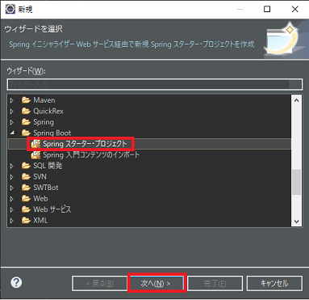
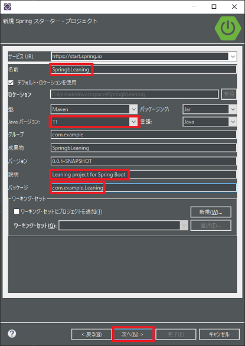
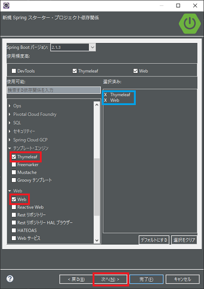
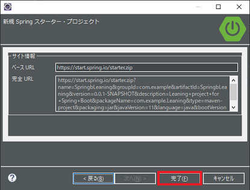
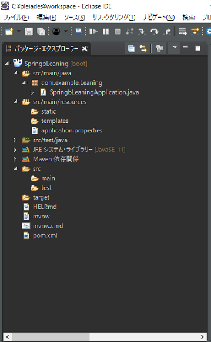

## 0. はじめに

SpringBootの入門。環境設定、プロジェクトの作成をしてみる。 
    Eclipse Pleiades2018-12とAdopt OpenJDK11が入っている事。他はPleiadesパッケージに内蔵済み。
    IDE : Eclipse Pleiades2018-12 日本語版　※Spring Tool Suite : 3.9.7プラグイン内蔵
    Java : Adopt OpenJDK11
    Framework : SpringBoot 2.1.3 RELEASE
    Build : Maven(メーベェン)
    Thymeleaf : 2.1.2

 

## 1. Springスターター・プロジェクトの作成

    1-1. メニューバーの「ファイル(F)」→「新規(N)」→「その他(O)」を選択し「ウィザード選択」
    　 ダイアログを表示する。
    1-2. ツリーの「SpringBoot」→「Springスターター・プロジェクト」を選択し「次へ(N)」
    　　  ボタンをクリック。

 

    1-3. 「名前」テキストボックスに「SpringbLeaning」と入力し、Javaバージョンコンボボックス
    　     に「11」を選ぶ。
    　   「説明」テキストボックスに「Leaning project for Spring Boot」と入力し、パッケージ
     　    テキストボックスに「com.example.Leaning」と入力する。
    　　 入力し終えたら「次へ(N)」へをクリック。

 

 **名前**は、`プロジェクト名`となり、**パッケージ**は`パッケージ名`となる。
**説明**は特に何でも良いが標準のコメントを書いてみた。
また、**パッケージ名**は`com.example.Leaning`としたが、`src\main\java\com\example\Leaning`とフォルダが自動で作られる。
ドット( . )で区切る事によりフォルダが出来るようだ。
 

    1-4. ツリーリストの「テンプレート・エンジン」→「Thymeleaf」、「Web」→「Web」にチェックする。
    　   選択済み欄にチェックした項目が表示される。
    　   「次へ(N)」へをクリック。

 
※Thymeleafはタイムリーフと読む。
 

    1-5-1. そのまま「完了(F)」をクリック。

 
  

    以下の様にプロジェクトが作成されます。
    ※プロジェクト作成には数十秒ほどかかる場合もある。

 

* * *
