## 0. はじめに

Spring Bootプロジェクト「SpringbLeaning」を作りログインアプリケーションを作成してみる。
本当は、パスワードはハッシュ値やソルトを使った方法でなければ良くない様ですが練習用なので平文とします。  

    IDE : Eclipse Pleiades 2018-12 日本語版　※Spring Tool Suite : 3.9.7プラグイン内蔵
    Java : Adopt OpenJDK11
    Build : Maven
    Framework : Spring Boot 2.1.3 RELEASE
    Tomcat : Apache Tomcat 9.0.16 ※自動で設定される？
    Thymeleaf : 2.1.2

<br />

## 1. 作成したプロジェクト内のpom.xmlにSpring Securityを使う設定をする。

    1-1. pom.xmlに以下を追加する。

```xml:pom.xml
<dependency>
    <groupId>org.springframework.boot</groupId>
    <artifactId>spring-boot-starter-security</artifactId>
</dependency>
```

<br />

* * *

## 2. Mavenをインストールする。

    2-1. パッケージ・エクスプローラーのプロジェクトを右クリックし「実行(R)」→「6. Maven install」を
    　　クリックしインストールする。

 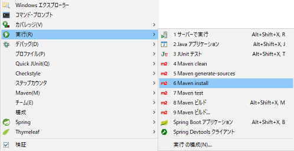

    コンソールに以下の様なものが実行される。
    また、プロジェクトのtargetフォルダに以下の様なものが追加される。

 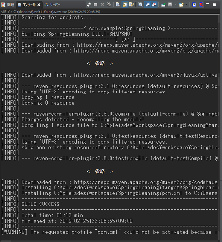

 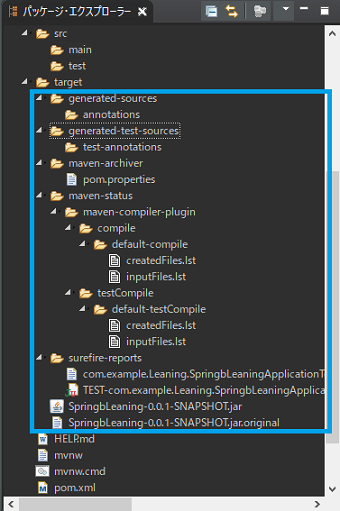
<br />

* * *

## 3. コンフィグファイルを作成する。

    2-3-1. com.example.Leaningパッケージの上で右クリックし、「新規(W)」→クラスを選択クリックする。
    2-3-2. 名前にMvcConfigと入力し「完了(F)」ボタンをクリックする。

 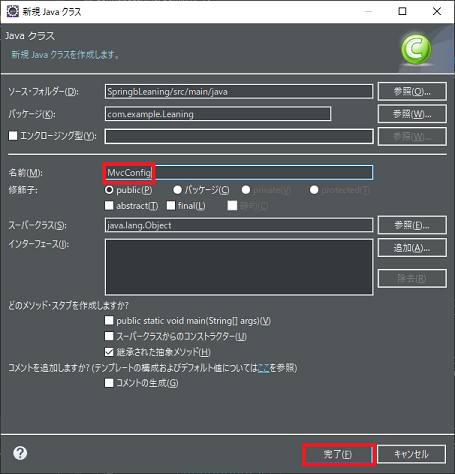
<br />

    2-3-3. MvcConfig.javaに以下のコードを追加する。

```java:MvcConfig.java
package com.example.Leaning;

import org.springframework.context.annotation.Configuration;
import org.springframework.web.servlet.config.annotation.ViewControllerRegistry;
import org.springframework.web.servlet.config.annotation.WebMvcConfigurer;

@Configuration
public class MvcConfig implements WebMvcConfigurer {
    public void addViewControllers(ViewControllerRegistry registry) {
        registry.addViewController("/").setViewName("login");
        registry.addViewController("/success").setViewName("success");
        registry.addViewController("/login").setViewName("login");
    }
}
```

このクラスは`URL`と`html`ファイルのマッピングを定義している。
例えば `registry.addViewController("/").setViewName("login");` は存在しないファイルへアクセスすると
**login.html**を表示する。
`registry.addViewController("/success").setViewName("success");` では`https://サーバー名/success` へ
アクセスすると**success.html**が表示される様に設定されている。
<br />

    2-3-4. 同様にWebSecurityConfigクラスを作り以下のコードを追加する。

```java:WebSecurityConfig.java
package com.example.Leaning;

import org.springframework.context.annotation.Bean;
import org.springframework.context.annotation.Configuration;
import org.springframework.security.config.annotation.web.builders.HttpSecurity;
import org.springframework.security.config.annotation.web.configuration.EnableWebSecurity;
import org.springframework.security.config.annotation.web.configuration.WebSecurityConfigurerAdapter;
import org.springframework.security.core.userdetails.User;
import org.springframework.security.core.userdetails.UserDetails;
import org.springframework.security.core.userdetails.UserDetailsService;
import org.springframework.security.crypto.factory.PasswordEncoderFactories;
import org.springframework.security.crypto.password.PasswordEncoder;
import org.springframework.security.provisioning.InMemoryUserDetailsManager;

@Configuration
@EnableWebSecurity
public class WebSecurityConfig extends WebSecurityConfigurerAdapter {
    @Override
    public void configure(HttpSecurity http) throws Exception {
        http
            .authorizeRequests()
                .anyRequest("/").authenticated()
                .and()
            .formLogin()
                .loginPage("/login")
                .defaultSuccessUrl("/success")
                .permitAll()
                .and()
            .logout()
                .permitAll();
    }

    @Bean
    @Override
    public UserDetailsService userDetailsService() {
        PasswordEncoder encoder = PasswordEncoderFactories.createDelegatingPasswordEncoder();
        UserDetails user = User.withUsername("user")
                            .passwordEncoder(encoder::encode)
                            .password("password")
                            .roles("USER")
                            .build();
        return new InMemoryUserDetailsManager(user);
    }
}
```

**WebSecurityConfigEnableWebSecurity**
このアノテーションを指定することでSpring Securityがサポートされたクラスになる。
**configure(HttpSecurity)**
`WebSecurityConfigurerAdapter`を継承し、`Configure()`メソッドをオーバーライドしている。
`HttpSecurity.authorizeRequests().anyRequest("/").authenticated()` でルートは全ユーザーがアクセスできるように設定。
`HttpSecurity.formLogin()` は認証の方法はフォーム認証を使うように指定。
`.defaultSuccessUrl("/success")` はログイン成功時のアクセス先を指定。
**userDetailsService()**
ユーザーの追加を行う。ここでは、「ユーザー名」をuser、「パスワード」をpasswordとします。
**configure**のオーバーロード` configure (AuthenticationManagerBuilder xxx)`メソッドをオーバー
ライドしユーザーの追加を行う方法もある。
`PasswordEncoder`を設定する必要がある。**Spring Boot 2.x.x**以上なのか元々なのかこれを設定しないとログインできない様な仕組みになっていると思われる。
<br />

* * *

## 4. ログイン認証画面を作成する。

    4-1. \src\main\resources\templates\フォルダ上で右クリックし「新規(W)」→「その他(O)」を
              選択クリックする。
    4-2. ツリーリストから「Web」→「HTMLファイル」を選び「次へ(N)」ボタンをクリック。

 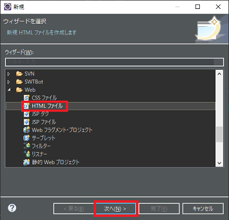
<br />

    4-3. 「ファイル名(M)」テキストボックスにlogin.htmlと入力し「次へ(N)」ボタンをクリック。

 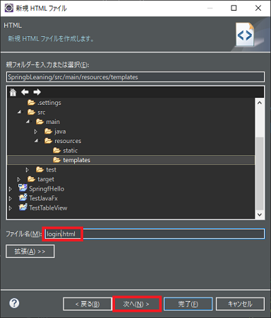
<br />

    4-4. 「HTML5」を選び、「完了(F)」ボタンをクリック。

 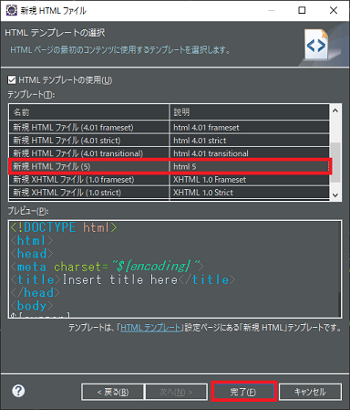
 <br />

    4-5. login.htmlに以下のコードを追加する。

```html:login.html
<!DOCTYPE html>
<html>
    <head>
        <meta charset="UTF-8">
        <title>ログイン</title>
    </head>
    <body>
        <div th:if="${param.error}">
            ユーザー名またはパスワードに誤りがあります
        </div>
        <div th:if="${param.logout}">
            ログアウトしました
        </div>
        <form th:action="@{/login}" method=post>
            <div><label> ユーザー名：<input type="text" name="username"/></label></div>
            <div><label> パスワード：<input type="password" name="password"/></label></div>
            <div><input type="submit" value="ログイン"/></div>
        </form>
    </body>
</html>
```

**`th:if="${param.error}"`**
ユーザー名またはパスワードが間違っていた場合に`<div></div>`内の表示をします。
**`th:if="${param.logout}"`**
ログイン先からログアウトしてログイン画面に戻った時に`<div></div>`内の表示をします。
<br />

* * *

## 5. ログイン認証先の画面を作成する。

    5-1. 同様にmain\resources\templates\フォルダ内にsuccess.htmlを作成する。
    　　success.htmlに以下のコードを追加する。

```html:success.html
<!DOCTYPE html>
<html>
    <head>
        <meta charset="UTF-8">
        <title>挨拶</title>
    </head>
    <body>
        <h1 th:inline="text">Hello [[${#httpServletRequest.remoteUser}]]!</h1>
        <form th:action="@{/logout}" method=post>
            <input type="submit" value="ログアウト"/>
        </form>
    </body>
</html>
```

**`httpServletRequest.remoteUser`**
ログインしたユーザーのユーザー名を取得している。
<br />

* * *

## 6. 実行する。

    6-1. プロジェクト上で右クリックし「実行(R)」→「Spring Boot アプリケーション」をクリック。

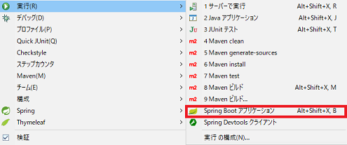

    コンソールに以下の様なものが実行される。

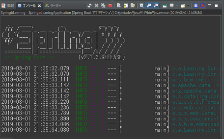

    6-2. エラーが出ず実行に成功したらブラウザを起動し、`https://localost:8080/login.html`へアクセス。
    6-3. ログイン画面が出ます。まずは、間違えたユーザー名とパスワードを入力してみます。
    　　「ユーザー名」にtekitou、「パスワード」にpppと入力しログインボタンを押してみます。

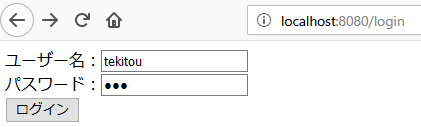

    6-4. ユーザー名、パスワードが一致しないので以下の様に表示されます。

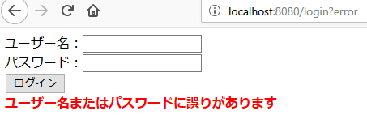

    6-5. 今度は正しユーザー名とパスワードを入力してみます。
    　　「ユーザー名」にuser、「パスワード」にpasswordなのでこれを入力しログインします。
    　　success.htmlへアクセスでき以下の様な画面になれば成功です。

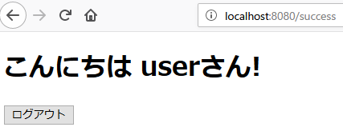

    6-6. 次にログアウトボタンを押しログアウトもしてlogin.htmlへ戻れば成功です。
    6-7. サーバー(実行)を停止するには画像のツールボタンを押すと停止します。

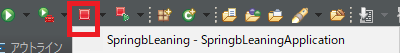

* * *
