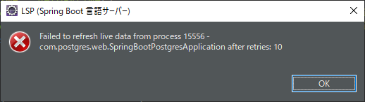

## 1. Spring Boot Tool SuiteによるLive dataエラー  

Live dataとはよく分からないがSpring Bootを起動すると以下の様なメッセージが出る。  
画面左下のステータスバーに何か10回カウントしているようですがよく分かりません。  

  

内容はよく分かりませんが以下の手順でこのチェックを無効にする事ができる様です。  

メニューバーの「ウィンドウ(W)」→「設定(P)」で設定ダイアログボックスを開き、左側リストの  
「言語サーバー」→「Spring 言語サーバー」→「Spring Boot 言語サーバー」→「Spring Boot Java」  
を選択し表示された中の「Live Information - Automatic Process Tracking Enabled」のチェック  
ボックスを外し「適用して閉じる」ボタンを押し適用します。  
**その後、Spring Boot Tool Suite(Eclipse内蔵ならEclipse)を再起動させます**。  

* * *
