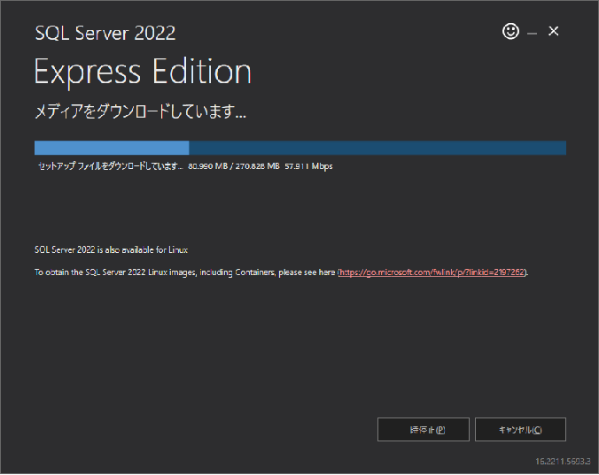

## 0. はじめに  
ここでは、Microsoft SQL Server 2022 Express EditionのWindows版のインストールの方法を書いていきます。  
また、データベースをグラフィカルなGUIインターフェースで操作するデータベース管理ツールはインストールされませんので別途インストールして下さい。  
※コマンドラインCUIインターフェースで操作する`sqlcmd`はインストールされます。  

 

## 1. Microsoft SQL Server 2022 Express Editonをダウンロードする  
まずは、Microsoft SQL Server 2022 Express Editionをダウンロードします。  

[ダウンロード先](https://www.microsoft.com/en-us/sql-server/sql-server-downloads)  
上記ダウンロード先内のOr, download a free specialized editionのExpressの**Download now**ボタンをクリックしダウンロードします。  
※日本語サイトは、新しいVersionをまだ提供していなので英語サイトでアクセスします。  

  

ダウンロードした`SQL2022-SSEI-Expr.exe`ファイルをダブルクリックしインストーラーを起動します。  
ウィンドウが表示され、ここでは一度オフライン版のようなインストールファイルをダウンロードしますので「メディアのダウンロード(D)」をクリック選択します。  

  

次に言語の選択は「日本語」が表示されていると思いますが日本語をプルダウンメニューの中から選びます。  
どのパッケージをダウンロードしますか？の所は「Express Core」ラジオボタンをクリックしデータベースの基本本体のみを選択します。  
ダウンロードの場所は、適当な場所でよいのでそのままダウンロードフォルダのままにします。  
すべて選択しましたら「ダウンロード(D)」ボタンをクリックしダウンロードを開始させます。  

  

ダウンロードが始まります。しばらくお待ちください。  

  

以下のような表示になりましたらダウンロード完了です。  
「閉じる(C)」ボタンをクリックます。  

  

終了確認ダイアログが表示されますので「はい(Y)」をクリックします。  

  

 

## 2. Microsoft SQL Server 2022 Express Editionをインストールする  
ダウンロードフォルダ内に`SQLEXPR_x64_JPN.exe`ファイルがありますのでダブルクリックします。  
以下のようなダイアログが表示され、インストールするためのファイルの展開先を指定してきます。  
ここでは、特にそのままダウンロードフォルダ内でよいのでそのまま「OK」ボタンをクリックし展開させます。  

  

展開してインストーラーを開始しています。しばらくお待ちください。  

  

以下のようなウィンドウが表示されます。  
ここでは、新規にインストールしますので一番上の「SQL Serverの新規スタンドアロン インストールを実行するか、既存のインストールに機能を追加」リンクをクリックします。  

  

インストーラーを開始しています。しばらくお待ちください。  

  

はじめに、ライセンス条項が表示されます。  
ライセンス条項をよく読み、よければ「ライセンス条項と次に同意します」チェックボックスをクリックし選択します。  
「次へ(N)」ボタンをクリックし次へ進みます。  

  

次に、Microsoft Updateで更新プログラムを確認するかの選択をします。  
都合の良いほうを選びチェックボックスにチェックするか選択してください。  
よければ、「次へ(N)」ボタンをクリックし次へ進みます。  

  

次に、セットアップを正しく完了させるためのチェックを行います。  
いずれかにエラー表示がされる場合はインストールするための環境が整っていませんのでいったん終了して解決する必要があると思います。  
※警告であるなら先へ進めます。  
少なくとも警告以上の状態にして「次へ(N)」ボタンをクリックし次に進みます。  

  

次は、私もよく分かりませんがAzureの機能を使うためにAzureのIDなどをを指定するようです。  
ここは、よく分かりませんでしたので「SQL Server用 Azure拡張機能」チェックボックスをクリックしチェックを外しておきます。  
よければ、「次へ(N)」ボタンをクリックし次へ進めます。  

  

次に機能の選択やインストール先フォルダを指定します。  
どちらもそのままで問題ないのでそのまま「次へ(N)」ボタンをクリックし次へ進みます。  

  

次に、データベースインスタンスをどうするか決めます。  
データベース内に1つだけ名前の無いインスタンスを作成する場合は既定のインスタンスを、名前を付けてインスタンスを使い分ける場合は名前付きインスタンスを選択します。  

ここでは、「名前付きインスタンス(A)」ラジオボタンをクリックしテキストボックスに`SQLExpress`と入力していなければ入力します。  
「インスタンスID(I)：」テキストボックスは、`SQLEXPRESS`とします。  
インスタンスおよびデータベース内のデータが作成されるフォルダはSQL Serverディレクトリ：に表示されていますので見ておきましょう。  

よろしければ、「次へ(N)」ボタンをクリックし次へ進めます。  

  

次に、サーバーの構成の設定です。  
ここでは、特に何も変更は必要ないと思いますのでそのまま「次へ(N)」ボタンをクリックし次へ進みます。  

  

次は、認証モードの選択などです。  
認証モードは、どちらも使えるよう「混合モード(SQL Server認証とWindows認証)(M)」ラジオボタンをクリックし選択します。  
Windows認証ではWindowsOSのユーザーログインを使うので指定しませんが、SQL Serverでの認証ではSQL Server独自の認証を使うのでパスワードが必要です。  
そこで、`sa`という管理者ユーザーのパスワードを決め「パスワードの入力(E)：」テキストボックスへ入力します。
「パスワードの確認入力(O)：」テキストボックスへも同様に入力します。  

その他のタブで様々な設定ができますがそのまま使うこととします。  
「次へ(N)」ボタンをクリックし次へ進みます。  

  

インストールされます。しばらくお待ちください。  

  

以下のようなウィンドウになりましたらインストール完了です。  
「閉じる」ボタンをクリックし終了してください。  

  

___