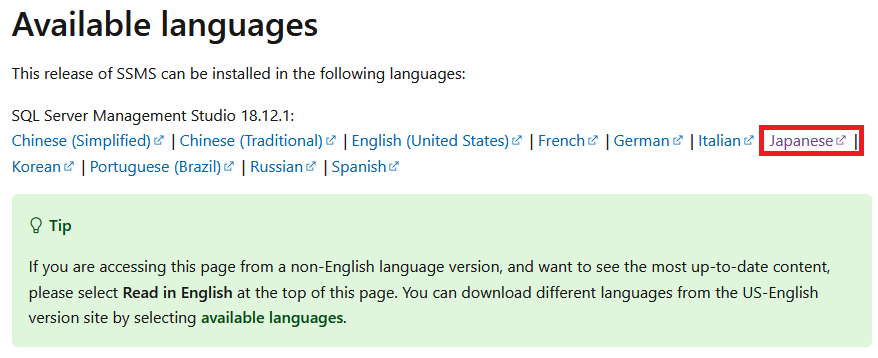
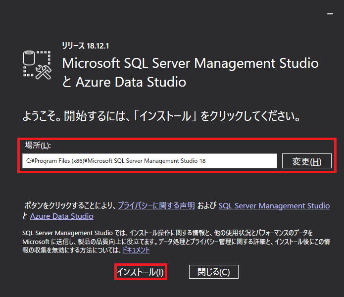
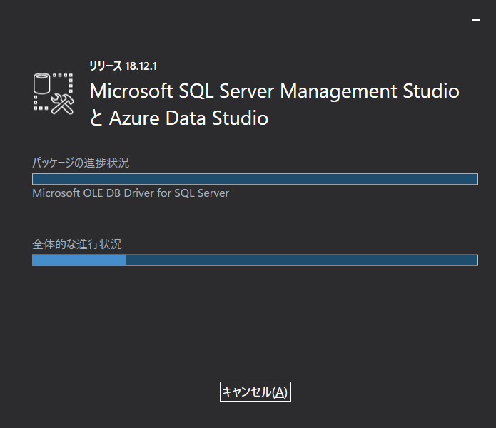
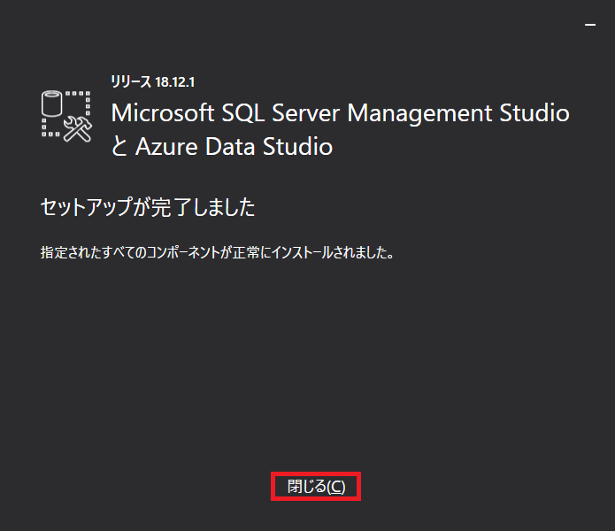

## 0. はじめに  
ここでは、Microsoft SQL ServerのGUIインターフェースで操作するMicrosoft SQL Server Management Studio 18.2.1という管理ツールのWindows版をインストールする方法を書いていきます。  

 

## 1. Microsoft SQL Server Management Studioをダウンロードする  
まずは、Microsoft SQL Server Management Studioをダウンロードします。  

[ダウンロード先](https://learn.microsoft.com/en-us/sql/ssms/download-sql-server-management-studio-ssms?view=sql-server-ver15)  
上記ダウンロード先内のAvailable languagesの**Japanese**ボタンをクリックしダウンロードします。  
※日本語サイトは、新しいVersionをまだ提供していなので英語サイトでアクセスします。  

  

 

## 2. Microsoft SQL Server Management Studioをインストールする  
ダウンロードフォルダ内に`SSSMS-Setup-JPN.exe`ファイルがありますのでダブルクリックします。  
以下のようなダイアログが表示され、インストールするフォルダを指定します。  
ここでは、デフォルトのフォルダPathにしますのでそのままにし「インストール(I)」ボタンをクリックしインストールを開始します。  

  

インストールしています。しばらくお待ちください。  

  

以下のようなウィンドウになりましたらインストール完了です。  
「閉じる(C)」ボタンをクリックし終了してください。  
スタートメニューにSQL Server Tools 18内にSQL Server Management Studio がありますのでクリックすると起動できます。  

  

___