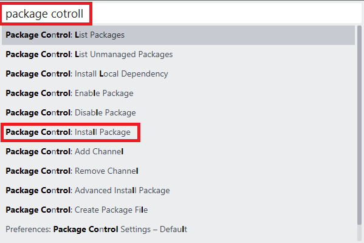
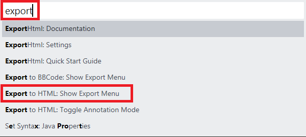
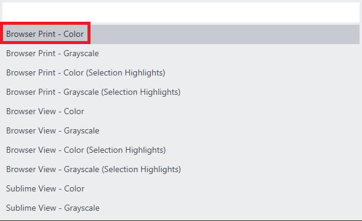
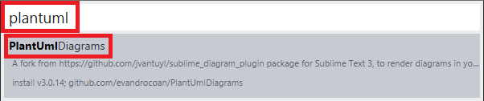
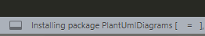
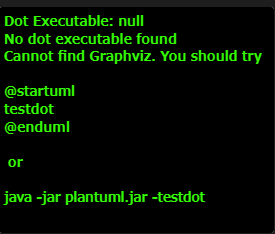
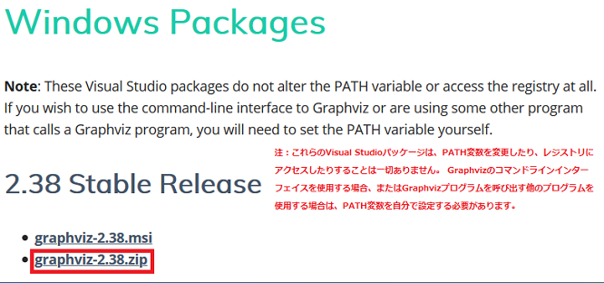

## 0. はじめに

プログラミングでは統合開発環境(IDE)、メモ取りやUML図の作成にはBoostnoteでマークダウンとPlantUMLを使う  
事によりあれこれアプリを使い分けなくて良いと思った。  
しかし、Microsoft Visual Studio(IDE)では問題無いがEclipseではコードの印刷機能が良くなく無駄に余白がある。  
よって当初は、マークダウンも使える割と気に入ったSublime Text3エディタでExportHTMLパッケージを導入し印刷  
していた。Atomエディタも良さそうだったが印刷機能がそもそも無い。  
メモアプリはBoostnoteがUML図やPlantUMLも標準で使える(Boost Noteの方はまだ使えない)のでこれを使っていま  
したがこのUML図を画像ファイルとしてエクスポート保存できない。  
PDFとしては出力できますがこのPDFをMicrosoft Excelなどで使おうとすると簡単にはいかず。  
PDFを開いてさらに画像ファイルとして保存しなおすのも手間が少しかかる。  
いろいろアプリを使い分けないといけないと思いましたが、Microsoft Visual Studio Codeの様々なプラグインを  
導入することにより、コードの印刷、PlantUMLのテキストベースでUML図を作成できそれを画像としてエクスポート  
できる。マークダウンでメモも取れるのでSublime Text3とBoostnoteからの移行ができるかもしれません。  

**とVisual Studio Codeで思いましたがまだ言語によってはコードのシンタックスハイライトの印刷がカラー  
に対応していません(2020/03/19日現在)。**  
さらに手間はかかりますがこれらすべてを整えてくれるので現段階ではSublime Text3が一番良いのかなと思います。  

<br />

## 1. Package Controlのインストール

Package Controlは、Sublime Text 3のプラグインの様なもので標準的なエディタに使用したい機能を管理し追加  
するものの様です。  

### 1-1. Package Controlの導入済みかの確認

メニューバーの「Preferences」をクリックするとプルダウンメニューが出ますがその中に「Package Controll」が
あるか確認して下さい。  

※このメモを残す段階で少しSublime Textを使っていたのでPackage Controllをインストールしたのか、すでに内蔵  
されるようになったのか覚えがありませんが、無い場合には以下の手順で行われます。  
(2020/07/07)インストール直後は入っていないので1-2.を参考にインストールを行う必要があります。  

### 1-2. Package Controlのインストール

メニューバーの「Tools」→「Command Palette」を選ぶか、またはキーボードのCtrl + Shift + Pキーを押すと  
検索バー以下の  
様な検索バーが現れますので`package control`と打ちます。  
`Package Control: Install Package`が出てくると思いますのでクリックし選択します。  

  

インストールされているはずなので**1-1**の手順で確認してみましょう。  

<br />

## 2. Sublime Text3を日本語化する

このアプリを日本語化にしてみますがメニューなどの一部のみとなっている様です。  

### 2-1. Japanizeパッケージのインストール

メニューバーの「Preferences」→「Package Controll」をクリックし検索バーを表示します。  
`Package Control: Install Package`が出てくるのでクリックし選択します。  
※表示に5秒から10秒程度少し時間がかかる様です。  
インストール可能なパッケージの候補が表れますので検索バーに`japanize`と入力して下さい。  
出てきたJapanizeをクリックしインストールを開始します。  
ウィンドウ左下ステータスバーにインストール状況が表示され完了すると日本語に代わっているはずです。  

<br />

## 3. コードの印刷機能を追加する

### 3-1. ExportHtmlパッケージのインストール

メニューバーの「基本設定(n)」→「Package Controll」をクリックし検索バーを表示します。  
`Package Control: Install Package`が出てくるのでクリックし選択します。  
※表示に5秒から10秒程度少し時間がかかる様です。  
インストール可能なパッケージの候補が表れますので検索バーに`exporthtml`と入力して下さい。  
出てきたExportHTMLをクリックしインストールを開始します。  
ウィンドウ左下ステータスバーにインストール状況が表示され完了するとインストールできているはずです。  

### 3-2. 印刷のためのテストコードを作成

メニューバーの「ファイル(F)」→「New File」で新しいファイルを起動し以下の様に.java用のファイルを作成。  

```java
package develop;

import java.util.String;

public class Develop1 {
    private String str;
    public static void main(String[] args) {
        str = "メッセージ";
        System.out.println(str);
    }
}
```

メニューバーの「ファイル(F)」→「Save As」を選び「ファイルの種類(T)」コンボボックスで`Java(*.java;*.bsh)`  
を選択し「名前(N)」テキストボックスへファイル名を付け適当な場所へ保存して下さい。  

### 3-3. テストコードの印刷

メニューバーの「ツール(T)」→「Command Palette」を選ぶか、またはキーボードのCtrl + Shift + Pキーを押すと  
インストールされているパッケージなどのコマンドを検索できる検索バーが表れますので`export`と入力します。  
出てきた候補の中の`Export to HTML: Show Export Menu`をクリックし選択します。  

  

カラー印刷を行うかモノクロ印刷を行うかなどの種類が出ますのでここでは、`Browser Pring - Color`を選択します。  
※モノクロ印刷の場合は`Grayscale`を選択します。  

※これは内部で1度htmlファイルに変換してそのhtmlファイルの印刷を行おうとするものです。  

  

既定のブラウザとその印刷ダイアログが表示され「印刷」ボタンなどを押すと印刷できます。  
※また、この印刷機能は内部で1度htmlファイルに変換してそのhtmlファイルの印刷を行おうとするものです。  

<br />

## 4. UML図の作成のためのPlantUMLを追加する

### 4-1. PlantUmlDiagramsパッケージのインストール

メニューバーの「基本設定(n)」→「Package Controll」をクリックし検索バーを表示します。  
`Package Control: Install Package`が出てくるのでクリックし選択します。  
※表示に5秒から10秒程度少し時間がかかる様です。  
インストール可能なパッケージの候補が表れますので検索バーに`plantuml`と入力して下さい。  
出てきたPlantUmlDiagramsをクリックしインストールを開始します。  

  

ウィンドウ左下ステータスバーにインストール状況が表示され完了するとインストールできているはずです。  

  

### 4-3. PlantUmlDiagramsを使用するための準備

実は、このパッケージを導入しただけでは使えません。試しに、  
メニューバーの「基本設定(n)」→「Package Settings」→「PlantUmlDiagrams」→「Display Diagrams」をクリック  
してみます。  
しかし、何も起きません。PlantUmlファイルの置かれた同じディレクトリ内にpngファイルが作成されており表示して  
見ますが何も画像は保存されておりません。  
PlantUML compiled Jar(`plantuml.jar`ファイル)と、Java(Jdk、Jreどちらでも良い)が必要です。  

#### plantuml.jarのダウンロードと配置

[PlantUML compiled Jar](https://plantuml.com/ja/download)でダウンロードし、Windowsなら`C:\ユーザー\`に  
**plantuml.jar**を置いてください。  

※メニューバーの「基本設定(n)」→「Package Settings」→「PlantUmlDiagrams」→「Settings - Default」でファイル  
を表示するとplantuml.jarがどこに必要か分かるはずです。  

#### Javaのダウンロードと配置、環境変数PATH設定

個々の環境によりますのでJavaのダウンロードと配置、環境設定PATH設定は省略しますが無ければ行ってください。  
Javaはgraphvizより上に配置した方が良いかもしれません。

### 4-4. PlantUmlDiagramのプレビューの表示

※Pathの設定などを行った後Sublime Text3を1度再起動する必要があるようです。  
メニューバーの「基本設定(n)」→「Package Settings」→「PlantUmlDiagrams」→「Display Diagrams」をクリック  
すると今度はプレビューを表示できるはずです。※表示には環境にもよりますが5秒程度の時間がかかる様です。  
※画像は別途保存するのではなくPlantUMLのソースファイルの置かれているディレクトリ内にpngファイルとして作成  
されています。  

また、色んなUML図を作成しているとシーケンス図とアクティビティ図以外では以下の様なエラーメッセージがプレビュー  
に表示されてしまいます。実はまだこれだけでは完全にUML図をすべて使えません。  
`Graphviz`というライブラリーをインストールする必要があります。  

  

```
dot実行可能ファイル：null
dot実行可能ファイルが見つかりません
Graphvizが見つかりません。試してみてください

@startuml
testdot
@enduml

または

java -jar plantuml.jar -testdot

```

### 4-5. Graphvizのインストールと環境変数PATH設定

よって、`Graphviz`というライブラリーをインストールする必要がある様です。  
[Graphvis(Windows版)](https://graphviz.gitlab.io/_pages/Download/Download_windows.html)で.zip版をインストールします。 

  

.zipファイルを展開し適当なディレクトリへ配置し`～\release\bin`を環境変数のPATHへ設定してください。  

これでクラス図などのUML図も表示されるはずです。 

* * *
