## 0. はじめに

実HDDへのインストールでは画面のキャプチャを取るのに難しいのでMacのVirtualBoxでのインストールで行います。  
実HDDにインストールする場合もほぼ同じと思われます。  
VirtualBoxなどの仮想化ツールを利用しインストールすると解像度が800x600などとなり以下のように画面が途切れる現象がおきる。`tab`キーなどでカーソルを移動してもよいが画面がそこへ飛ばない。  
よって、解像度を変更する方法も書いておきます。  

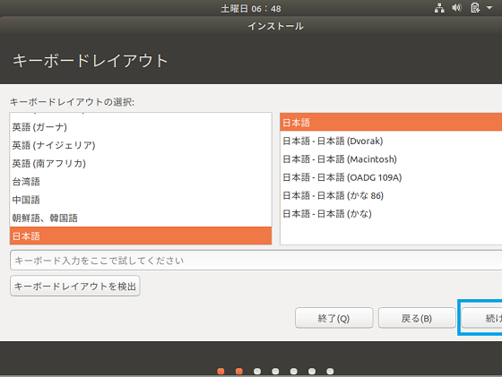  

 

## 1. Ubuntuのインストール

1-1. メニューが出る前の起動直後`Esc`キーを押すと以下の様な起動オプションが表示されます。  
その中の`F6`キーのその他のオプションを選びます。※Macでは`fn`キー + `F6`キーとなります。  

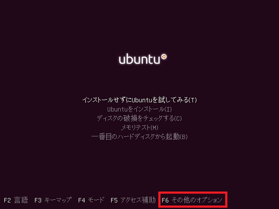  

1-2. メニューが出てきますが必要ないので`Esc`キーを押します。  

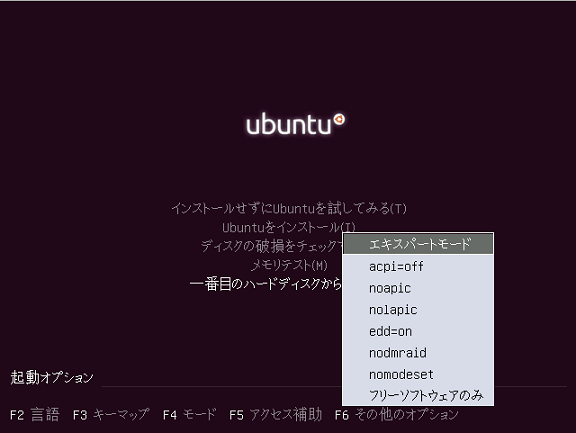  

1-3. キーボードの上下ボタンを使い「Ubuntuをインストール(I)」にカーソルを合わせます。  
起動オプションには以下の様な文字が出ていますので`～splash --`の後ろに` vga=1280x800`などと入力します。`--`と`vga`の間は半角スペースが必要です。  
実は、vgaのパラメーターは1280x800などではなく対応の番号を入力しなければなりませんがわかりませんので該当しない適当な番号を入力して一覧を出すよう取り合えず1280x800としました。  

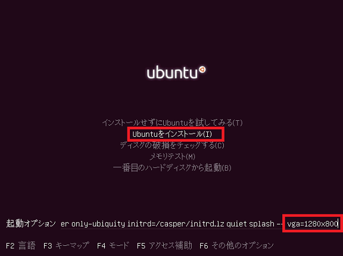  

1-4. `Enter`キーを押して使用可能な解像度の一覧を表示させます。  
パソコンの解像度が`1440x800`程度しかないのでここでは`1024x768`の`344`を入力し`Enter`キーを押します。  

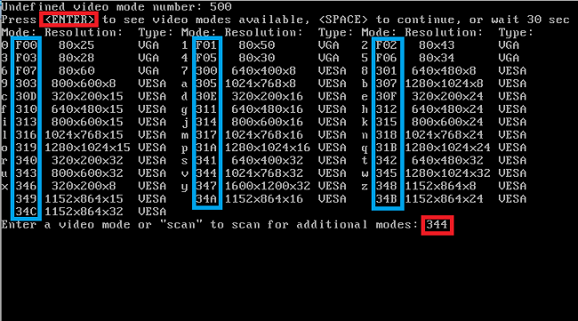  

1-5. インストーラーが起動しました。  
左側リスト内の言語の選択は`日本語`を選び「続ける」ボタンをクリックし次に進みます。  

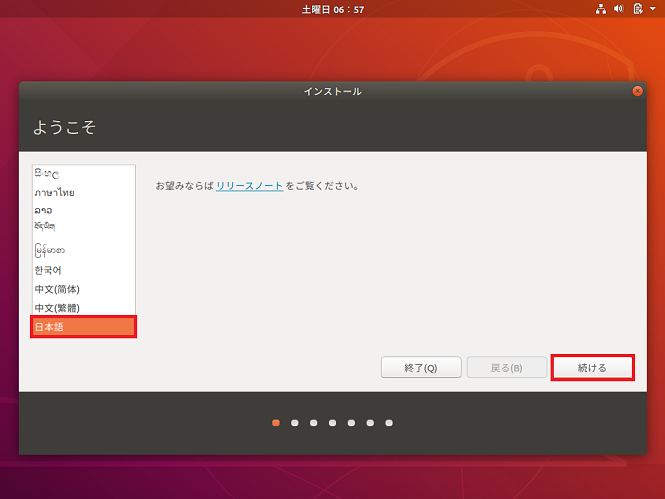  

1-6. キーボードレイアウトの画面が出ます。  
左側リストおよび右側リスト内の`日本語`を選び「続ける」ボタンをクリックし次に進みます。  

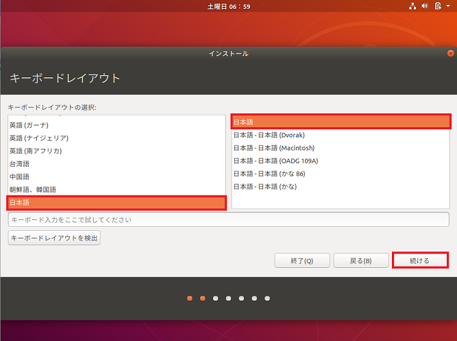  

1-7. インストールの基準とオプションの画面が出ます。  
「通常のインストール」ラジオボタンをクリックし、その他のオプションのチェックボックスも両方クリックし選択しておきます。  
良ければ「続ける」ボタンをクリックし次に進みます。  

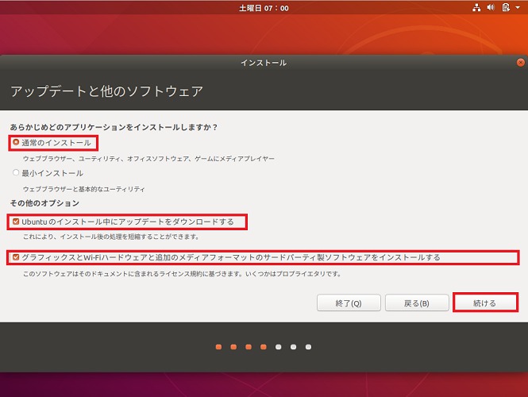  

1-8. インストールの種類の画面が出ます。  
普通にインストールするので「ディスクを削除してUbuntuをインストール」ラジオボタンを選択し「インストール(I)」ボタンをクリックし次へ進みます。  

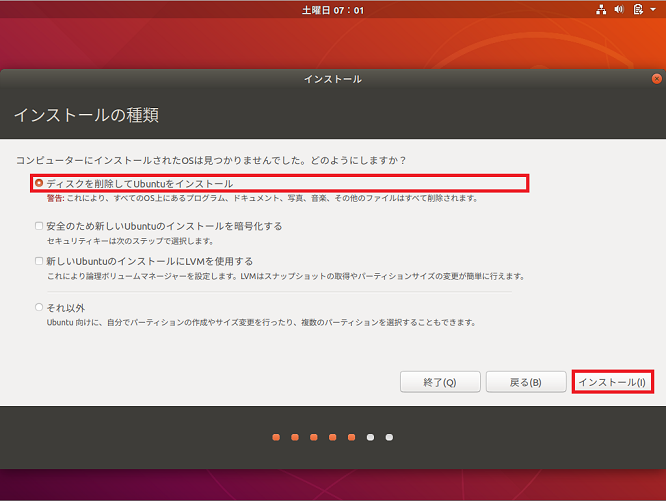  

1-9. 確認メッセージが出ますので良ければ「続ける」ボタンをクリックし次に進みます。  

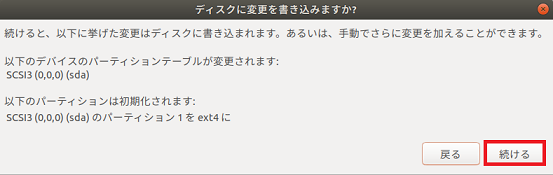  

1-10. 時刻などを合わせるため地域を指定する画面が出ます。  
地図上の日本がある行をクリック選択し「続ける」ボタンをクリックし次に進みます。  

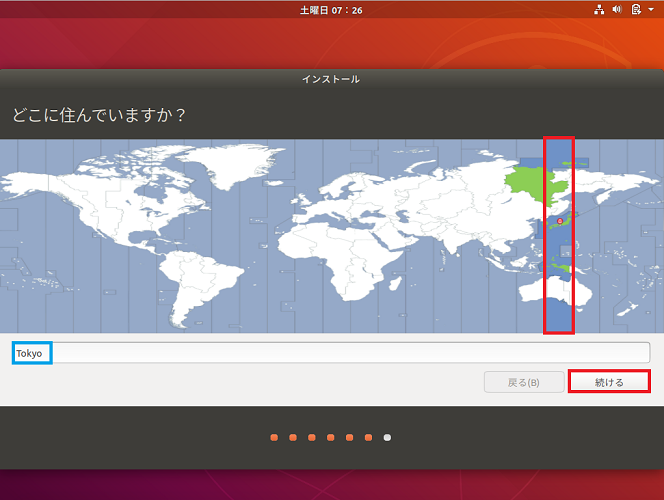  

1-11. コンピュータの情報を入力する画面が出ます。  
すべてのテキストボックスに入力し「続ける」ボタンをクリックし次に進みます。  
※すべてを入力しないと「続ける」ボタンは有効になりません。  

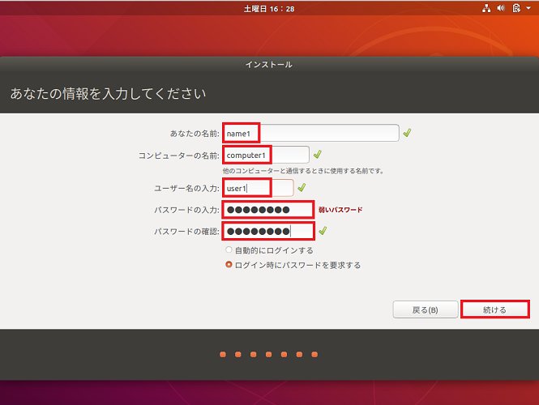  

途中止まってしまったのか画面が無反応になりましたので終了させました。  
**ただ今作成中**  

* * *
