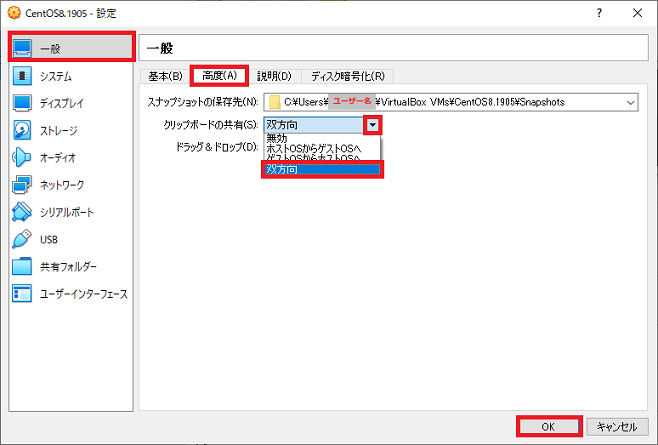
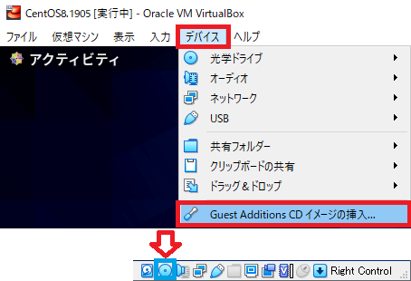
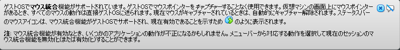

## 0. はじめに

VBoxGuestAdditionsは、ホストOSとゲストOS間でクリップボードの共有やマウスのズレ、マウスが斜めに動くのを改善、  
キャプチャ時にマウスポインタ除去、ホストOSとゲストOS間のマウス統合、パフォーマンス、利用できる画面の解像度の  
追加などが行われるようです。  
仮想化ソフトを使う事による不具合や調整、ホストOSとのやりとりなどをまとめた物の様です。  

※以下はCentOS8、FedoraなどのRedHat系でのコマンドです。  
CentOS7や古いFedoraなどはdnfをyumに置き換えて下さい。  
UbuntuなどのDebian系はdnfをaptに置き換えて下さい。  

 

## 1. 準備

### 1-1. VirtualBox側でクリップボードの共有設定

クリップボードの共有(コピー&ペーストの共有)は設定が必要なので事前に設定しておきます。  
※一度起動してクリップボードの共有が出来ない事を確認してみるのも良いです。  
VirtualBoxのメイン画面で「設定(S)」をクリックしダイアログを開きます。  

  

ダイアログの左リストの一般を選び「高度(A)」タブをクリックします。  
「クリップボードの共有(S)」コンボボックスをクリックし「双方向」をクリックします。  
双方向を選んだら「OK」ボタンを押し適用します。  

  

### 1-2. GuestAdditionsディスクを入れる

VirtualBoxを起動しメニューバーの「デバイス」→「GuestAdditions CDイメージの挿入」をクリックしisoファイルを  
セットします。  

  

以下のメッセージが出ますがここではコマンドでインストールしてみますので「キャンセル(C)」をクリックして下さい。  

  

### 1-3. カーネルのUpdate

`su -`でrootでログインします。また、インターネットへ接続できるようにもしておきます。  
念のため以下のコマンドでカーネルのupdateをし最新の状態にしておきます。  
パッケージのインストールでVersionの不一致など不具合を起こさないためです。  

    [root@localhost ~]# dnf -y update kernel
    CentOS-8 - AppStream                           393  B/s | 4.3 kB     00:11
    CentOS-8 - Base                                345  B/s | 3.8 kB     00:11
    CentOS-8 - Extras                              141  B/s | 1.5 kB     00:10
    依存関係が解決しました。
    ================================================================================
     パッケージ          アーキテクチャー
                                     バージョン                   リポジトリ  サイズ
    ================================================================================
    Installing:
     kernel              x86_64      4.18.0-147.3.1.el8_1         BaseOS      1.5 M
    依存関係をインストール中:
     kernel-core         x86_64      4.18.0-147.3.1.el8_1         BaseOS       25 M
     kernel-modules      x86_64      4.18.0-147.3.1.el8_1         BaseOS       22 M

    トランザクションの概要
    ================================================================================
    インストール　3 パッケージ

    ダウンロードサイズの合計: 49 M
    インストール済みのサイズ: 78 M
    パッケージのダウンロード中です:
    (1/3): kernel-4.18.0-147.3.1.el8_1.x86_64.rpm   272 kB/s | 1.5 MB     00:05
    (2/3): kernel-modules-4.18.0-147.3.1.el8_1.x86_ 1.0 MB/s |  22 MB     00:20
    (3/3): kernel-core-4.18.0-147.3.1.el8_1.x86_64. 1.2 MB/s |  25 MB     00:20
    --------------------------------------------------------------------------------
    合計                                            1.8 MB/s |  49 MB     00:26
    トランザクションの確認を実行中
    トランザクションの確認に成功しました。
    トランザクションのテストを実行中
    トランザクションのテストに成功しました。
    トランザクションを実行中
    　準備             :                                                        1/1
    　Installing　     : kernel-core-4.18.0-147.3.1.el8_1.x86_64                1/3
    　scriptletの実行中: kernel-core-4.18.0-147.3.1.el8_1.x86_64                1/3
    　Installing　     : kernel-modules-4.18.0-147.3.1.el8_1.x86_64             2/3
    　scriptletの実行中: kernel-modules-4.18.0-147.3.1.el8_1.x86_64             2/3
    　Installing　     : kernel-4.18.0-147.3.1.el8_1.x86_64                     3/3
    　scriptletの実行中: kernel-core-4.18.0-147.3.1.el8_1.x86_64                3/3
    　scriptletの実行中: kernel-4.18.0-147.3.1.el8_1.x86_64                     3/3
    　検証　           : kernel-4.18.0-147.3.1.el8_1.x86_64                     1/3
    　検証　           : kernel-core-4.18.0-147.3.1.el8_1.x86_64                2/3
    　検証　           : kernel-modules-4.18.0-147.3.1.el8_1.x86_64             3/3

    インストール済み:
      kernel-4.18.0-147.3.1.el8_1.x86_64
      kernel-core-4.18.0-147.3.1.el8_1.x86_64
      kernel-modules-4.18.0-147.3.1.el8_1.x86_64

    完了しました!

終わったら再起動させておきます。  

 

## 2. マウント

### 2-1. isoディスクイメージファイルのマウント

isoファイルをマウントします。※ディスクイメージは`/dev/cdrom`にあります。  
また、マウントは/mntへ直接行えば良いですが今回はmntフォルダ下にvboxmntフォルダを作成し`/mnt/vboxmnt`にマウント  
する方法で行ってみます。以下のコマンドを入力し実行します。  
※警告が出ますが、これはマウントしている間は読み取り専用フォルダに変更しますと言う確認のメッセージなので特に  
問題はありません。  
また、`su -`でrootとして操作した場合はログイン前の一般ユーザーが所有者となっています。  

    [root@localhost ~]# mkdir /mnt/vboxmnt
    [root@localhost ~]# mount /dev/cdrom /mnt/vboxmnt
    mount: /mnt/vboxmnt: 警告: デバイスは書き込み禁止です、読み込み専用でマウントし
    ます．

何らかの理由でマウントを解除したい場合は`umount`を使うか再起動すれば解除されます。  

    [root@localhost ~]# umount /mnt/vboxmnt
    または許可されていなければ
    [root@localhost ~]# sudo umount /mnt/vboxmnt

 

## 3. GuestAdditionsのインストール

### 3-1. VBoxLinuxAdditions.runの実行

マウントされたvboxmntフォルダの中にLinux用の`.run`ファイルがあるので以下の様に実行します。  
Linuxのインストール後比較的すぐにGuestAdditionsを実行するとすると以下の様なエラーが出ると思われます。      

    [root@localhost ~]# /mnt/vboxmnt/VBoxLinuxAdditions.run
    Verifying archive integrity... All good.
    Uncompressing VirtualBox 6.1.2 Guest Additions for Linux........
    VirtualBox Guest Additions installer
    Copying additional installer modules ...
    Installing additional modules ...
    VirtualBox Guest Additions: Starting.
    VirtualBox Guest Additions: Building the VirtualBox Guest Additions kernel
    modules.  This may take a while.
    VirtualBox Guest Additions: To build modules for other installed kernels, run
    VirtualBox Guest Additions:   /sbin/rcvboxadd quicksetup <version>
    VirtualBox Guest Additions: or
    VirtualBox Guest Additions:   /sbin/rcvboxadd quicksetup all
    VirtualBox Guest Additions: Kernel headers not found for target kernel
    4.18.0-147.3.1.el8_1.x86_64. Please install them and execute
      /sbin/rcvboxadd setup
    modprobe vboxguest failed
    The log file /var/log/vboxadd-setup.log may contain further information.

`Kernel headers not found for target kernel`  
`訳：ターゲットカーネルのカーネルヘッダーが見つかりません`  
kernel-headersというパッケージが必要な様です。  
調べてみるとkernel-headersが無いのでインストールされていない事が分かります。  

    [root@localhost ~]# dnf list --installed kernel
    インストール済みパッケージ
    kernel.x86_64                  4.18.0-80.el8                      @anaconda
    kernel.x86_64                  4.18.0-147.3.1.el8_1               @Base

 

## 4. 必要なパッケージのインストール

### 4-1. kernel-headersパッケージのインストール

よって、`kernel-headers`パッケージをインストールしてみます。  

    [root@localhost ~]# dnf -y install kernel-headers
    メタデータの期限切れの最終確認：23:54:06 時間前の 2020年01月28日 20時48分21秒 に
    実施しました。
    依存関係が解決しました。
    ================================================================================
     パッケージ          アーキテクチャー
     インストール　1 パッケージ

    ダウンロードサイズの合計: 2.7 M
    インストール済みのサイズ: 4.6 M
    パッケージのダウンロード中です:
    kernel-headers-4.18.0-147.3.1.el8_1.x86_64.rpm  451 kB/s | 2.7 MB     00:06
    --------------------------------------------------------------------------------
    合計                                            233 kB/s | 2.7 MB     00:11
    トランザクションの確認を実行中
    トランザクションの確認に成功しました。
    トランザクションのテストを実行中
    トランザクションのテストに成功しました。
    トランザクションを実行中
    　準備             :                                                        1/1
    　Installing　     : kernel-headers-4.18.0-147.3.1.el8_1.x86_64             1/1
                                    バージョン                  リポジトリ    サイズ
    ================================================================================
    Installing:
     kernel-headers     x86_64      4.18.0-147.3.1.el8_1        BaseOS        2.7 M

    トランザクションの概要
    ================================================================================
    インストール　1 パッケージ

    ダウンロードサイズの合計: 2.7 M
    インストール済みのサイズ: 4.6 M
    パッケージのダウンロード中です:
    kernel-headers-4.18.0-147.3.1.el8_1.x86_64.rpm  451 kB/s | 2.7 MB     00:06
    --------------------------------------------------------------------------------
    合計                                            233 kB/s | 2.7 MB     00:11
    トランザクションの確認を実行中
    トランザクションの確認に成功しました。
    トランザクションのテストを実行中
    トランザクションのテストに成功しました。
    トランザクションを実行中
    　準備             :                                                        1/1
    　Installing　     : kernel-headers-4.18.0-147.3.1.el8_1.x86_64             1/1
     インストール　1 パッケージ

    ダウンロードサイズの合計: 2.7 M
    インストール済みのサイズ: 4.6 M
    パッケージのダウンロード中です:
    kernel-headers-4.18.0-147.3.1.el8_1.x86_64.rpm  451 kB/s | 2.7 MB     00:06
    --------------------------------------------------------------------------------
    合計                                            233 kB/s | 2.7 MB     00:11
    トランザクションの確認を実行中
    トランザクションの確認に成功しました。
    トランザクションのテストを実行中
    トランザクションのテストに成功しました。
    トランザクションを実行中
    　準備             :                                                        1/1
    　Installing　     : kernel-headers-4.18.0-147.3.1.el8_1.x86_64             1/1
    　検証　           : kernel-headers-4.18.0-147.3.1.el8_1.x86_64             1/1

    インストール済み:
      kernel-headers-4.18.0-147.3.1.el8_1.x86_64

    完了しました！

kernel-headersをインストールしましたので、再度GuestAdditionsを実行してみます。  

    [root@localhost ~]# /mnt/vboxmnt/VBoxLinuxAdditions.run
    Verifying archive integrity... All good.
    Uncompressing VirtualBox 6.1.2 Guest Additions for Linux........
    VirtualBox Guest Additions installer
    Removing installed version 6.1.2 of VirtualBox Guest Additions...
    Copying additional installer modules ...
    Installing additional modules ...
    VirtualBox Guest Additions: Starting.
    VirtualBox Guest Additions: Building the VirtualBox Guest Additions kernel
    modules.  This may take a while.
    VirtualBox Guest Additions: To build modules for other installed kernels, run
    VirtualBox Guest Additions:   /sbin/rcvboxadd quicksetup <version>
    VirtualBox Guest Additions: or
    VirtualBox Guest Additions:   /sbin/rcvboxadd quicksetup all
    VirtualBox Guest Additions: Kernel headers not found for target kernel
    4.18.0-147.3.1.el8_1.x86_64. Please install them and execute
      /sbin/rcvboxadd setup
    ValueError: File context for /opt/VBoxGuestAdditions-6.1.2/other/mount.vboxsf al
    ready defined
    modprobe vboxguest failed
    The log file /var/log/vboxadd-setup.log may contain further information.

まだエラーが出ています。よく見るとログへエラー情報が出ている場合がある様です。  
`The log file /var/log/vboxadd-setup.log may contain further information.`  
`訳：ログファイル/var/log/vboxadd-setup.logに詳細情報が含まれている場合があります。`  
vboxadd-setup.logを見てみますが`modprobe vboxguest failed(modprobe vboxguestが失敗しました)`  
としか書かれていませんでしたので詳しい情報はありません。  
分からないのでインターネットで調べると`kernel-devel`パッケージも必要な様です。  

### 4-2. kernel-develパッケージのインストール

よって、`kernel-devel`パッケージをインストールしてみます。  

    [root@localhost ~]# dnf -y install kernel-devel
    メタデータの期限切れの最終確認：1 day, 0:06:02 時間前の 2020年01月28日 20時48分2
    1秒 に実施しました。
    依存関係が解決しました。
    ================================================================================
     パッケージ          アーキテクチャー
                                    バージョン                  リポジトリ    サイズ
    ================================================================================
    Installing:
     kernel-devel       x86_64      4.18.0-147.3.1.el8_1        BaseOS        13 M

    トランザクションの概要
    ================================================================================
    インストール　1 パッケージ

    ダウンロードサイズの合計: 13 M
    インストール済みのサイズ: 46 M
    パッケージのダウンロード中です:
    kernel-devel-4.18.0-147.3.1.el8_1.x86_64.rpm    809 kB/s |  13 MB     00:17
    --------------------------------------------------------------------------------
    合計                                            602 kB/s |  13 MB     00:22
    トランザクションの確認を実行中
    トランザクションの確認に成功しました。
    トランザクションのテストを実行中
    トランザクションのテストに成功しました。
    トランザクションを実行中
    　準備             :                                                        1/1
    　Installing　     : kernel-devel-4.18.0-147.3.1.el8_1.x86_64               1/1
    　scriptletの実行中: kernel-devel-4.18.0-147.3.1.el8_1.x86_64               1/1
    　検証　           : kernel-devel-4.18.0-147.3.1.el8_1.x86_64               1/1

    インストール済み:
      kernel-devel-4.18.0-147.3.1.el8_1.x86_64

    完了しました！

kernel-develもインストールしましたので、再びGuestAdditionsを実行してみます。  
キャプチャーを取り忘れましたが少しメッセージが変わりました。  
gcc、make、perlのパッケージをインストールして下さいとありました。  

### 4-3. gccパッケージのインストール

よって、`gcc`パッケージをインストールしてみます。  

    [root@localhost ~]# dnf -y install gcc
    CentOS-8 - AppStream                           397  B/s | 4.3 kB     00:11
    CentOS-8 - Base                                350  B/s | 3.8 kB     00:11
    CentOS-8 - Extras                              144  B/s | 1.5 kB     00:10
    依存関係が解決しました。
    ================================================================================
     パッケージ              アーキテクチャー
                                         バージョン          リポジトリ   サイズ
    ================================================================================
    Installing:
     gcc                     x86_64       8.3.1-4.5.el8      AppStream        23 M
    Upgrading:
     glibc                   x86_64       2.28-72.el8        BaseOS          3.5 M
     glibc-common            x86_64       2.28-72.el8        BaseOS          811 k
     glibc-langpack-en       x86_64       2.28-72.el8        BaseOS          818 k
     glibc-langpack-ja       x86_64       2.28-72.el8        BaseOS          323 k
     libgcc                  x86_64       8.3.1-4.5.el8      BaseOS           78 k
     libgomp                 x86_64       8.3.1-4.5.el8      BaseOS          203 k
    依存関係をインストール中:
     cpp                     x86_64       8.3.1-4.5.el8      AppStream        10 M
     isl                     x86_64       0.16.1-6.el8       AppStream       841 k
     glibc-devel             x86_64       2.28-72.el8        BaseOS          1.0 M
     glibc-headers           x86_64       2.28-72.el8        BaseOS          469 k
     libxcrypt-devel         x86_64       4.1.1-4.el8        BaseOS           25 k

    トランザクションの概要
    ================================================================================
    インストール　  6 パッケージ
    アップグレード  6 パッケージ

    ダウンロードサイズの合計: 42 M
    パッケージのダウンロード中です:
    (1/12): isl-0.16.1-6.el8.x86_64.rpm              76 kB/s | 841 kB     00:11
    (2/12): glibc-devel-2.28-72.el8.x86_64.rpm      183 kB/s | 1.0 kB     00:05
    (3/12): glibc-headers-2.28-72.el8.x86_64.rpm    346 kB/s | 469 kB     00:01
    (4/12): libxcrypt-devel-4.1.1-4.el8.x86_64.rpm  263 kB/s |  25 kB     00:00
    (5/12): glibc-2.28-72.el8.x86_64.rpm            1.4 MB/s | 3.5 MB     00:02
    (6/12): glibc-common-2.28-72.el8.x86_64.rpm     1.8 MB/s | 811 kB     00:00
    (7/12): glibc-langpack-en-2.28-72.el8.x86_64.rp 1.3 MB/s | 818 kB     00:00
    (8/12): glibc-langpack-ja-2.28-72.el8.x86_64.rp 1.1 MB/s | 323 kB     00:00
    (9/12): libgcc-8.3.1-4.5.el8.x86_64.rpm         668 kB/s |  78 kB     00:00
    (10/12): libgomp-8.3.1-4.5.el8.x86_64.rpm       1.1 MB/s | 203 kB     00:00
    (11/12): cpp-8.3.1-4.5.el8.x86_64.rpm           142 kB/s |  10 MB     01:15
    (12/12): gcc-8.3.1-4.5.el8.x86_64.rpm           142 kB/s |  23 MB     02:48
    --------------------------------------------------------------------------------
    合計                                            238 kB/s |  42 MB     02:59
    トランザクションの確認を実行中
    トランザクションの確認に成功しました。
    トランザクションのテストを実行中
    トランザクションのテストに成功しました。
    トランザクションを実行中
    　準備             :                                                        1/1
    　Upgrading　      : glibc-common-2.28-72.el8.x86_64                       1/18
    　Upgrading　      : glibc-langpack-en-2.28-72.el8.x86_64                  2/18
    　Upgrading　      : glibc-langpack-ja-2.28-72.el8.x86_64                  3/18
    　scriptletの実行中: glibc-2.28-72.el8.x86_64                              4/18
    　Upgrading　      : glibc-2.28-72.el8.x86_64                              4/18
    　scriptletの実行中: glibc-2.28-72.el8.x86_64                              4/18
    　scriptletの実行中: glibc-headers-2.28-72.el8.x86_64                      5/18
    　Installing　     : glibc-headers-2.28-72.el8.x86_64                      5/18
    　Upgrading　      : libgcc-8.3.1-4.5.el8.x86_64                           6/18
    　scriptletの実行中: libgcc-8.3.1-4.5.el8.x86_64                           6/18
    　Installing　     : libxcrypt-devel-4.1.1-4.el8.x86_64                    7/18
    　Installing　     : glibc-devel-2.28-72.el8.x86_64                        8/18
    　scriptletの実行中: glibc-devel-2.28-72.el8.x86_64                        8/18
    　Installing　     : cpp-8.3.1-4.5.el8.x86_64                              9/18
    　scriptletの実行中: cpp-8.3.1-4.5.el8.x86_64                              9/18
    　Installing　     : isl-0.16.1-6.el8.x86_64                              10/18
    　scriptletの実行中: isl-0.16.1-6.el8.x86_64                              10/18
    　Upgrading　      : libgomp-8.3.1-4.5.el8.x86_64                         11/18
    　scriptletの実行中: libgomp-8.3.1-4.5.el8.x86_64                         11/18
    　Installing　     : gcc-8.3.1-4.5.el8.x86_64                             12/18
    　scriptletの実行中: gcc-8.3.1-4.5.el8.x86_64                             12/18
    　scriptletの実行中: libgomp-8.2.1-3.5.el8.x86_64                         13/18
    　整理             : libgomp-8.2.1-3.5.el8.x86_64                         13/18
    　scriptletの実行中: libgomp-8.2.1-3.5.el8.x86_64                         13/18
    　整理             : glibc-langpack-ja-2.28-42.el8.1.x86_64               14/18
    　整理             : glibc-2.28-42.el8.1.x86_64                           15/18
    　整理             : glibc-langpack-en-2.28-42.el8.1.x86_64               16/18
    　整理             : glibc-common-2.28-42.el8.1.x86_64                    17/18
    　整理             : libgcc-8.2.1-3.5.el8.x86_64                          18/18
    　scriptletの実行中: libgcc-8.2.1-3.5.el8.x86_64                          18/18
    　scriptletの実行中: glibc-common-2.28-72.el8.x86_64                      18/18
    　検証　           : cpp-8.3.1-4.5.el8.x86_64                              1/18
    　検証　           : gcc-8.3.1-4.5.el8.x86_64                              2/18
    　検証　           : isl-0.16.1-6.el8.x86_64                               3/18
    　検証　           : glibc-devel-2.28-72.el8.x86_64                        4/18
    　検証　           : glibc-headers-2.28-72.el8.x86_64                      5/18
    　検証　           : libxcrypt-devel-4.1.1-4.el8.x86_64                    6/18
    　検証　           : glibc-2.28-72.el8.x86_64                              7/18
    　検証　           : glibc-2.28-42.el8.1.x86_64                            8/18
    　検証　           : glibc-common-2.28-72.el8.x86_64                       9/18
    　検証　           : glibc-common-2.28-42.el8.1.x86_64                    10/18
    　検証　           : glibc-langpack-en-2.28-72.el8.x86_64                 11/18
    　検証　           : glibc-langpack-en-2.28-42.el8.1.x86_64               12/18
    　検証　           : glibc-langpack-ja-2.28-72.el8.x86_64                 13/18
    　検証　           : glibc-langpack-ja-2.28-42.el8.1.x86_64               14/18
    　検証　           : libgcc-8.3.1-4.5.el8.x86_64                          15/18
    　検証　           : libgcc-8.2.1-3.5.el8.x86_64                          16/18
    　検証　           : libgomp-8.3.1-4.5.el8.x86_64                         17/18
    　検証　           : libgomp-8.2.1-3.5.el8.x86_64                         18/18

    アップグレード済み:
      glibc-2.28-72.el8.x86_64               glibc-common-2.28-72.el8.x86_64
      glibc-langpack-en-2.28-72.el8.x86_64   glibc-langpack-ja-2.28-72.el8.x86_64
      libgcc-8.3.1-4.5.el8.x86_64            libgomp-8.3.1-4.5.el8.x86_64

    インストール済み:
      gcc-8.3.1-4.5.el8.x86_64              cpp-8.3.1-4.5.el8.x86_64
      isl-0.16.1-6.el8.x86_64               glibc-devel-2.28-72.el8.x86_64
      glibc-headers-2.28-72.el8.x86_64      libxcrypt-devel-4.1.1-4.el8.x86_64

    完了しました！

### 4-4. makeパッケージのインストール

続いて、`make`パッケージをインストールしてみます。  

    [root@localhost ~]# dnf -y install make
    メタデータの期限切れの最終確認：0:11:50 時間前の 2020年01月29日 21時06分53秒 に
    実施しました。
    依存関係が解決しました。
    ================================================================================
     パッケージ     アーキテクチャー バージョン              リポジトリ       サイズ
    ================================================================================
    Installing:
     make           x86_64          1:4.2.1-9.el8           BaseOS           498 k

    トランザクションの概要
    ================================================================================
    インストール　1 パッケージ

    ダウンロードサイズの合計: 498 k
    インストール済みのサイズ: 1.4 M
    パッケージのダウンロード中です:
    make-4.2.1-9.el8.x86_64.rpm                      86 kB/s | 498 kB     00:05
    --------------------------------------------------------------------------------
    合計                                             43 kB/s | 498 kB     00:11
    トランザクションの確認を実行中
    トランザクションの確認に成功しました。
    トランザクションのテストを実行中
    トランザクションのテストに成功しました。
    トランザクションを実行中
    　準備　           :                                                        1/1
    　Installing　     : make-1:4.2.1-9.el8.x86_64                              1/1
    　scriptletの実行中: make-1:4.2.1-9.el8.x86_64                              1/1
    　検証　           : make-1:4.2.1-9.el8.x86_64                              1/1

    インストール済み:
      make-1:4.2.1-9.el8.x86_64

    完了しました！

### 4-5. perlパッケージのインストール

最後に、`perl`パッケージをインストールしてみます。  

    [root@localhost ~]# dnf -y install perl
    長いので省略します

    完了しました！

すべてインストールしましたのでGuestAdditionsを実行してみます。  

    [root@localhost ~]# /mnt/vboxmnt/VBoxLinuxAdditions.run
    Verifying archive integrity... All good.
    Uncompressing VirtualBox 6.1.2 Guest Additions for Linux........
    VirtualBox Guest Additions installer
    Removing installed version 6.1.2 of VirtualBox Guest Additions...
    Copying additional installer modules ...
    Installing additional modules ...
    VirtualBox Guest Additions: Starting.
    VirtualBox Guest Additions: Building the VirtualBox Guest Additions kernel
    modules.  This may take a while.
    VirtualBox Guest Additions: To build modules for other installed kernels, run
    VirtualBox Guest Additions:   /sbin/rcvboxadd quicksetup <version>
    VirtualBox Guest Additions: or
    VirtualBox Guest Additions:   /sbin/rcvboxadd quicksetup all
    VirtualBox Guest Additions: Building the modules for kernel
    4.18.0-147.3.1.el8_1.x86_64.

    VirtualBox Guest Additions: Look at /var/log/vboxadd-setup.log to find out what
    went wrong
    ValueError: File context for /opt/VBoxGuestAdditions-6.1.2/other/mount.vboxsf al
    ready defined
    modprobe vboxguest failed
    The log file /var/log/vboxadd-setup.log may contain further information.

まだエラーが出ています。変わった所といえば以下のメッセージが付いています。  
`Look at /var/log/vboxadd-setup.log to find out that went wrong`  
`訳：/var/log/vboxadd-setup.logを見て、問題が発生したことを確認します`

よって、vboxadd-setup.logを見てみるとこのようなログがありました。   

    Cannot generate ORC metadata for CONFIG_UNWINDER_ORC=y, please install libelf-dev, 
    libelf-devel or elfutils-libelf-devel
    訳：CONFIG_UNWINDER_ORC = yのORCメタデータを生成できません。libelf-dev、libelf-devel、
    またはelfutils-libelf-develをインストールしてください

まだパッケージが足りない様です。  

### 4-6. elfutils-libelf-develパッケージのインストール

libelf-dev、libelf-develは該当するパッケージが無かったのでelfutils-libelf-develをインストールします。  

    [root@localhost ~]# dnf -y install elfutils-libelf-devel
    メタデータの期限切れの最終確認：0:50:20 時間前の 2020年01月29日 21時06分53秒 に
    実施しました。
    依存関係が解決しました。
    ================================================================================
     パッケージ                 アーキテクチャー
                                           バージョン            リポジトリ   サイズ
    ================================================================================
    Installing:
     elfutils-libelf-devel      x86_64     0.176-5.el8           BaseOS        54 M
    Upgrading:
     elfutils-libelf            x86_64     0.176-5.el8           BaseOS       211 k
     elfutils-libs              x86_64     0.176-5.el8           BaseOS       321 k
    依存関係をインストール中:
     zlib-devel                 x86_64     1.2.11-10.el8         BaseOS        56 k

    トランザクションの概要
    ================================================================================
    インストール　  2 パッケージ
    アップグレード  2 パッケージ

    ダウンロードサイズの合計: 643 k
    パッケージのダウンロード中です:
    (1/4): elfutils-libelf-devel-0.176-5.el8.x86_64  10 kB/s |  54 kB     00:05
    (2/4): zlib-devel-1.2.11-10.el8.x86_64.rpm       10 kB/s |  56 kB     00:05
    (3/4): elfutils-libelf-0.176-5.el8.x86_64.rpm    38 kB/s | 211 kB     00:05
    (4/4): elfutils-libs-0.176-5.el8.x86_64.rpm     1.5 MB/s | 321 kB     00:00
    --------------------------------------------------------------------------------
    合計                                             56 kB/s | 643 kB     00:11
    トランザクションの確認を実行中
    トランザクションの確認に成功しました。
    トランザクションのテストを実行中
    トランザクションのテストに成功しました。
    トランザクションを実行中
    　準備             :                                                        1/1
    　Upgrading　      : elfutils-libelf-0.176-5.el8.x86_64                     1/6
    　Installing　     : zlib-devel-1.2.11-10.el8.x86_64                        2/6
    　Installing　     : elfutils-libelf-devel-0.176-5.el8.x86_64               3/6
    　Upgrading　      : elfutils-libs-0.176-5.el8.x86_64                       4/6
    　整理             : elfutils-libs-0.174-6.el8.x86_64                       5/6
    　整理             : elfutils-libelf-0.174-6.el8.x86_64                     6/6
    　scriptletの実行中: elfutils-libelf-0.174-6.el8.x86_64                     6/6
    　検証　           : elfutils-libelf-devel-0.176-5.el8.x86_64               1/6
    　検証　           : zlib-devel-1.2.11-10.el8.x86_64                        2/6
    　検証　           : elfutils-libelf-0.176-5.el8.x86_64                     3/6
    　検証　           : elfutils-libelf-0.174-6.el8.x86_64                     4/6
    　検証　           : elfutils-libs-0.176-5.el8.x86_64                       5/6
    　検証　           : elfutils-libs-0.174-6.el8.x86_64                       6/6

    アップグレード済み:
      elfutils-libelf-0.176-5.el8.x86_64      elfutils-libs-0.176-5.el8.x86_64

    インストール済み:
      elfutils-libelf-devel-0.176-5.el8.x86_64    zlib-devel-1.2.11-10.el8.x86_64

    完了しました！

再度実行しますがValueError:のエラーが出ています。  
ですがここで、ホストOSとゲストOS間でマウス統合された様でVirtualBox上部にマウス統合されたメッセージが出ました。  

  

右Ctrl(MacはLeftCommand⌘)で切り替える事なく切り替えられます。クリップボードの共有はまだ出来ませんでした。  
分からないので、ここで再起動して見た所クリップボードにコピーできるようになっていました。  
しかし、ValueErrorは解消されていません。これはすでにインストールされているという事でしょうか？  

    ValueError: File context for /opt/VBoxGuestAdditions-6.1.2/other/mount.vboxsf already defined
    ValueError：/opt/VBoxGuestAdditions-6.1.2/other/mount.vboxsfのファイルコンテキストは既に定義されています

覚えがありませんがVirtualBoxを使い始めてすぐにGuestAdditionsのディスクをセットしGUIのダイアログメッセージを実行してしまい  
中途半端にインストールしてしまっていたのかもしれません。  
取り敢えずは、使えるようになったので再インストールする事があれば次回まとめる事にします。  

* * *
