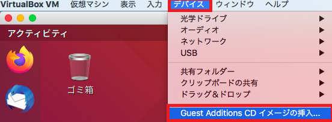
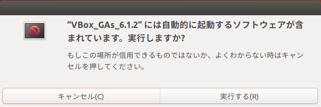

## 0. はじめに

CentOSとは手順が異なる事が多かったのでUbuntu版のGuestAdditionsのインストールを行う手順とします。  

 

## 1. 準備

### 1-1. VirtualBox側でクリップボードの共有設定

クリップボードの共有(コピー&ペーストの共有)は設定が必要なので事前に設定しておきます。  
ただ今作成中、ここは、CentOSのページを参照。  

### 1-2. GuestAdditionsディスクを入れる

VirtualBoxを起動しメニューバーの「デバイス」→「GuestAdditions CDイメージの挿入」をクリックしisoファイルを  
セットします。  

  

以下のメッセージが出ますがここではコマンドでインストールしてみますので「キャンセル(C)」をクリックして下さい。  

  

### 1-3. カーネルのUpdate

CentOS同様カーネルのUpdateを行うのかと思いましたがUbuntuでは余りUpdateを行わない方が良いと書かれていたりしたので  
ここでは行いません。  

 

## 2. マウント

### 2-1. isoディスクイメージファイルのマウント

isoファイルをマウントしようとしましたがUbuntuでは`/media/ubuntu/VBox_GAs_6.1.2`に自動でマウントされる様です。  
よって何も行いません。※また、Virtual Box 6.1.2の場合の例ですので6.1.2の所をご自身のVersion名に置き換えてください。  

 

## 3. GuestAdditionsのインストール

### 3-1. VBoxLinuxAdditions.runの実行

マウントされている`/media/ubuntu/VBox_GAs_6.1.2`の中にLinux用の`.run`ファイルがあるので以下の様に実行します。  
Linuxのインストール後比較的すぐにGuestAdditionsを実行するとすると以下の様なエラーが出ると思われます。  
※以下、rootでログインして試していますので`su -`などでrootで実行して下さい。  

    root@username:~# /media/ubuntu/VBox_GAs_6.1.2/VBoxLinuxAdditions.run
    Verifying archive integrity... All good.
    Uncompressing VirtualBox 6.1.2 Guest Additions for Linux........
    VirtualBox Guest Additions installer
    Copying additional installer modules ...
    Installing additional modules ...
    VirtualBox Guest Additions: Starting.
    VirtualBox Guest Additions: Building the VirtualBox Guest Additions kernel 
    modules.  This may take a while.
    VirtualBox Guest Additions: To build modules for other installed kernels, run
    VirtualBox Guest Additions:   /sbin/rcvboxadd quicksetup <version>
    VirtualBox Guest Additions: or
    VirtualBox Guest Additions:   /sbin/rcvboxadd quicksetup all
    VirtualBox Guest Additions: Building the modules for kernel 5.3.0-26-generic.

    This system is currently not set up to build kernel modules.
    Please install the gcc make perl packages from your distribution.
    VirtualBox Guest Additions: Running kernel modules will not be replaced until 
    the system is restarted

gcc、make、perlのパッケージをインストールして下さいと書かれています。  
また、kernel-develとelfutils-libelf-develの情報は取り忘れましたがGuestAdditionsのインストールに必要なパッケージ  
のインストール状況です。  

    root@username:~# apt list --installed kernel
    一覧表示... 完了
    root@username:~# apt list --installed gcc
    一覧表示... 完了
    root@username:~# apt list --installed make
    一覧表示... 完了
    root@username:~# apt list --installed perl
    一覧表示... 完了
    perl/bionic-updates,bionic-security,now 5.26.1-6ubuntu0.3 amd64 [インストール済み]
    N: 追加バージョンが 1 件あります。表示するには '-a' スイッチを付けてください。
    root@username:~# apt list --installed bzip2
    一覧表示... 完了
    bzip2/bionic-updates,bionic-security,now 1.0.6-8.1ubuntu0.2 amd64 [インストール済み、自動]
    N: 追加バージョンが 1 件あります。表示するには '-a' スイッチを付けてください。

 

## 4. 必要なパッケージのインストール

### 4-1. gccパッケージのインストール

よって、`gcc`パッケージをインストールしてみます。  
しかし、以下の様なエラーが出てしまいました。`--fix-broken`をインストールしてみて下さいとあります。  

    root@username:~# apt-get -y install gcc
    パッケージリストを読み込んでいます... 完了
    依存関係ツリーを作成しています                
    状態情報を読み取っています... 完了
    これらを直すためには 'apt --fix-broken install' を実行する必要があるかもしれません。
    以下のパッケージには満たせない依存関係があります:
     gcc : 依存: gcc-7 (>= 7.4.0-1~) しかし、インストールされようとしていません
           推奨: libc6-dev しかし、インストールされようとしていません または
                   libc-dev
     gnome-software-plugin-snap : 依存: gnome-software (= 3.28.1-0ubuntu4.18.04.14) しかし、3.28.1-0ubuntu4.18.04.10 はインストールされようとしています
    E: 未解決の依存関係です。'apt --fix-broken install' を実行してみてください (または解法を明示してください)。

試しに`make`のインストールも試してみますがやはり同じようなメッセージが出ます。  

    root@username:~# apt-get -y install make
    パッケージリストを読み込んでいます... 完了
    依存関係ツリーを作成しています                
    状態情報を読み取っています... 完了
    これらを直すためには 'apt --fix-broken install' を実行する必要があるかもしれません。
    以下のパッケージには満たせない依存関係があります:
     gnome-software-plugin-snap : 依存: gnome-software (= 3.28.1-0ubuntu4.18.04.14) しかし、3.28.1-0ubuntu4.18.04.10 はインストールされようとしています
    E: 未解決の依存関係です。'apt --fix-broken install' を実行してみてください (または解法を明示してください)。

### 4-2. fix-brokenのインストール

よって、fix-brokenのインストールを実行してみます。  

    root@username:~# apt --fix-broken install
    パッケージリストを読み込んでいます... 完了
    依存関係ツリーを作成しています                
    状態情報を読み取っています... 完了
    依存関係を解決しています ... 完了
    以下の追加パッケージがインストールされます:
      gnome-software gnome-software-common
    提案パッケージ:
      apt-config-icons-hidpi gnome-software-plugin-flatpak
      gnome-software-plugin-limba
    以下のパッケージはアップグレードされます:
      gnome-software gnome-software-common
    アップグレード: 2 個、新規インストール: 0 個、削除: 0 個、保留: 65 個。
    1 個のパッケージが完全にインストールまたは削除されていません。
    2,967 kB 中 0 B のアーカイブを取得する必要があります。
    この操作後に追加で 8,192 B のディスク容量が消費されます。
    続行しますか? [Y/n] Y
    (データベースを読み込んでいます ... 現在 164873 個のファイルとディレクトリがインストールされています。)
    .../gnome-software_3.28.1-0ubuntu4.18.04.14_amd64.deb を展開する準備をしています ...
    gnome-software (3.28.1-0ubuntu4.18.04.14) で (3.28.1-0ubuntu4.18.04.10 に) 上書き展開しています ...
    .../gnome-software-common_3.28.1-0ubuntu4.18.04.14_all.deb を展開する準備をしています ...
    gnome-software-common (3.28.1-0ubuntu4.18.04.14) で (3.28.1-0ubuntu4.18.04.10 に) 上書き展開しています ...
    gnome-software-common (3.28.1-0ubuntu4.18.04.14) を設定しています ...
    gnome-software (3.28.1-0ubuntu4.18.04.14) を設定しています ...
    man-db (2.8.3-2ubuntu0.1) のトリガを処理しています ...
    gnome-menus (3.13.3-11ubuntu1.1) のトリガを処理しています ...
    hicolor-icon-theme (0.17-2) のトリガを処理しています ...
    mime-support (3.60ubuntu1) のトリガを処理しています ...
    desktop-file-utils (0.23-1ubuntu3.18.04.2) のトリガを処理しています ...
    libglib2.0-0:amd64 (2.56.4-0ubuntu0.18.04.4) のトリガを処理しています ...
    gnome-software-plugin-snap (3.28.1-0ubuntu4.18.04.14) を設定しています ...

インストールを終えたので再びgccのインストールを実行してみます。  
しかし、再び以下のエラーが出てしまいました。  

    root@username:~# apt-get -y install gcc
    パッケージリストを読み込んでいます... 完了
    依存関係ツリーを作成しています                
    状態情報を読み取っています... 完了
    以下の追加パッケージがインストールされます:
      gcc-7 libasan4 libatomic1 libc-dev-bin libc6-dev libcilkrts5 libgcc-7-dev
      libitm1 liblsan0 libmpx2 libquadmath0 libtsan0 libubsan0 linux-libc-dev
      manpages-dev
    提案パッケージ:
      gcc-multilib make autoconf automake libtool flex bison gcc-doc
      gcc-7-multilib gcc-7-doc gcc-7-locales libgcc1-dbg libgomp1-dbg libitm1-dbg
      libatomic1-dbg libasan4-dbg liblsan0-dbg libtsan0-dbg libubsan0-dbg
      libcilkrts5-dbg libmpx2-dbg libquadmath0-dbg glibc-doc
    以下のパッケージが新たにインストールされます:
      gcc gcc-7 libasan4 libatomic1 libc-dev-bin libc6-dev libcilkrts5
      libgcc-7-dev libitm1 liblsan0 libmpx2 libquadmath0 libtsan0 libubsan0
      linux-libc-dev manpages-dev
    アップグレード: 0 個、新規インストール: 16 個、削除: 0 個、保留: 65 個。
    16.9 MB のアーカイブを取得する必要があります。
    この操作後に追加で 73.6 MB のディスク容量が消費されます。
    取得:1 http://jp.archive.ubuntu.com/ubuntu bionic-updates/main amd64 libitm1 amd64 8.3.0-6ubuntu1~18.04.1 [28.0 kB]
    取得:2 http://jp.archive.ubuntu.com/ubuntu bionic-updates/main amd64 libatomic1 amd64 8.3.0-6ubuntu1~18.04.1 [9,184 B]
    取得:3 http://jp.archive.ubuntu.com/ubuntu bionic-updates/main amd64 libasan4 amd64 7.4.0-1ubuntu1~18.04.1 [359 kB]
    取得:4 http://jp.archive.ubuntu.com/ubuntu bionic-updates/main amd64 liblsan0 amd64 8.3.0-6ubuntu1~18.04.1 [133 kB]
    取得:5 http://jp.archive.ubuntu.com/ubuntu bionic-updates/main amd64 libtsan0 amd64 8.3.0-6ubuntu1~18.04.1 [288 kB]
    取得:6 http://jp.archive.ubuntu.com/ubuntu bionic-updates/main amd64 libubsan0 amd64 7.4.0-1ubuntu1~18.04.1 [126 kB]
    取得:7 http://jp.archive.ubuntu.com/ubuntu bionic-updates/main amd64 libcilkrts5 amd64 7.4.0-1ubuntu1~18.04.1 [42.5 kB]
    取得:8 http://jp.archive.ubuntu.com/ubuntu bionic-updates/main amd64 libmpx2 amd64 8.3.0-6ubuntu1~18.04.1 [11.6 kB]
    取得:9 http://jp.archive.ubuntu.com/ubuntu bionic-updates/main amd64 libquadmath0 amd64 8.3.0-6ubuntu1~18.04.1 [133 kB]
    取得:10 http://jp.archive.ubuntu.com/ubuntu bionic-updates/main amd64 libgcc-7-dev amd64 7.4.0-1ubuntu1~18.04.1 [2,381 kB]
    取得:11 http://jp.archive.ubuntu.com/ubuntu bionic-updates/main amd64 gcc-7 amd64 7.4.0-1ubuntu1~18.04.1 [7,463 kB]
    取得:12 http://jp.archive.ubuntu.com/ubuntu bionic-updates/main amd64 gcc amd64 4:7.4.0-1ubuntu2.3 [5,184 B]
    取得:13 http://jp.archive.ubuntu.com/ubuntu bionic/main amd64 libc-dev-bin amd64 2.27-3ubuntu1 [71.8 kB]
    無視:14 http://jp.archive.ubuntu.com/ubuntu bionic-updates/main amd64 linux-libc-dev amd64 4.15.0-74.84
    取得:15 http://jp.archive.ubuntu.com/ubuntu bionic/main amd64 libc6-dev amd64 2.27-3ubuntu1 [2,587 kB]
    取得:16 http://jp.archive.ubuntu.com/ubuntu bionic/main amd64 manpages-dev all 4.15-1 [2,217 kB]
    エラー:14 http://security.ubuntu.com/ubuntu bionic-updates/main amd64 linux-libc-dev amd64 4.15.0-74.84
      404  Not Found [IP: xxx.xxx.xxx.xxx]
    15.9 MB を 5秒 で取得しました (3,147 kB/s)
    E: http://security.ubuntu.com/ubuntu/pool/main/l/linux/linux-libc-dev_4.15.0-74.84_amd64.deb の取得に失敗しました  404  Not Found [IP: xxx.xxx.xxx.xxx]
    E: いくつかのアーカイブを取得できません。apt-get update を実行するか --fix-missing オプションを付けて試してみてください。

### 4-3. apt-get updateの実行

apt-get update を実行するか --fix-missing オプションを付けて試してみてくださいとありましたので今回はapt-get updateの方を  
実行してみます。  

    root@username:~# apt-get update
    ヒット:1 http://jp.archive.ubuntu.com/ubuntu bionic InRelease
    取得:2 http://jp.archive.ubuntu.com/ubuntu bionic-updates InRelease [88.7 kB]  
    ヒット:3 http://archive.ubuntulinux.jp/ubuntu bionic InRelease                 
    ヒット:4 http://archive.ubuntulinux.jp/ubuntu-ja-non-free bionic InRelease     
    取得:5 http://jp.archive.ubuntu.com/ubuntu bionic-backports InRelease [74.6 kB]
    取得:6 http://security.ubuntu.com/ubuntu bionic-security InRelease [88.7 kB]   
    取得:7 http://jp.archive.ubuntu.com/ubuntu bionic-updates/main i386 Packages [650 kB]
    取得:8 http://jp.archive.ubuntu.com/ubuntu bionic-updates/main amd64 Packages [871 kB]
    取得:9 http://jp.archive.ubuntu.com/ubuntu bionic-updates/main Translation-en [303 kB]
    取得:10 http://jp.archive.ubuntu.com/ubuntu bionic-updates/main amd64 DEP-11 Metadata [307 kB]
    取得:11 http://jp.archive.ubuntu.com/ubuntu bionic-updates/main DEP-11 48x48 Icons [73.8 kB]
    取得:12 http://jp.archive.ubuntu.com/ubuntu bionic-updates/main DEP-11 64x64 Icons [140 kB]
    取得:13 http://jp.archive.ubuntu.com/ubuntu bionic-updates/restricted amd64 Packages [32.9 kB]
    取得:14 http://jp.archive.ubuntu.com/ubuntu bionic-updates/restricted i386 Packages [9,568 B]
    取得:15 http://jp.archive.ubuntu.com/ubuntu bionic-updates/restricted Translation-en [8,468 B]
    取得:16 http://jp.archive.ubuntu.com/ubuntu bionic-updates/universe amd64 Packages [1,054 kB]
    取得:17 http://jp.archive.ubuntu.com/ubuntu bionic-updates/universe i386 Packages [1,010 kB]
    取得:18 http://jp.archive.ubuntu.com/ubuntu bionic-updates/universe Translation-en [326 kB]
    取得:19 http://jp.archive.ubuntu.com/ubuntu bionic-updates/universe amd64 DEP-11 Metadata [264 kB]
    取得:20 http://jp.archive.ubuntu.com/ubuntu bionic-updates/universe DEP-11 48x48 Icons [200 kB]
    取得:21 http://jp.archive.ubuntu.com/ubuntu bionic-updates/universe DEP-11 64x64 Icons [445 kB]
    取得:22 http://jp.archive.ubuntu.com/ubuntu bionic-updates/multiverse amd64 Packages [10.1 kB]
    取得:23 http://jp.archive.ubuntu.com/ubuntu bionic-updates/multiverse i386 Packages [7,476 B]
    取得:24 http://jp.archive.ubuntu.com/ubuntu bionic-updates/multiverse Translation-en [4,636 B]
    取得:25 http://jp.archive.ubuntu.com/ubuntu bionic-updates/multiverse amd64 DEP-11 Metadata [2,468 B]
    取得:26 http://jp.archive.ubuntu.com/ubuntu bionic-backports/universe i386 Packages [4,028 B]
    取得:27 http://jp.archive.ubuntu.com/ubuntu bionic-backports/universe amd64 Packages [4,028 B]
    取得:28 http://jp.archive.ubuntu.com/ubuntu bionic-backports/universe amd64 DEP-11 Metadata [7,984 B]
    取得:29 http://security.ubuntu.com/ubuntu bionic-security/main i386 Packages [442 kB]
    取得:30 http://security.ubuntu.com/ubuntu bionic-security/main amd64 Packages [651 kB]
    取得:31 http://security.ubuntu.com/ubuntu bionic-security/main Translation-en [211 kB]
    取得:32 http://security.ubuntu.com/ubuntu bionic-security/main amd64 DEP-11 Metadata [38.5 kB]
    取得:33 http://security.ubuntu.com/ubuntu bionic-security/main DEP-11 48x48 Icons [17.6 kB]
    取得:34 http://security.ubuntu.com/ubuntu bionic-security/main DEP-11 64x64 Icons [41.5 kB]
    取得:35 http://security.ubuntu.com/ubuntu bionic-security/restricted amd64 Packages [23.8 kB]
    取得:36 http://security.ubuntu.com/ubuntu bionic-security/restricted Translation-en [6,528 B]
    取得:37 http://security.ubuntu.com/ubuntu bionic-security/universe i386 Packages [617 kB]
    取得:38 http://security.ubuntu.com/ubuntu bionic-security/universe amd64 Packages [649 kB]
    取得:39 http://security.ubuntu.com/ubuntu bionic-security/universe Translation-en [218 kB]
    取得:40 http://security.ubuntu.com/ubuntu bionic-security/universe amd64 DEP-11 Metadata [42.2 kB]
    取得:41 http://security.ubuntu.com/ubuntu bionic-security/universe DEP-11 48x48 Icons [16.4 kB]
    取得:42 http://security.ubuntu.com/ubuntu bionic-security/universe DEP-11 64x64 Icons [111 kB]
    取得:43 http://security.ubuntu.com/ubuntu bionic-security/multiverse amd64 Packages [6,760 B]
    取得:44 http://security.ubuntu.com/ubuntu bionic-security/multiverse i386 Packages [4,292 B]
    取得:45 http://security.ubuntu.com/ubuntu bionic-security/multiverse Translation-en [2,700 B]
    取得:46 http://security.ubuntu.com/ubuntu bionic-security/multiverse amd64 DEP-11 Metadata [2,464 B]
    9,089 kB を 33秒 で取得しました (272 kB/s)                                     
    パッケージリストを読み込んでいます... 完了

apt-get updateを実行してみましたので再びgccのインストールを行ってみます。  

    root@username:~# apt-get -y install gcc
    パッケージリストを読み込んでいます... 完了
    依存関係ツリーを作成しています                
    状態情報を読み取っています... 完了
    以下の追加パッケージがインストールされます:
      gcc-7 libasan4 libatomic1 libc-dev-bin libc6-dev libcilkrts5 libgcc-7-dev
      libitm1 liblsan0 libmpx2 libquadmath0 libtsan0 libubsan0 linux-libc-dev
      manpages-dev
    提案パッケージ:
      gcc-multilib make autoconf automake libtool flex bison gcc-doc
      gcc-7-multilib gcc-7-doc gcc-7-locales libgcc1-dbg libgomp1-dbg libitm1-dbg
      libatomic1-dbg libasan4-dbg liblsan0-dbg libtsan0-dbg libubsan0-dbg
      libcilkrts5-dbg libmpx2-dbg libquadmath0-dbg glibc-doc
    以下のパッケージが新たにインストールされます:
      gcc gcc-7 libasan4 libatomic1 libc-dev-bin libc6-dev libcilkrts5
      libgcc-7-dev libitm1 liblsan0 libmpx2 libquadmath0 libtsan0 libubsan0
      linux-libc-dev manpages-dev
    アップグレード: 0 個、新規インストール: 16 個、削除: 0 個、保留: 158 個。
    16.9 MB 中 1,022 kB のアーカイブを取得する必要があります。
    この操作後に追加で 73.6 MB のディスク容量が消費されます。
    取得:1 http://jp.archive.ubuntu.com/ubuntu bionic-updates/main amd64 linux-libc-dev amd64 4.15.0-88.88 [1,022 kB]
    1,022 kB を 6秒 で取得しました (177 kB/s)
    以前に未選択のパッケージ libitm1:amd64 を選択しています。
    (データベースを読み込んでいます ... 現在 164873 個のファイルとディレクトリがインストールされています。)
    .../00-libitm1_8.3.0-6ubuntu1~18.04.1_amd64.deb を展開する準備をしています ...
    libitm1:amd64 (8.3.0-6ubuntu1~18.04.1) を展開しています...
    以前に未選択のパッケージ libatomic1:amd64 を選択しています。
    .../01-libatomic1_8.3.0-6ubuntu1~18.04.1_amd64.deb を展開する準備をしています ...
    libatomic1:amd64 (8.3.0-6ubuntu1~18.04.1) を展開しています...
    以前に未選択のパッケージ libasan4:amd64 を選択しています。
    .../02-libasan4_7.4.0-1ubuntu1~18.04.1_amd64.deb を展開する準備をしています ...
    libasan4:amd64 (7.4.0-1ubuntu1~18.04.1) を展開しています...
    以前に未選択のパッケージ liblsan0:amd64 を選択しています。
    .../03-liblsan0_8.3.0-6ubuntu1~18.04.1_amd64.deb を展開する準備をしています ...
    liblsan0:amd64 (8.3.0-6ubuntu1~18.04.1) を展開しています...
    以前に未選択のパッケージ libtsan0:amd64 を選択しています。
    .../04-libtsan0_8.3.0-6ubuntu1~18.04.1_amd64.deb を展開する準備をしています ...
    libtsan0:amd64 (8.3.0-6ubuntu1~18.04.1) を展開しています...
    以前に未選択のパッケージ libubsan0:amd64 を選択しています。
    .../05-libubsan0_7.4.0-1ubuntu1~18.04.1_amd64.deb を展開する準備をしています ...
    libubsan0:amd64 (7.4.0-1ubuntu1~18.04.1) を展開しています...
    以前に未選択のパッケージ libcilkrts5:amd64 を選択しています。
    .../06-libcilkrts5_7.4.0-1ubuntu1~18.04.1_amd64.deb を展開する準備をしています ...
    libcilkrts5:amd64 (7.4.0-1ubuntu1~18.04.1) を展開しています...
    以前に未選択のパッケージ libmpx2:amd64 を選択しています。
    .../07-libmpx2_8.3.0-6ubuntu1~18.04.1_amd64.deb を展開する準備をしています ...
    libmpx2:amd64 (8.3.0-6ubuntu1~18.04.1) を展開しています...
    以前に未選択のパッケージ libquadmath0:amd64 を選択しています。
    .../08-libquadmath0_8.3.0-6ubuntu1~18.04.1_amd64.deb を展開する準備をしています ...
    libquadmath0:amd64 (8.3.0-6ubuntu1~18.04.1) を展開しています...
    以前に未選択のパッケージ libgcc-7-dev:amd64 を選択しています。
    .../09-libgcc-7-dev_7.4.0-1ubuntu1~18.04.1_amd64.deb を展開する準備をしています ...
    libgcc-7-dev:amd64 (7.4.0-1ubuntu1~18.04.1) を展開しています...
    以前に未選択のパッケージ gcc-7 を選択しています。
    .../10-gcc-7_7.4.0-1ubuntu1~18.04.1_amd64.deb を展開する準備をしています ...
    gcc-7 (7.4.0-1ubuntu1~18.04.1) を展開しています...
    以前に未選択のパッケージ gcc を選択しています。
    .../11-gcc_4%3a7.4.0-1ubuntu2.3_amd64.deb を展開する準備をしています ...
    gcc (4:7.4.0-1ubuntu2.3) を展開しています...
    以前に未選択のパッケージ libc-dev-bin を選択しています。
    .../12-libc-dev-bin_2.27-3ubuntu1_amd64.deb を展開する準備をしています ...
    libc-dev-bin (2.27-3ubuntu1) を展開しています...
    以前に未選択のパッケージ linux-libc-dev:amd64 を選択しています。
    .../13-linux-libc-dev_4.15.0-88.88_amd64.deb を展開する準備をしています ...
    linux-libc-dev:amd64 (4.15.0-88.88) を展開しています...
    以前に未選択のパッケージ libc6-dev:amd64 を選択しています。
    .../14-libc6-dev_2.27-3ubuntu1_amd64.deb を展開する準備をしています ...
    libc6-dev:amd64 (2.27-3ubuntu1) を展開しています...
    以前に未選択のパッケージ manpages-dev を選択しています。
    .../15-manpages-dev_4.15-1_all.deb を展開する準備をしています ...
    manpages-dev (4.15-1) を展開しています...
    libquadmath0:amd64 (8.3.0-6ubuntu1~18.04.1) を設定しています ...
    libatomic1:amd64 (8.3.0-6ubuntu1~18.04.1) を設定しています ...
    libasan4:amd64 (7.4.0-1ubuntu1~18.04.1) を設定しています ...
    libcilkrts5:amd64 (7.4.0-1ubuntu1~18.04.1) を設定しています ...
    libubsan0:amd64 (7.4.0-1ubuntu1~18.04.1) を設定しています ...
    libtsan0:amd64 (8.3.0-6ubuntu1~18.04.1) を設定しています ...
    linux-libc-dev:amd64 (4.15.0-88.88) を設定しています ...
    liblsan0:amd64 (8.3.0-6ubuntu1~18.04.1) を設定しています ...
    libmpx2:amd64 (8.3.0-6ubuntu1~18.04.1) を設定しています ...
    libc-dev-bin (2.27-3ubuntu1) を設定しています ...
    manpages-dev (4.15-1) を設定しています ...
    libc6-dev:amd64 (2.27-3ubuntu1) を設定しています ...
    libitm1:amd64 (8.3.0-6ubuntu1~18.04.1) を設定しています ...
    libgcc-7-dev:amd64 (7.4.0-1ubuntu1~18.04.1) を設定しています ...
    gcc-7 (7.4.0-1ubuntu1~18.04.1) を設定しています ...
    gcc (4:7.4.0-1ubuntu2.3) を設定しています ...
    man-db (2.8.3-2ubuntu0.1) のトリガを処理しています ...
    libc-bin (2.27-3ubuntu1) のトリガを処理しています ...

ようやく正しくgccをインストール出来た様です。  

### 4-4. makeパッケージのインストール

続いてmakeパッケージのインストールを行います。  

    root@username:~# apt-get -y install make
    パッケージリストを読み込んでいます... 完了
    依存関係ツリーを作成しています                
    状態情報を読み取っています... 完了
    提案パッケージ:
      make-doc
    以下のパッケージが新たにインストールされます:
      make
    アップグレード: 0 個、新規インストール: 1 個、削除: 0 個、保留: 158 個。
    154 kB のアーカイブを取得する必要があります。
    この操作後に追加で 381 kB のディスク容量が消費されます。
    取得:1 http://jp.archive.ubuntu.com/ubuntu bionic/main amd64 make amd64 4.1-9.1ubuntu1 [154 kB]
    154 kB を 1秒 で取得しました (279 kB/s)
    以前に未選択のパッケージ make を選択しています。
    (データベースを読み込んでいます ... 現在 168747 個のファイルとディレクトリがインストールされています。)
    .../make_4.1-9.1ubuntu1_amd64.deb を展開する準備をしています ...
    make (4.1-9.1ubuntu1) を展開しています...
    make (4.1-9.1ubuntu1) を設定しています ...
    man-db (2.8.3-2ubuntu0.1) のトリガを処理しています ...

### 4-5. perlパッケージのインストール

最後にperlパッケージのインストールを行ってみます。  
perlパッケージはすでにインストール済みでしたが更新されるか試しに行ってみます。  

    root@username:~# apt-get -y install perl
    パッケージリストを読み込んでいます... 完了
    依存関係ツリーを作成しています                
    状態情報を読み取っています... 完了
    perl はすでに最新バージョン (5.26.1-6ubuntu0.3) です。
    perl は手動でインストールしたと設定されました。
    アップグレード: 0 個、新規インストール: 0 個、削除: 0 個、保留: 158 個。

gcc、make、perlインストール後のパッケージインストール状況です。  
※kernel-develとelfutils-libelf-develの情報は取り忘れています。  

    root@username:~# apt list --installed kernel
    一覧表示... 完了
    root@username:~# apt list --installed gcc
    一覧表示... 完了
    gcc/bionic-updates,bionic-security,now 4:7.4.0-1ubuntu2.3 amd64 [インストール済み]
    N: 追加バージョンが 1 件あります。表示するには '-a' スイッチを付けてください。
    root@username:~# apt list --installed make
    一覧表示... 完了
    make/bionic,now 4.1-9.1ubuntu1 amd64 [インストール済み]
    root@username:~# apt list --installed perl
    一覧表示... 完了
    perl/bionic-updates,bionic-security,now 5.26.1-6ubuntu0.3 amd64 [インストール済み]
    N: 追加バージョンが 1 件あります。表示するには '-a' スイッチを付けてください。
    root@username:~# apt list --installed bzip2
    一覧表示... 完了
    bzip2/bionic-updates,bionic-security,now 1.0.6-8.1ubuntu0.2 amd64 [インストール済み、自動]
    N: 追加バージョンが 1 件あります。表示するには '-a' スイッチを付けてください。

 

## 5. GuestAdditionsのインストールを再度試す

### 5-1. VBoxLinuxAdditions.runの再実行

gcc、make、perlをインストールしたのでVBoxLinuxAdditions.runを再度実行してみます。

    root@username:~# /media/ubuntu/VBox_GAs_6.1.2/VBoxLinuxAdditions.run
    Verifying archive integrity... All good.
    Uncompressing VirtualBox 6.1.2 Guest Additions for Linux........
    VirtualBox Guest Additions installer
    Removing installed version 6.1.2 of VirtualBox Guest Additions...
    Copying additional installer modules ...
    Installing additional modules ...
    VirtualBox Guest Additions: Starting.
    VirtualBox Guest Additions: Building the VirtualBox Guest Additions kernel 
    modules.  This may take a while.
    VirtualBox Guest Additions: To build modules for other installed kernels, run
    VirtualBox Guest Additions:   /sbin/rcvboxadd quicksetup <version>
    VirtualBox Guest Additions: or
    VirtualBox Guest Additions:   /sbin/rcvboxadd quicksetup all
    VirtualBox Guest Additions: Building the modules for kernel 5.3.0-26-generic.
    update-initramfs: Generating /boot/initrd.img-5.3.0-26-generic
    VirtualBox Guest Additions: Running kernel modules will not be replaced until 
    the system is restarted

CentOS同様これで正しくインストール出来たのかは不明ですがコピー＆ペーストなどできるので取り敢えずここまで。  

* * *
