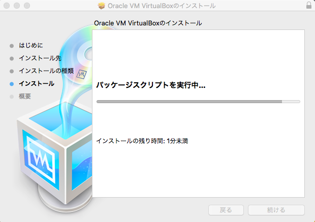

## 0. Oracle VM VirtualBoxのダウンロード

[Oracle VM VirtualBox](https://www.virtualbox.org/wiki/Downloads)で`OS X hosts`をクリックしダウンロードする。  

  

 

## 1. VirtualBoxのインストール

1-1. ダウンロードした`VirtualBox-6.1.2-135662-OSX.dmg`(Version6.1.2の場合)をダブルクリックしてマウントし中身を開きます。  
`Duble click on this icon`のアイコンをダブルクリックし、パッケージのインストーラーを起動します。  

  

1-2. 「Next」ボタンをクリックし次へ進みます。  

  

1-3. 警告メッセージが出ますが良ければ「続ける」ボタンをクリックし次へ進みます。  

  

1-4. 説明書きが書かれています。「続ける」ボタンをクリックし次へ進みます。  

  

1-5. インストール先を変更する場合は「インストール先を変更」ボタンをクリックし変更します。良ければ「インストール」ボタンをクリックし次へ進みます。  

  

1-6. MacOSの管理パスワードを入力して「ソフトウェアをインストール」ボタンをクリックします。  

  

インストール中ですのでしばらく待ちます。  

  

1-8. インストールが完了しましたので「閉じる」ボタンを押し完了します。  

  

 

## 2. VirtualBoxの仮想環境の作成

2-1. VirtualBoxを起動すると以下の様な画面になります。  
仮想マシンの新規追加を行う設定を行ってみます。  
「新規(N)」アイコンをクリックしダイアログを開きます。  

  

2-2. 仮想マシンの名前(何でも良い)と仮想マシンにインストールするOSの種類などを選びます。  
今回の例はLinuxのUbuntu(64-bit Desktop版)をインストールする事にしますので「名前：」テキストボックスに分かりやすく`Ubuntu18.04.3jaDesktop`などとします。  
マシンフォルダーは、仮想マシンを作成する場所でどこでも良いですが今回はデフォルトのフォルダーにインストールしますので変更はしません。  
「タイプ」コンボボックスは`Linux`、「バージョン」は`Ubuntu(64-bit)`を選びます。  
確認しましたら「続き」ボタンをクリックし次へ進みます。  

  

2-3. メモリーのサイズを指定します。  
パソコンのメインメモリーの容量により決定しますが普段使うWindowsのメモリー使用量とは別に仮想マシンに割り当てるメモリーの容量を指定します。  
このパソコンでは4GBなので兼ね合いをみて1.5GB(1536MB)程度としておきます。  
良ければ「続き」ボタンをクリックし次へ進みます。  

  

2-4. 仮想ハードディスクを作成するかの選択をします。  
「仮想ハードディスクを作成する」ラジオボタンを選択し、「作成」ボタンをクリックします。  
仮想マシンそのものを作成(OSの容量とは別)するのにHDDなどに10GB必要です。  

  

2-5. 仮想ハードディスクのファイルタイプはデフォルトの「VDI(VirtualBox Disk Image)」ラジオボタンを選択します。  
良ければ「続き」ボタンをクリックし次へ進みます。  

  

2-6. 仮想マシンへOSをインストールするためのHDDなどの容量を可変にするか固定にするかの選択をします。ここでは「固定サイズ」ラジオボタンを選択し、「続き」ボタンをクリックし次へ進みます。  
可変サイズはその名の通り使用した分のみのHDD容量しか使用しません。固定サイズは高速ではありますが次項で設定する容量を仮想マシンの作成をした段階で使用しますので注意して下さい。  

  

2-7. 仮想マシンへOSをインストールするHDDなどの容量を決めます。  
自身のパソコンのHDDおよびSSDの容量により決定してください。  
このパソコンでは240GBの容量なので兼ね合いを見て40GB程度としておきます。  
良ければ「作成」ボタンをクリックし次へ進みます。  

  

作成中なのでしばらくお待ちください。  

  

作成されるとメイン画面には以下の様に表示され作成されます。  

  

 

## 3. 仮想マシンにOSをインストールする

※事前にUbuntuのイメージファイル(.iso)をサイトでダウンロードしておいて下さい。  

3-1. 初回のみメイン画面の「起動(T)」後に以下の様なダイアログで`.iso`ファイルを指定して読み込む方法があります。  

  

または、起動する前に以下の設定をしてイメージファイルを読み込ませます。  
メイン画面のストレージ項目の`IDEセカンダリマスター`が空になっているのでクリックし、プルダウンメニューの「Choose a disk file...」を選択します。  
※この`IDEセカンダリマスター`が光学ドライブとなっているので仮想マシン内のDVDドライブに相当するものだと思います。  

  

Ubuntuをダウンロードしたイメージファイル(.iso)を選び「開く」ボタンをクリックします。  
IDEプライマリストレージにセットされます。  

  

その後、メイン画面の「起動(T)」ボタンを押しUbuntuのインストールを行ってください。  

OSのインストール後はIDEセカンダリマスターを右クリックし「仮想ドライブからディスクを除去」を選び`空`に戻してください。  
このディスクイメージをセットしたままだと再起動後に再びOSのインストールが始まります。  
起動してしまった場合は、強制ではありますが右上の閉じるボタンを押して終了して下さい。  

* * *
